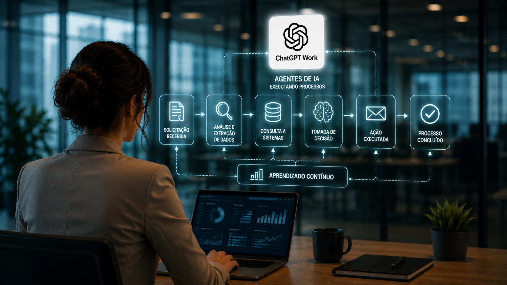
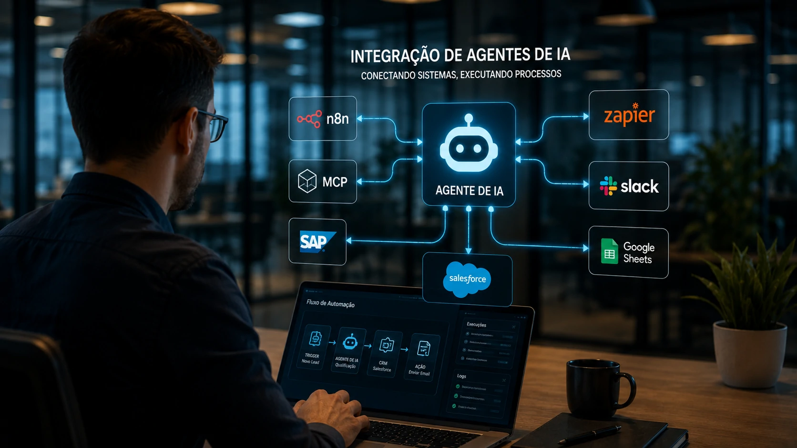
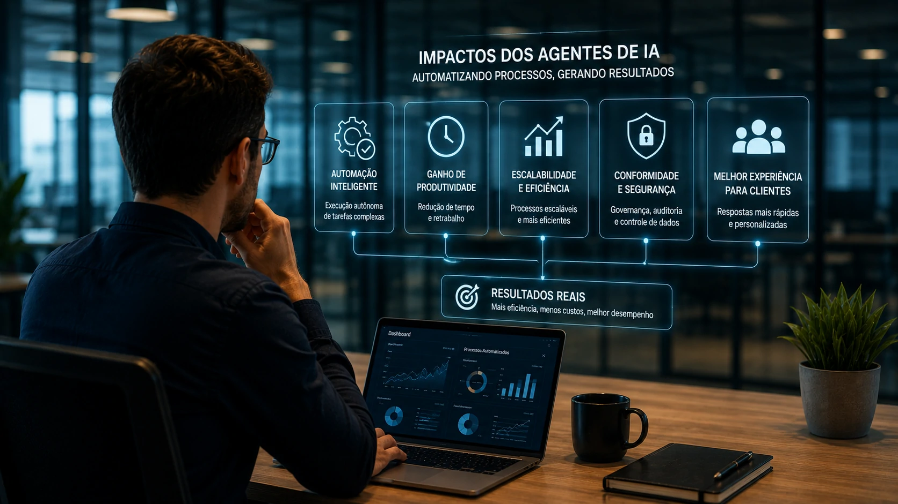

*O lançamento do **ChatGPT Work** colocou os agentes de IA no centro das discussões sobre produtividade. No entanto, a transformação mais relevante não está em uma única plataforma, mas na mudança estrutural da forma como empresas automatizam processos inteiros. Essa nova fase combina inteligência artificial, integração entre sistemas e tomada de decisão automatizada, ampliando significativamente o potencial da automação corporativa.*

O lançamento do **ChatGPT Work** chamou a atenção por apresentar uma experiência mais orientada à execução de tarefas complexas dentro das empresas. Entretanto, limitar essa mudança apenas ao produto da **OpenAI** seria uma análise incompleta.

O mercado corporativo já vinha evoluindo para um modelo conhecido como **Agentic AI**, no qual agentes inteligentes deixam de responder apenas perguntas e passam a executar processos completos envolvendo múltiplos sistemas, documentos e pessoas.

Esse movimento conecta tendências que o **Notícia Tech** já vem acompanhando, como **AI Process Automation**, **AI Orchestration**, **MCP** e plataformas de automação inteligentes. Em vez de representar um ponto final, o **ChatGPT Work** funciona como um acelerador de uma transformação que já estava em curso.

## O que mudou com a nova geração de agentes de IA

*Os agentes inteligentes começam a assumir fluxos completos de trabalho, integrando pessoas, sistemas e dados corporativos.*

Durante muitos anos, automação significava executar tarefas repetitivas seguindo regras previamente definidas. Esse modelo continua importante, mas possui limitações quando processos exigem interpretação, contexto ou decisões durante a execução.

A chegada dos **Large Language Models (LLMs)** mudou esse cenário ao permitir que sistemas compreendam linguagem natural, analisem documentos e interajam com diferentes aplicações de maneira mais flexível.

### Da automação baseada em regras para agentes inteligentes

Na automação tradicional, cada etapa precisa ser previamente programada. Caso uma condição inesperada aconteça, normalmente o fluxo é interrompido ou exige intervenção humana.

Já os **agentes de IA** conseguem interpretar o contexto, consultar informações adicionais, decidir o próximo passo e continuar a execução dentro de limites previamente definidos pela empresa.

### O papel do ChatGPT Work nessa transformação

O **ChatGPT Work** tornou esse conceito mais visível para gestores e executivos ao apresentar uma interface focada em produtividade empresarial.

Entretanto, o verdadeiro avanço não está apenas na ferramenta, mas na consolidação de um novo paradigma: softwares deixam de ser apenas assistentes e passam a atuar como executores de processos.

Essa evolução complementa outros movimentos já abordados pelo **Notícia Tech**, como o crescimento da **AI Orchestration**.

Veja também:

-[O que é AI Orchestration? Por que ela substitui a disputa entre modelos de IA nas empresas](https://noticiatech.com.br/automacao/o-que-e-ai-orchestration-substitui-disputa-modelos-ia-empresas/)

## ChatGPT Work é apenas o começo

O crescimento do interesse pelo **ChatGPT Work** acontece em um momento em que praticamente todas as grandes empresas de tecnologia aceleram investimentos em agentes inteligentes.

Não se trata apenas da disputa entre modelos como **GPT**, **Claude** ou **Gemini**, mas da corrida para construir plataformas capazes de integrar aplicações corporativas e executar fluxos completos de trabalho.

### A competição deixou de ser apenas entre modelos

Nos primeiros anos da IA generativa, a competição girava em torno da qualidade das respostas produzidas pelos modelos.

Agora, o diferencial passa a ser a capacidade de conectar múltiplos sistemas empresariais, acessar informações com segurança e executar ações reais dentro do ambiente corporativo.

### O foco agora é produtividade empresarial

Empresas procuram reduzir tempo operacional, eliminar tarefas repetitivas e aumentar a produtividade das equipes.

Nesse contexto, agentes inteligentes tornam-se uma camada operacional capaz de conectar CRMs, ERPs, plataformas de atendimento, sistemas financeiros e ferramentas de colaboração.

Esse movimento também reforça tendências apresentadas anteriormente pelo **Notícia Tech** sobre **AI Process Automation**.

Leia também:

[O que é AI Process Automation? Como a Inteligência Artificial está transformando a automação de processos](https://noticiatech.com.br/automacao/o-que-e-ai-process-automation-automacao-processos-inteligencia-artificial/)

## Como empresas estão automatizando processos inteiros

*Plataformas inteligentes conectam diferentes sistemas corporativos para executar processos completos com mínima intervenção humana.*

Os projetos mais avançados de **Enterprise AI** já não utilizam inteligência artificial apenas para responder perguntas ou gerar textos. O foco agora está na execução ponta a ponta de processos empresariais.

Em vez de um funcionário alternar entre CRM, ERP, planilhas, e-mail e plataformas de atendimento, um agente de IA consegue coordenar essas etapas automaticamente, reduzindo gargalos operacionais e acelerando decisões.

### Da execução de tarefas para a execução de processos

Imagine um novo lead chegando ao site da empresa.

Em um fluxo tradicional, diferentes colaboradores precisariam validar informações, registrar dados no CRM, enviar um e-mail, criar uma tarefa comercial e atualizar indicadores.

Com agentes de IA, esse processo pode ocorrer praticamente de forma autônoma.

O agente analisa o perfil do cliente, consulta bases internas, identifica oportunidades, registra informações, agenda reuniões e aciona outros sistemas quando necessário.

### Onde entram MCP, n8n e Zapier

Essa evolução depende de plataformas capazes de conectar diferentes aplicações.

O **Model Context Protocol (MCP)** surge como um padrão para facilitar a comunicação entre modelos de IA e sistemas corporativos, reduzindo integrações isoladas.

Ao mesmo tempo, ferramentas como **n8n**, **Zapier**, **Make** e soluções de **AI Orchestration** tornam possível criar fluxos inteligentes envolvendo centenas de aplicações sem necessidade de desenvolvimento complexo.

Na prática, essas tecnologias passam a funcionar como a infraestrutura operacional dos agentes inteligentes.

## Quais setores devem adotar primeiro

*Os primeiros setores a adotar agentes inteligentes tendem a ser aqueles com grande volume de processos repetitivos e integração entre sistemas.*

Embora praticamente qualquer organização possa utilizar agentes de IA, alguns segmentos apresentam retorno mais rápido devido ao elevado número de processos repetitivos e baseados em informação.

Nesses ambientes, pequenas reduções no tempo de execução já representam ganhos significativos de produtividade.

### Vendas e relacionamento com clientes

Áreas comerciais provavelmente continuarão liderando essa transformação.

Os agentes podem qualificar leads, preparar propostas, atualizar CRMs, responder clientes, organizar follow-ups e sugerir oportunidades antes mesmo da intervenção de um vendedor.

Isso complementa tendências observadas em soluções modernas de **CRM com IA**, que evoluem rapidamente para plataformas orientadas por agentes.

### Financeiro, RH e operações

Departamentos financeiros podem utilizar agentes para conciliar documentos, analisar contratos, organizar pagamentos e gerar relatórios.

No RH, os agentes podem apoiar recrutamento, responder colaboradores, organizar documentação e acompanhar processos internos.

Já em operações, a combinação entre IA e automação reduz retrabalho, melhora rastreabilidade e acelera decisões em cadeias produtivas.

## O que esperar até 2027

O mercado caminha para um cenário em que os agentes deixarão de ser diferenciais competitivos para se tornarem parte da infraestrutura tecnológica das empresas.

Da mesma forma que ERPs e CRMs se tornaram essenciais ao longo das últimas décadas, agentes inteligentes tendem a assumir atividades operacionais que hoje consomem grande parte do tempo das equipes.

Essa evolução também aumenta a importância de temas como **Governança de IA**, segurança dos dados, auditoria das decisões automatizadas e integração padronizada entre plataformas.

O **ChatGPT Work** provavelmente será lembrado como um dos marcos dessa transição, mas dificilmente será seu destino final. A tendência aponta para um ecossistema formado por múltiplos agentes especializados, conectados por protocolos como **MCP**, coordenados por plataformas de **AI Orchestration** e integrados aos sistemas corporativos já existentes.

Para as empresas, a principal mudança não será simplesmente utilizar uma nova ferramenta de inteligência artificial, mas transformar a forma como processos inteiros são executados. É justamente essa mudança estrutural que deve definir a próxima fase da automação empresarial e consolidar os agentes de IA como uma das tecnologias mais estratégicas dos próximos anos.

---