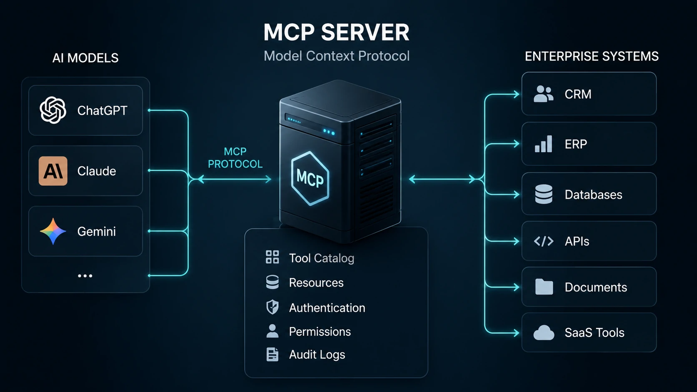

*À medida que empresas deixam de utilizar a inteligência artificial apenas como chatbot e passam a incorporá-la em processos internos, cresce a necessidade de uma camada padronizada de integração. É exatamente nesse cenário que os servidores MCP surgem como uma das arquiteturas mais promissoras para conectar modelos de IA aos sistemas corporativos.*

## O que é um servidor MCP e por que ele ganhou importância nas empresas



*Servidor MCP funcionando como camada intermediária entre modelos de IA e aplicações corporativas.*

O **Model Context Protocol (MCP)** foi criado para resolver um problema recorrente das empresas: cada modelo de IA exigia uma integração diferente para acessar documentos, bancos de dados e aplicações internas.

Na prática, um **servidor MCP** funciona como uma camada intermediária entre o modelo de inteligência artificial e os recursos corporativos. Em vez de desenvolver integrações específicas para **ChatGPT**, **Claude** ou **Gemini**, a empresa disponibiliza tudo por meio de um único protocolo.

Esse modelo reduz custos de desenvolvimento, melhora a governança e facilita futuras migrações entre provedores de IA.

### O papel do servidor

O servidor centraliza:

- APIs corporativas;
- bancos de dados;
- arquivos internos;
- sistemas ERP;
- plataformas CRM;
- ferramentas SaaS;
- mecanismos de autenticação.

Isso transforma a IA em um verdadeiro agente capaz de executar ações e consultar informações em tempo real.

### Por que esse modelo está crescendo

A tendência é semelhante ao que aconteceu com APIs REST anos atrás: padronização reduz complexidade.

Empresas que já estudam arquiteturas de agentes inteligentes também costumam evoluir para conceitos apresentados em [O que é AI Orchestration? Por que ela substitui a disputa entre modelos de IA nas empresas](https://noticiatech.com.br/automacao/o-que-e-ai-orchestration-substitui-disputa-modelos-ia-empresas/), onde diferentes modelos passam a trabalhar sobre uma mesma infraestrutura.

## Como funciona a arquitetura de um servidor MCP


*O servidor MCP centraliza o fluxo entre modelos de IA e aplicações empresariais.*

Em vez de conectar diretamente uma IA ao ERP ou ao CRM, a arquitetura normalmente segue quatro etapas.

1. O usuário faz uma solicitação ao modelo de IA.

2. O modelo identifica que precisa utilizar uma ferramenta disponível no servidor MCP.

3. O servidor executa a operação no sistema corporativo.

4. O resultado retorna ao modelo, que gera a resposta final.

### Fluxo lógico

```
Usuário

↓

Modelo de IA

↓

Servidor MCP

↓

API / ERP / CRM / Banco de Dados

↓

Resposta estruturada

↓

Modelo de IA

↓

Usuário
```

Essa separação permite trocar o modelo de IA futuramente sem reconstruir todas as integrações.

Além disso, organizações que já utilizam automações podem complementar essa arquitetura com estratégias apresentadas em [Como usar IA para qualificação de leads B2B](https://noticiatech.com.br/automacao/como-usar-ia-qualificacao-leads-b2b/), ampliando o uso da inteligência artificial em processos comerciais.

### Componentes principais

Um servidor MCP normalmente contém:

- catálogo de ferramentas;
- definição de recursos disponíveis;
- autenticação;
- controle de permissões;
- registro de auditoria;
- integração com APIs externas.

## Como criar um servidor MCP na prática


*Exemplo simplificado da arquitetura utilizada para disponibilizar ferramentas corporativas por meio de um servidor MCP.*

Criar um **servidor MCP** não significa apenas instalar uma biblioteca. O principal trabalho consiste em definir quais recursos corporativos poderão ser utilizados pelos modelos de IA e como essas informações serão protegidas.

Uma implementação bem planejada normalmente começa pequena e evolui conforme novos sistemas passam a utilizar o protocolo.

### Etapa 1 — Defina as ferramentas disponíveis

O primeiro passo consiste em listar tudo o que a IA poderá acessar.

Exemplos:

- consultar clientes no CRM;
- abrir chamados;
- pesquisar documentos internos;
- consultar estoque;
- gerar relatórios;
- buscar indicadores financeiros.

Quanto menor o escopo inicial, mais simples será validar a arquitetura.

### Etapa 2 — Conecte as APIs corporativas

Depois, o servidor passa a consumir as APIs existentes.

Em vez de permitir acesso direto aos sistemas internos, o MCP centraliza essas integrações e controla quais operações poderão ser executadas.

### Etapa 3 — Defina autenticação e permissões

Nem toda IA deve acessar todas as informações.

É recomendável criar políticas como:

- somente leitura;
- acesso por departamento;
- autenticação via OAuth;
- registro de auditoria;
- controle de logs.

Esse modelo reduz riscos de segurança e facilita conformidade com políticas corporativas.

### Exemplo de prompt para testar um servidor MCP

Depois que o servidor estiver disponível, um teste simples pode ser feito utilizando um prompt semelhante:

```text
Você possui acesso ao servidor MCP da empresa.

Localize os cinco clientes com maior faturamento no último trimestre.

Retorne:

- nome da empresa;
- faturamento;
- segmento;
- responsável comercial;

Organize os resultados em formato de tabela e destaque oportunidades de expansão comercial.
```

Esse tipo de prompt demonstra como o modelo passa a utilizar dados reais da empresa em vez de responder apenas com conhecimento previamente treinado.

## Limitações, segurança e o papel do Human-in-the-Loop

Embora o **MCP** simplifique a integração entre sistemas e modelos de IA, ele não elimina a necessidade de supervisão humana.

Modelos generativos ainda podem interpretar incorretamente solicitações, utilizar ferramentas inadequadas ou produzir respostas inconsistentes quando recebem dados incompletos.

Por isso, processos críticos devem manter o conceito de **Human-in-the-Loop**, no qual uma pessoa valida decisões importantes antes que ações sejam executadas automaticamente.

Entre as principais recomendações estão:

- limitar permissões por função;
- registrar todas as chamadas realizadas;
- validar respostas antes de executar operações críticas;
- revisar periodicamente os recursos disponibilizados pelo servidor.

Essa abordagem reduz riscos operacionais e aumenta a confiabilidade da automação.

## O futuro dos servidores MCP nas empresas

A evolução da inteligência artificial aponta para um cenário em que diferentes modelos compartilharão a mesma infraestrutura de integração.

Em vez de construir conectores específicos para cada plataforma, organizações passarão a investir em arquiteturas padronizadas capazes de atender diversos assistentes inteligentes simultaneamente.

Nesse contexto, o **Model Context Protocol** representa muito mais do que um padrão técnico. Ele estabelece uma camada de interoperabilidade que facilita a adoção de agentes de IA em larga escala, reduz custos de manutenção e prepara empresas para futuras mudanças no mercado.

À medida que novos modelos surgirem, organizações que já utilizarem servidores MCP estarão em posição mais favorável para incorporar novas tecnologias sem reconstruir toda a infraestrutura existente. Para empresas que enxergam a inteligência artificial como parte da estratégia de transformação digital, essa capacidade de adaptação pode se tornar uma importante vantagem competitiva.

---