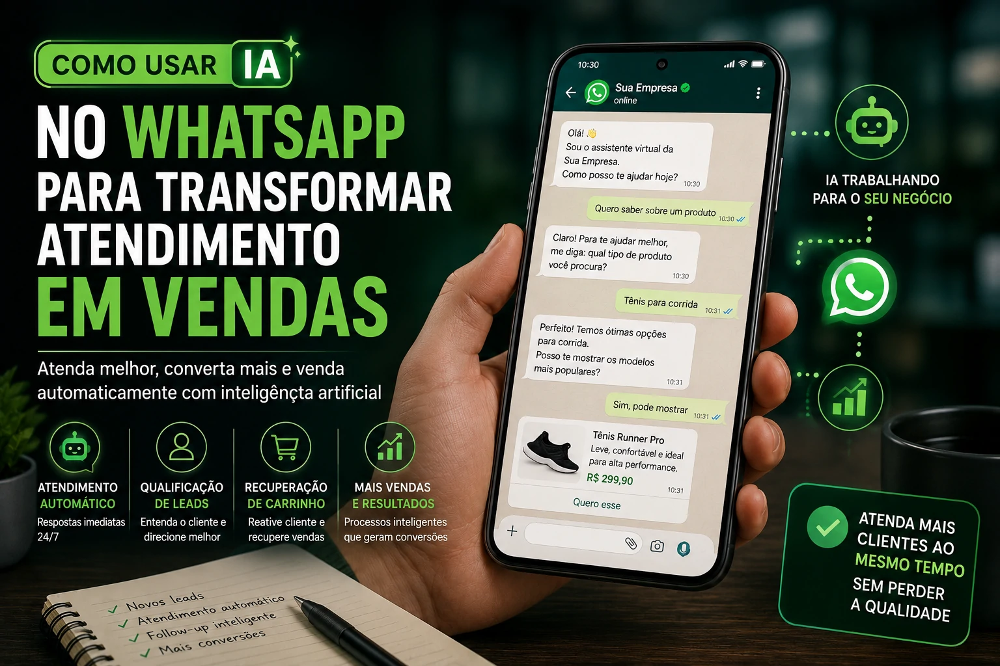
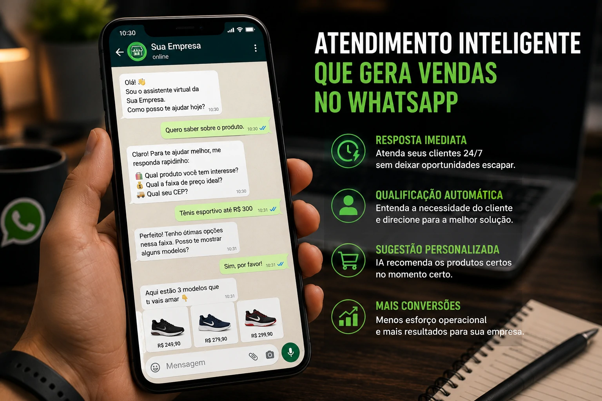

O WhatsApp deixou de ser apenas um canal de atendimento. Em 2026, ele se consolidou como um dos principais ambientes de venda para empresas brasileiras.

O problema é que muita operação ainda funciona no modo manual.

Mensagem por mensagem.

Cliente por cliente.

Sem escala.

É aí que entra a inteligência artificial.

Com IA integrada ao WhatsApp, empresas conseguem responder mais rápido, qualificar melhor os leads e automatizar processos comerciais sem perder personalização.

## O WhatsApp virou canal central de vendas

No Brasil, o WhatsApp virou infraestrutura comercial.

Muitas empresas usam o aplicativo como principal ponto de contato para:

- primeiro atendimento  
- orçamento  
- fechamento  
- suporte  
- pós-venda  

Mas existe um gargalo.

Volume.

Quando a demanda cresce, o atendimento trava.

E cliente esperando é cliente esfriando.

### A velocidade virou fator de conversão

Quem responde primeiro tem vantagem.

Simples assim.

IA reduz esse tempo para segundos.

## Onde a IA entra na operação comercial

A inteligência artificial não substitui o comercial.

Ela organiza o fluxo.

E acelera.

Na prática:

### Qualificação automática de leads

Antes de chegar no vendedor, o sistema já pode perguntar:

- qual produto deseja  
- faixa de orçamento  
- urgência  
- cidade  
- perfil da empresa  

Quando o vendedor entra, entra no momento certo.

### Recuperação de oportunidades perdidas

Clientes somem.

Isso é normal.

Mas IA pode reativar:

- carrinhos abandonados  
- orçamentos esquecidos  
- contatos frios  

Tudo automaticamente.

### Follow-up inteligente

O maior erro comercial é esquecer de acompanhar.

A IA não esquece.

## O impacto direto no faturamento

Empresas que automatizam o WhatsApp ganham em três frentes:

### Mais velocidade

Resposta imediata.

Sem fila.

Sem espera.

### Mais eficiência

Equipe foca em vendas complexas.

Não em tarefas repetitivas.

### Mais conversão

Menos perda de lead.

Mais oportunidade aproveitada.

Esse ganho é operacional e financeiro.

## O erro que muitas empresas ainda cometem

Automatizar não significa robotizar.

Esse é o erro.

Mensagens frias e mecânicas afastam clientes.

O ideal é usar IA para:

- acelerar  
- organizar  
- priorizar  
- personalizar  

A experiência precisa continuar humana.

## O novo comercial brasileiro passa pelo WhatsApp

O comportamento do cliente mudou.

E o processo comercial também.

Empresas que ainda operam no manual estão perdendo velocidade competitiva.

O WhatsApp já é canal de venda.

A IA está transformando esse canal em máquina de conversão.

Quem implementar primeiro, aprende primeiro.

E vende primeiro.