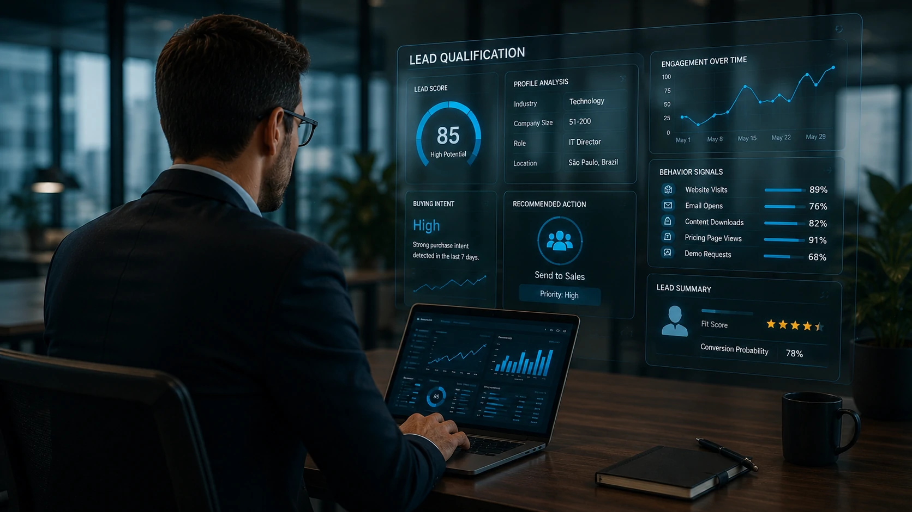
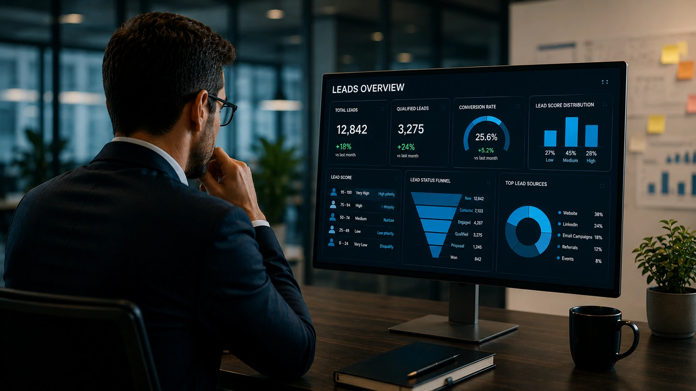

*Empresas B2B geram milhares de contatos todos os meses, mas poucas conseguem identificar rapidamente quais realmente têm potencial de compra. A inteligência artificial está mudando esse cenário ao transformar grandes volumes de dados em decisões comerciais mais rápidas e precisas.*

## O que é qualificação de leads B2B com inteligência artificial

*Imagem: plataformas de IA analisam milhares de sinais para identificar oportunidades comerciais com maior potencial de conversão.*

A qualificação de leads consiste em identificar quais contatos possuem maior probabilidade de se tornarem clientes.

Tradicionalmente esse trabalho era realizado manualmente pelos vendedores, consumindo horas de análise e aumentando o risco de decisões baseadas apenas na experiência individual.

Com a chegada da **Inteligência Artificial**, esse processo passou a utilizar algoritmos capazes de analisar milhares de variáveis simultaneamente.

### Como a IA analisa um lead

Os modelos conseguem avaliar informações como:

- cargo do contato;
- segmento da empresa;
- tamanho do negócio;
- histórico de navegação;
- abertura de e-mails;
- interação com conteúdos;
- comportamento no site;
- momento da jornada de compra.

A partir desses sinais, a plataforma calcula automaticamente a probabilidade de conversão.

### Por que isso é importante

Em vez de distribuir todos os contatos igualmente para a equipe comercial, a empresa direciona esforços apenas para oportunidades realmente relevantes.

Isso reduz desperdícios e melhora significativamente a produtividade da operação.

Para empresas que já utilizam CRM inteligente, vale entender também **como implementar CRM com IA**:

https://noticiatech.com.br/ferramentas/como-implementar-crm-com-ia-empresas-guia-pratico/

## Como a IA melhora o processo comercial

*Imagem: automação comercial utilizando IA para acelerar a geração de oportunidades e reduzir tarefas repetitivas.*

A principal vantagem da **IA** não está apenas em encontrar bons leads, mas em acelerar todo o ciclo comercial.

Ela elimina tarefas operacionais, reduz o tempo de resposta e permite que vendedores concentrem esforços em negociações mais estratégicas.

### Lead scoring inteligente

O lead scoring tradicional utiliza regras fixas.

Já a IA aprende continuamente com novos dados, ajustando automaticamente a pontuação conforme o comportamento dos clientes.

Isso torna as previsões muito mais precisas.

### Automação das primeiras interações

Outra aplicação importante envolve agentes inteligentes capazes de:

- responder perguntas iniciais;
- agendar reuniões;
- atualizar o CRM;
- enviar conteúdos personalizados;
- identificar intenção de compra.

Essa combinação entre **CRM**, automação e agentes inteligentes vem transformando o conceito de vendas B2B.

Empresas que desejam ampliar esse processo também podem conhecer **os melhores CRMs com IA para empresas**:

https://noticiatech.com.br/ferramentas/melhores-crms-com-ia-2026-comparativo-empresas/

Além disso, a evolução dos **Agentes de IA** tende a ampliar ainda mais esse cenário, tornando operações comerciais cada vez mais autônomas e orientadas por dados.

## Principais benefícios da IA na qualificação de leads

*Imagem: inteligência artificial aumentando a eficiência da equipe comercial por meio da automação da qualificação de leads.*

À medida que as empresas ampliam suas operações comerciais, cresce também a dificuldade de analisar manualmente todos os contatos gerados por campanhas de marketing, eventos e canais digitais.

A **Inteligência Artificial** permite transformar esse volume de dados em decisões comerciais mais rápidas e consistentes.

### Mais produtividade para a equipe de vendas

Ao eliminar tarefas repetitivas, a IA reduz o tempo gasto com análises manuais e libera os vendedores para atividades que realmente exigem interação humana.

Entre os principais ganhos estão:

- priorização automática dos melhores leads;
- redução do tempo de resposta;
- atualização automática do CRM;
- maior número de oportunidades trabalhadas por vendedor.

### Melhor taxa de conversão

Quando os vendedores dedicam mais tempo aos contatos com maior intenção de compra, a tendência é aumentar a eficiência do funil comercial.

Além disso, a IA consegue identificar padrões que normalmente passariam despercebidos em uma análise manual.

Empresas que desejam ampliar esse nível de automação também podem conhecer **AI Process Automation**, conceito que integra inteligência artificial aos processos corporativos:

https://noticiatech.com.br/automacao/o-que-e-ai-process-automation-automacao-processos-inteligencia-artificial/

## Como começar a utilizar IA para qualificar leads

A adoção da IA não exige substituir toda a operação comercial.

Na maioria dos casos, a implementação acontece de forma gradual, aproveitando ferramentas que já fazem parte da rotina da empresa.

### Escolha um CRM com recursos de IA

O primeiro passo é utilizar uma plataforma capaz de centralizar informações comerciais e aplicar inteligência sobre esses dados.

CRMs modernos conseguem automatizar classificação de contatos, sugerir prioridades e fornecer previsões mais precisas para gestores e vendedores.

### Automatize processos aos poucos

Em vez de automatizar toda a operação de uma única vez, é recomendável começar por atividades repetitivas, como:

- classificação de leads;
- envio de e-mails;
- atualização de cadastros;
- agendamento de reuniões;
- distribuição automática de oportunidades.

Essa estratégia reduz riscos e facilita a adaptação da equipe.

### A IA complementa o trabalho humano

Embora os modelos de IA estejam cada vez mais sofisticados, decisões estratégicas, negociações complexas e construção de relacionamento continuam dependendo das pessoas.

A maior vantagem está justamente na combinação entre inteligência humana e automação.

Nos próximos anos, empresas que utilizarem **IA**, **CRM inteligente**, automação e **Agentes de IA** deverão construir operações comerciais mais eficientes, escaláveis e orientadas por dados. Mais do que reduzir custos, essa transformação representa uma nova forma de identificar oportunidades e acelerar o crescimento dos negócios.

---