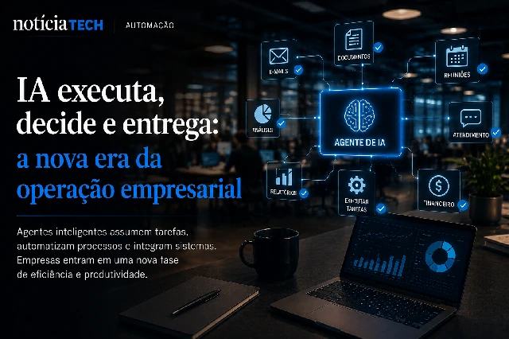
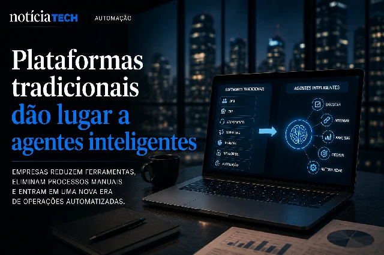

*Durante anos, empresas construíram operações inteiras em torno de softwares corporativos tradicionais. Agora, uma nova transformação começa a ganhar força dentro do mercado global: agentes de inteligência artificial capazes de executar tarefas, tomar decisões operacionais e automatizar fluxos completos começam a substituir a lógica tradicional dos aplicativos empresariais.*

## Empresas começam a trocar softwares por agentes inteligentes

O avanço da inteligência artificial generativa está criando uma mudança estrutural dentro do mercado corporativo.

Em vez de depender exclusivamente de softwares tradicionais, empresas começam a utilizar agentes inteligentes capazes de:
- executar tarefas;
- interpretar contexto;
- automatizar operações;
- acessar múltiplos sistemas;
- responder decisões operacionais em tempo real.

Na prática, o mercado começa a sair da era dos softwares estáticos para entrar na era dos sistemas operacionais inteligentes.

Isso significa que, em muitos casos, profissionais não precisarão mais navegar manualmente entre:
- CRMs;
- plataformas de atendimento;
- sistemas financeiros;
- ferramentas de produtividade;
- softwares internos.

Os próprios agentes poderão executar parte dessas operações automaticamente.

### A IA deixa de apenas responder e começa a agir

Nos primeiros anos da IA generativa, o foco estava em chatbots e assistentes de texto.

Agora, o mercado avança para uma nova fase:
IA com capacidade operacional.

Isso inclui agentes capazes de:
- acessar ferramentas;
- navegar sistemas;
- executar comandos;
- integrar plataformas;
- automatizar processos completos.

Grandes empresas de tecnologia já aceleram investimentos nesse modelo:
- OpenAI;
- Microsoft;
- Google;
- Anthropic;
- Salesforce;
- Notion.

O objetivo é transformar IA em uma camada operacional permanente dentro das empresas.

Essa transformação também se conecta ao avanço da IA corporativa e da automação empresarial que já vem mudando o desenvolvimento de software nos últimos meses:

[IA acelera produção de software e muda o papel dos programadores nas empresas](https://noticiatech.com.br/inteligencia-artificial/ia-acelera-produ%C3%A7%C3%A3o-de-software-e-muda-o-papel-dos-programadores-nas-empresas/)

## O mercado de SaaS pode entrar em transformação profunda

Durante mais de uma década, o mercado SaaS dominou o ambiente corporativo.

Empresas passaram a operar através de dezenas de plataformas:
- CRM;
- ERP;
- atendimento;
- marketing;
- analytics;
- automação;
- colaboração.

Agora, agentes inteligentes começam a criar uma nova lógica operacional:
menos interfaces e mais execução automática.

Em vez de abrir vários aplicativos diferentes, usuários poderão simplesmente solicitar objetivos:
- gerar relatório;
- organizar reuniões;
- responder clientes;
- atualizar contratos;
- criar campanhas;
- consolidar dados.

O agente passa a operar nos bastidores.

Isso reduz fricção operacional e altera profundamente a experiência corporativa tradicional.

### O software tradicional pode perder protagonismo

Especialistas do setor já começam a discutir um possível reposicionamento do mercado SaaS.

Os softwares não devem desaparecer completamente, mas podem deixar de ser o centro da experiência operacional.

A IA tende a se tornar a principal interface.

Nesse cenário:
- aplicativos viram infraestrutura invisível;
- agentes se tornam camada principal;
- automação substitui navegação manual;
- empresas operam por objetivos e não mais por ferramentas isoladas.

Essa mudança pode afetar:
- modelos de assinatura;
- retenção de usuários;
- produtividade corporativa;
- equipes operacionais;
- desenvolvimento de software empresarial.

O movimento também se conecta ao crescimento da disputa global pela infraestrutura de IA e pelo controle dos ecossistemas corporativos:

[OpenAI começa a reduzir dependência da Microsoft e mercado de IA entra em nova guerra bilionária](https://noticiatech.com.br/inteligencia-artificial/openai-come%C3%A7a-a-reduzir-depend%C3%AAncia-da-microsoft-e-mercado-de-ia-entra-em-nova-guerra-bilion%C3%A1ria/)

## Empresas AI-first começam a ganhar vantagem competitiva

O avanço dos agentes inteligentes também acelera o surgimento das chamadas empresas “AI-first”.

Nesse modelo, a inteligência artificial deixa de ser apenas ferramenta complementar e passa a ocupar posição central na operação corporativa.

Isso inclui:
- automação de atendimento;
- coordenação operacional;
- análise de dados;
- gestão de tarefas;
- produtividade;
- suporte interno;
- geração de conteúdo;
- execução de fluxos empresariais.

Empresas que conseguem integrar agentes rapidamente tendem a ganhar:
- velocidade operacional;
- redução de custos;
- maior escalabilidade;
- produtividade ampliada;
- vantagem competitiva.

Ao mesmo tempo, cresce a pressão sobre empresas que ainda operam com estruturas tradicionais e altamente manuais.

### A próxima fase da IA será operacional

A inteligência artificial está deixando de ser apenas uma ferramenta de apoio.

Ela começa a se transformar em uma camada operacional permanente dentro das empresas.

Enquanto o mercado ainda debate chatbots e geração de conteúdo, a próxima disputa já acontece em outro nível:
quem conseguirá construir operações inteiras coordenadas por agentes inteligentes.

Esse movimento pode redefinir:
- produtividade corporativa;
- softwares empresariais;
- modelos de trabalho;
- estrutura operacional das empresas;
- economia digital global.

E tudo indica que essa transformação ainda está apenas começando.