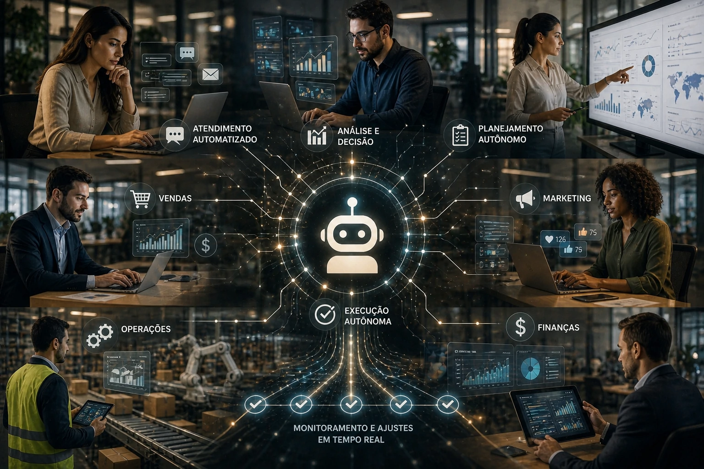

A nova fase da <u>**inteligência artificial**</u> começa a sair do campo experimental e entrar no centro das operações empresariais.

Depois da explosão da IA generativa, uma nova camada tecnológica começa a ganhar força: a <u>**IA agêntica**</u>.

O conceito ainda é novo para grande parte do mercado, mas pode representar um avanço importante na forma como empresas automatizam decisões, executam tarefas e escalam produtividade.

Diferente da IA tradicional baseada em resposta, a lógica agora é autonomia.

## O que é IA agêntica e por que ela importa

A <u>**IA agêntica**</u> funciona com base em objetivos.

Em vez de apenas responder comandos, esses sistemas conseguem:

- interpretar contexto;
- planejar etapas;
- executar ações;
- avaliar resultados;
- corrigir rotas.

Na prática, isso transforma a IA em um agente operacional.

É um salto importante em relação à primeira geração de automação.

Se antes a IA precisava de comando constante, agora ela começa a agir com mais independência.

Esse modelo já começa a influenciar áreas como <u>**automação empresarial**</u>, atendimento, marketing e operações.

## O que muda em relação à automação tradicional

Na automação tradicional, tudo depende de regras fixas.

Se uma condição acontece, uma ação é executada.

Na IA agêntica, a lógica muda.

O sistema pode avaliar múltiplos cenários e decidir qual caminho seguir.

### Em vendas

Em vez de simplesmente disparar e-mails automáticos, um agente pode:

- analisar perfil do lead;
- entender comportamento;
- adaptar abordagem;
- escolher momento ideal.

### Em atendimento

Ao invés de seguir roteiros fechados, agentes inteligentes conseguem adaptar conversas conforme o contexto.

Isso aumenta eficiência e personalização.

Para empresas que já trabalham com <u>**automação de processos**</u>, esse pode ser o próximo passo evolutivo.

## Onde a IA agêntica pode gerar impacto real

O impacto tende a ser maior em áreas com alto volume de decisões.

### Marketing

Campanhas podem ser ajustadas automaticamente conforme resultados.

### Vendas

Leads podem ser qualificados com menos intervenção humana.

### Atendimento

Respostas mais rápidas, personalizadas e contextuais.

### Operações

Processos internos podem ganhar autonomia operacional.

A lógica central é clara:

menos execução manual.

Mais inteligência operacional.

Empresas que já investem em <u>**eficiência operacional**</u> podem acelerar ganhos com esse modelo.

## O desafio que vem junto com essa nova fase

Apesar do potencial, existe um ponto crítico.

A IA agêntica depende de bons processos.

Sem estrutura, dados organizados e regras claras, a autonomia pode gerar ruído em vez de eficiência.

Os principais desafios são:

- integração de sistemas;
- governança de dados;
- segurança operacional;
- qualidade da informação.

A vantagem competitiva não estará apenas em usar IA.

Mas em usar melhor.

E isso começa agora.

Empresas que entenderem esse movimento cedo podem ganhar vantagem antes que o mercado inteiro faça a mesma transição.