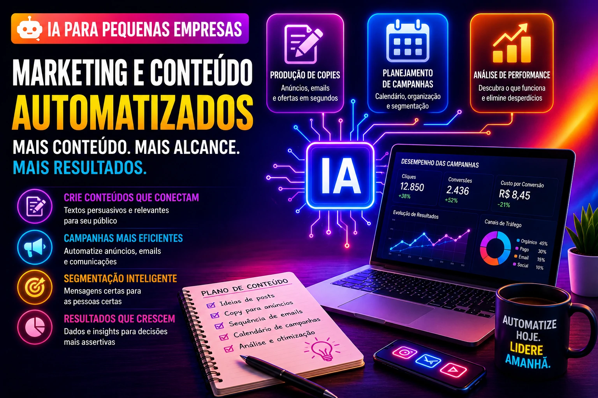

Pequenas empresas sempre tiveram um desafio estrutural: fazer mais com menos.

Menos equipe.

Menos tempo.

Menos margem para erro.

Em 2026, a inteligência artificial começou a mudar essa lógica.

Hoje, processos que antes consumiam horas podem ser automatizados em minutos.

E isso não é mais privilégio de grandes empresas.

A tecnologia ficou acessível.

E a vantagem agora está na velocidade de implementação.

## Atendimento ao cliente

Atendimento é um dos processos mais fáceis de automatizar.

E um dos que mais consomem tempo.

Hoje, IA consegue:

### Responder perguntas repetitivas

Exemplos:

- preços  
- prazo de entrega  
- disponibilidade  
- formas de pagamento  

### Direcionar clientes corretamente

Separando:

- suporte  
- vendas  
- financeiro  

Isso reduz ruído operacional.

## Processo comercial e vendas

Vender exige repetição.

Mas repetição consome energia.

A IA pode automatizar:

### Qualificação de leads

Filtrando:

- interesse  
- orçamento  
- urgência  

### Follow-up automático

Muitas vendas morrem por falta de acompanhamento.

Esse é um problema clássico.

### Recuperação de oportunidades

Clientes esquecem.

A IA lembra.

## Marketing e produção de conteúdo

Marketing também virou campo forte para automação.

Hoje é possível automatizar:

### Produção de copies

Anúncios.

E-mails.

Ofertas.

### Planejamento de campanhas

Organização.

Calendário.

Segmentação.

### Análise de performance

Entender o que funciona.

E cortar desperdício.

## Financeiro e cobrança

Muitas pequenas empresas ainda operam manualmente no financeiro.

Isso gera:

- atraso  
- erro  
- retrabalho  

IA pode ajudar em:

### Cobrança automática

Lembretes.

Confirmações.

Recuperação.

### Organização financeira

Fluxo de caixa.

Previsão.

Alertas.

## RH e recrutamento

Mesmo empresas pequenas contratam.

E contratar mal custa caro.

IA pode automatizar:

### Triagem de currículos

Filtrando perfis.

### Agendamento de entrevistas

Sem troca infinita de mensagens.

### Comunicação interna

Onboarding.

Informações.

Documentos.

## Suporte técnico

Quem vende serviço precisa sustentar atendimento.

A IA ajuda em:

### Base de conhecimento inteligente

Respostas rápidas.

### Organização de chamados

Priorização automática.

### Resolução inicial

Redução de carga humana.

## Dados e tomada de decisão

Muitas empresas têm dados.

Poucas usam.

Esse é o problema.

IA consegue:

### Ler padrões

Venda.

Comportamento.

Operação.

### Gerar insights

Onde cortar.

Onde investir.

Onde melhorar.

## O erro não é não usar IA

O erro é achar que IA substitui gestão.

Ela não substitui.

Ela acelera.

Automatizar processo ruim só acelera problema.

Por isso:

primeiro organiza.

Depois automatiza.

## Quem automatizar primeiro cresce primeiro

Pequenas empresas não precisam competir em tamanho.

Precisam competir em eficiência.

E eficiência hoje passa por automação.

A inteligência artificial deixou de ser tecnologia de laboratório.

Virou ferramenta de operação.

Quem implementar cedo vai construir vantagem antes do mercado amadurecer.