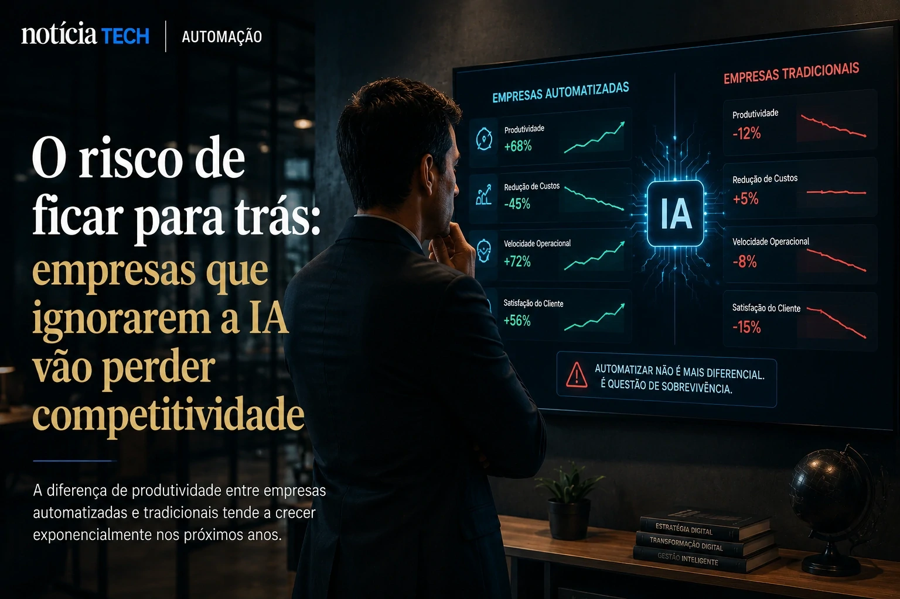

*Enquanto o mercado acompanha os movimentos bilionários das gigantes da tecnologia, uma transformação mais discreta começa a ganhar força entre pequenas empresas brasileiras. Ferramentas de automação, agentes inteligentes e plataformas low-code estão mudando operações inteiras sem exigir grandes estruturas de TI. Em 2026, a adoção silenciosa de IA por PMEs virou um dos movimentos mais estratégicos da economia digital.*

## A automação deixou de ser exclusividade das grandes empresas

Durante muitos anos, soluções de automação corporativa eram associadas a grandes corporações com equipes robustas de tecnologia. Em 2026, esse cenário mudou rapidamente.

Ferramentas baseadas em **Inteligência Artificial**, integração via API e plataformas SaaS passaram a reduzir drasticamente o custo operacional para pequenas empresas. Hoje, negócios locais conseguem automatizar:

- atendimento ao cliente;
- emissão de notas fiscais;
- CRM;
- campanhas de marketing;
- análise financeira;
- controle de estoque;
- geração de relatórios.

Na prática, isso significa que pequenas empresas conseguem competir com estruturas muito maiores utilizando softwares acessíveis e modelos operacionais enxutos.

O impacto aparece principalmente em setores como:

- e-commerce;
- escritórios contábeis;
- agências de marketing;
- clínicas;
- imobiliárias;
- pequenos varejistas;
- empresas de serviços.

Em muitos casos, um único operador agora consegue executar tarefas que antes exigiam equipes inteiras.

Além da redução de custos, a velocidade operacional virou diferencial competitivo. Empresas que automatizam processos conseguem responder clientes mais rápido, gerar propostas automaticamente e reduzir falhas humanas.

Esse avanço acompanha um movimento mais amplo do mercado corporativo brasileiro, onde agentes inteligentes e automação operacional começam a substituir softwares tradicionais em várias áreas das empresas.

Para entender como essa transformação está acontecendo, vale conferir também:

- [Empresas começam a substituir softwares tradicionais por agentes de IA](https://noticiatech.com.br/automacao/empresas-come%C3%A7am-a-substituir-softwares-tradicionais-por-agentes-de-ia/)
- [Empresas dobram investimentos em IA corporativa e Brasil acelera adoção de agentes inteligentes](https://noticiatech.com.br/inteligencia-artificial/empresas-dobram-investimentos-em-ia-corporativa-e-brasil-acelera-ado%C3%A7%C3%A3o-de-agentes-inteligentes/)
- [Como empresas usam IA para automatizar processos](https://noticiatech.com.br/automacao/como-empresas-usam-ia-para-automatizar-processos/)

## Plataformas low-code aceleram adoção de IA nas PMEs

Outro fator decisivo para essa transformação é o crescimento das plataformas **low-code** e **no-code**.

Essas soluções permitem criar automações sem necessidade de programação avançada. Em vez de depender exclusivamente de desenvolvedores, pequenas equipes conseguem integrar sistemas utilizando interfaces visuais.

Ferramentas modernas já permitem:

- criar fluxos automatizados;
- integrar WhatsApp com CRM;
- automatizar e-mails;
- gerar relatórios inteligentes;
- conectar marketplaces;
- utilizar chatbots com IA generativa.

Esse movimento também favorece empresas brasileiras que possuem orçamento limitado para tecnologia.

Em vez de investir milhares de reais em desenvolvimento personalizado, muitos negócios passaram a operar com assinaturas mensais acessíveis e automações prontas.

Além disso, a popularização da **IA generativa** reduziu a barreira de entrada para criação de conteúdo, suporte e produtividade.

Hoje, pequenas empresas utilizam IA para:

### Produção de conteúdo

Ferramentas inteligentes ajudam a gerar descrições de produtos, artigos, anúncios e textos para redes sociais.

### Atendimento automatizado

Chatbots integrados ao WhatsApp conseguem responder clientes 24 horas por dia.

### Gestão operacional

Softwares inteligentes já identificam padrões financeiros, gargalos e oportunidades de otimização.

Esse avanço cria um novo perfil de empresa digital: operações menores, mais enxutas e altamente automatizadas.

A tendência também aparece em outras áreas estratégicas do mercado:

- [WhatsApp Business ganha automações com IA e vira ferramenta central para pequenas empresas no Brasil](https://noticiatech.com.br/negocios/whatsapp-business-ganha-automa%C3%A7%C3%B5es-com-ia-e-vira-ferramenta-central-para-pequenas-empresas-no-brasil/)
- [IA para pequenas empresas: processos automatizados aceleram produtividade](https://noticiatech.com.br/automacao/ia-pequenas-empresas-processos-automatizados/)
- [CRM com IA e automação está mudando processos comerciais nas empresas](https://noticiatech.com.br/negocios/crm-com-ia-automacao-vendas-processos-comerciais/)

## O risco para empresas que ignorarem a nova onda de automação

Embora a adoção de IA ainda esteja em estágio inicial em muitas pequenas empresas brasileiras, o mercado já começa a criar uma nova divisão competitiva.

De um lado, empresas que automatizam processos rapidamente.

Do outro, negócios que continuam operando com estruturas lentas, manuais e pouco escaláveis.

A diferença de produtividade tende a crescer nos próximos anos.

Empresas automatizadas conseguem:

- reduzir custos fixos;
- operar com menos funcionários;
- atender mais clientes;
- responder mais rápido;
- escalar operações sem ampliar equipes na mesma proporção.

Enquanto isso, empresas tradicionais começam a enfrentar dificuldade para competir em velocidade e eficiência operacional.

O movimento lembra outras grandes transições tecnológicas do passado, mas com uma diferença importante: desta vez, a adoção pode acontecer muito mais rápido.

A combinação entre **IA generativa**, automação acessível e integração simplificada está acelerando a transformação digital até mesmo em negócios extremamente pequenos.

Empresas que demorarem para adaptar operações podem enfrentar o mesmo problema observado em outras ondas tecnológicas recentes: perda gradual de competitividade, redução de margens e dificuldade para acompanhar concorrentes mais eficientes.

Esse cenário já começa a preocupar executivos e gestores em diversos setores:

- [Empresas adiam investimentos em IA e perdem competitividade](https://noticiatech.com.br/negocios/empresas-adiam-investimentos-ia-perdem-competitividade/)
- [Anthropic quadruplica receita com IA e envia recado ao mercado: empresas que demorarem podem ficar para trás](https://noticiatech.com.br/inteligencia-artificial/anthropic-quadruplica-receita-com-ia-e-envia-recado-ao-mercado-empresas-que-demorarem-podem-ficar-para-tr%C3%A1s/)
- [Por que empresas estão redesenhando processos internos com IA e não apenas automatizando tarefas](https://noticiatech.com.br/negocios/por-que-empresas-est%C3%A3o-redesenhando-processos-internos-com-ia-e-n%C3%A3o-apenas-automatizando-tarefas/)

Nos próximos anos, a discussão provavelmente deixará de ser “vale a pena usar IA?” para se transformar em “como sobreviver sem automação inteligente?”.

---