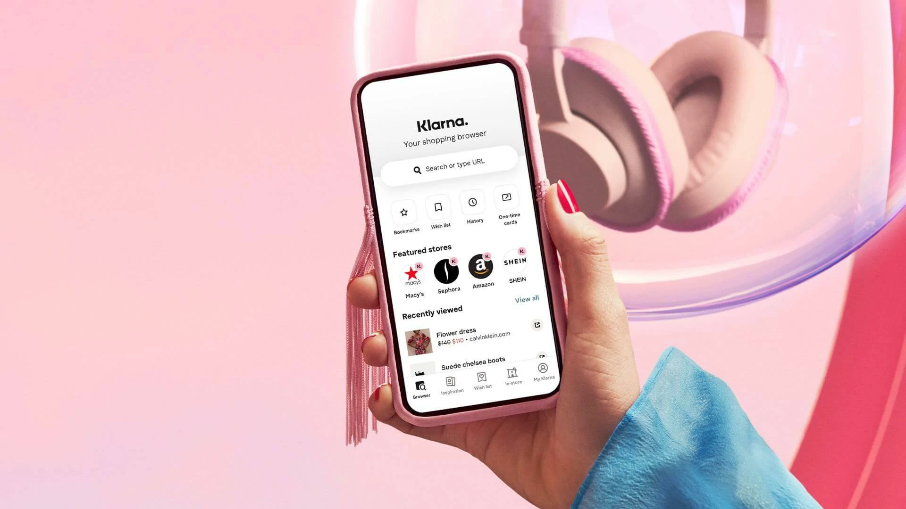

# Klarna e a automação do suporte: o que aconteceu quando a IA assumiu o atendimento

A Klarna virou um dos casos mais observados do mercado ao substituir parte relevante do atendimento ao cliente por inteligência artificial.

O movimento trouxe ganhos claros de produtividade, redução de custos operacionais e maior capacidade de escala.

Mas também revelou um limite importante: nem toda interação pode ser automatizada sem impacto na experiência do cliente.

O caso se tornou uma referência prática para empresas que estudam automação de suporte e implementação de IA em operações de atendimento.

## A Klarna acelerou a automação e reduziu sua dependência de equipes humanas

Nos primeiros meses da mudança, a empresa transferiu grande parte das interações de suporte para sistemas de inteligência artificial.

A proposta era simples: automatizar o alto volume de demandas repetitivas, reduzir tempo de resposta e diminuir custos operacionais.

Na prática, a IA passou a assumir tarefas como:

### Respostas para dúvidas frequentes

Questões simples como status de pagamento, prazos e cobranças passaram a ser resolvidas automaticamente.

### Triagem inicial de chamados

Antes de chegar a um humano, a IA passou a identificar o problema e direcionar o cliente.

### Atendimento em larga escala

A capacidade de responder milhares de clientes simultaneamente aumentou sem expansão proporcional da equipe.

## Onde a automação começou a falhar

A operação mostrou eficiência no início, mas começou a enfrentar limitações em situações menos previsíveis.

Demandas mais complexas exigiam interpretação contextual, análise emocional e flexibilidade de decisão.

### Casos mais complexos ficaram comprometidos

Problemas específicos de cobrança, disputas e exceções operacionais passaram a gerar atrito.

Em alguns casos, o cliente precisava repetir informações diversas vezes antes de conseguir atendimento humano.

### A experiência do cliente sofreu impacto

Embora o tempo médio de resposta tenha caído, parte da satisfação foi afetada pela dificuldade em resolver casos fora do padrão.

Esse é um problema comum em operações excessivamente automatizadas.

## O que Sebastian Siemiatkowski disse sobre a estratégia

Sebastian Siemiatkowski explicou que a intenção nunca foi apenas cortar custos.

Segundo ele, a prioridade era tornar a operação mais eficiente e escalável.

Mas reconheceu que o avanço da automação foi rápido demais em alguns pontos.

### O aprendizado estratégico

O principal ajuste foi entender que eficiência operacional não depende apenas de velocidade.

Qualidade de atendimento e resolução efetiva continuam sendo métricas críticas.

## O impacto operacional da IA dentro da Klarna

A automação reduziu parte importante da carga operacional do suporte.

Isso trouxe efeitos relevantes:

### Menor custo por atendimento

Com menos necessidade de intervenção humana em tarefas repetitivas.

### Maior velocidade de resposta

O atendimento inicial ficou mais rápido e disponível em maior escala.

### Melhor distribuição da equipe humana

Os atendentes passaram a focar em casos mais críticos e estratégicos.

Esse modelo híbrido tende a ser mais sustentável no longo prazo.

## O que empresas podem aprender com esse caso

O caso da Klarna reforça uma realidade importante do mercado.

Automação não significa substituição total.

Significa redistribuição inteligente de tarefas.

Empresas que automatizam corretamente conseguem:

### Escalar sem inflar custos

Aumentando produtividade sem expandir operação na mesma velocidade.

### Melhorar eficiência operacional

Reduzindo gargalos em processos repetitivos.

### Liberar equipes para tarefas estratégicas

Permitindo foco maior em retenção, relacionamento e resolução complexa.

## Como aplicar esse modelo em pequenas e médias empresas

Negócios menores também podem usar a mesma lógica.

Mesmo sem infraestrutura de uma fintech global, algumas etapas podem ser automatizadas imediatamente.

### Primeiro atendimento automatizado

Bots podem resolver dúvidas básicas rapidamente.

### Qualificação de demandas

Filtrar e organizar solicitações antes do atendimento humano.

### Automação de pós-venda

Acompanhamento, notificações e suporte inicial podem ser automatizados.

O caso da Klarna deixa uma mensagem clara para o mercado: a IA acelera operações, reduz custos e amplia escala, mas a vantagem real aparece quando tecnologia e pessoas trabalham juntas.