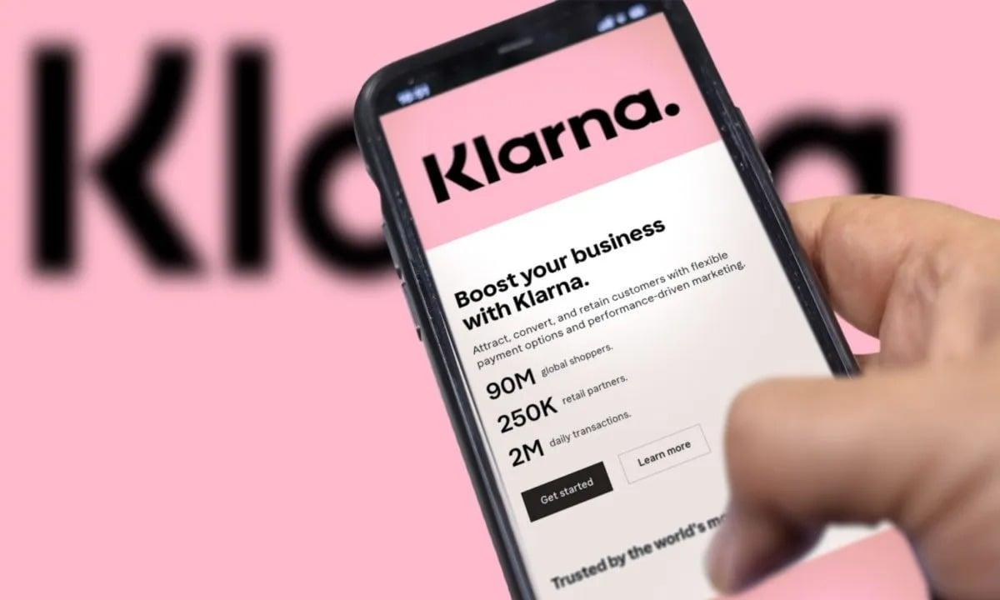
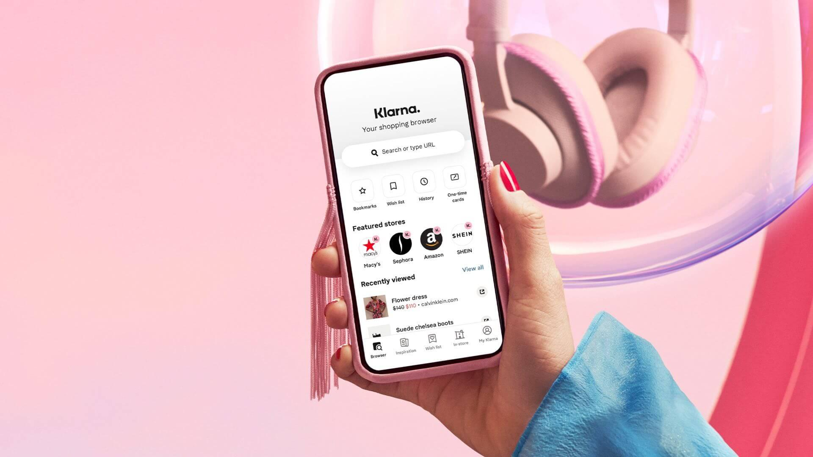

A Klarna, fintech sueca conhecida pelo modelo “compre agora e pague depois”, começou a substituir parte do atendimento ao cliente por inteligência artificial. A mudança reduziu custos, aumentou eficiência, mas também trouxe problemas que obrigaram a empresa a rever parte da estratégia.

## A Klarna substituiu atendentes por IA e depois precisou corrigir a rota

Nos primeiros movimentos, a empresa acelerou a automação e reduziu equipes de suporte. A inteligência artificial passou a responder grande parte das interações com clientes, assumindo tarefas repetitivas e aumentando a velocidade de atendimento.

## Como essa mudança aconteceu na prática

A transição não foi linear.

No início, a IA funcionou bem para escalar o atendimento. A empresa conseguiu lidar com um volume maior de clientes sem aumentar a equipe.

Com o tempo, começaram a surgir falhas em atendimentos mais complexos. Parte dos clientes teve problemas não resolvidos, o que impactou a experiência.

A Klarna então ajustou a estratégia, reforçando novamente o papel do atendimento humano em situações mais críticas.

## O que o CEO da Klarna disse sobre a mudança

O CEO Sebastian Siemiatkowski afirmou que o objetivo nunca foi apenas reduzir custos, mas tornar a operação mais eficiente.

Ele também reconheceu que a automação precisa de equilíbrio. Segundo ele, em alguns momentos a empresa avançou rápido demais e precisou corrigir o caminho.

## O impacto real nos números

A inteligência artificial passou a assumir uma parte significativa do atendimento inicial, reduzindo carga operacional e tempo de resposta.

Ao mesmo tempo, a empresa percebeu que manter pessoas em pontos estratégicos continua sendo essencial para garantir qualidade.

## O que esse caso mostra sobre o mercado

O movimento da Klarna mostra que a automação funciona, mas não resolve tudo sozinha.

Empresas que tentam substituir totalmente equipes acabam enfrentando limitações. As que combinam IA com operação humana tendem a alcançar melhores resultados.

## Como aplicar isso em um negócio menor

Mesmo sem estrutura de uma fintech global, o modelo pode ser aplicado.

Automatizar o primeiro contato, responder dúvidas frequentes e filtrar demandas já gera ganho imediato.

O resultado aparece na produtividade, no tempo de resposta e na capacidade de escalar sem aumentar a equipe na mesma proporção.