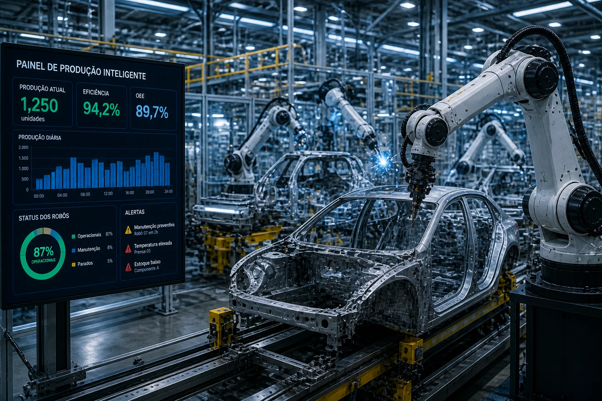

*A inteligência artificial começa a sair do software e ganhar presença física dentro das operações. A nova movimentação da Meta reforça um movimento que pode acelerar a automação em logística, indústria e varejo.*

A entrada mais agressiva da **__Meta__** no setor de robótica mostra que a próxima fase da inteligência artificial pode ser menos digital e mais operacional.

A empresa adquiriu a startup Assured Robot Intelligence (ARI), especializada em modelos de IA para robôs humanoides.

O movimento amplia a atuação da companhia em uma área estratégica que vai além de redes sociais, publicidade e modelos de linguagem.

O foco agora é automação física.

E isso muda o jogo.

Grandes empresas como **__Amazon__**, **__Tesla__** e **__Nvidia__** também aceleraram investimentos em robótica avançada nos últimos meses.

O objetivo é claro:

transformar operações físicas em sistemas mais inteligentes, rápidos e eficientes.

Para empresas, isso significa uma nova camada de produtividade.

## A robótica está entrando em uma nova fase

Durante anos, robôs industriais foram limitados a tarefas repetitivas e ambientes previsíveis.

Agora esse cenário começa a mudar.

Com modelos mais avançados de IA, os sistemas ganham autonomia operacional.

Isso significa:

- adaptação a mudanças no ambiente
- tomada de decisão contextual
- correção de falhas em tempo real
- aprendizado contínuo

Na prática, isso torna a automação mais flexível.

E flexibilidade operacional é uma vantagem importante em setores de alta demanda.

## Onde essa tecnologia pode impactar primeiro

A aplicação mais imediata está em áreas com grande repetição operacional.

Os setores mais impactados tendem a ser:

- logística
- indústria
- varejo
- centros de distribuição
- saúde

No setor logístico, por exemplo, robôs inteligentes podem otimizar separação de pedidos e movimentação de estoque.

Na indústria, a flexibilidade de produção pode aumentar sem necessidade de reprogramação constante.

No varejo, organização e reposição operacional podem ganhar mais velocidade.

O ganho é simples:

menos erro.

Mais eficiência.

Mais previsibilidade.

## O impacto prático para empresas brasileiras

No Brasil, custo operacional e baixa eficiência ainda são problemas centrais para muitas empresas.

A combinação entre robótica e IA pode atacar exatamente esses gargalos.

Empresas que operam com alto volume físico tendem a ganhar primeiro.

Isso vale para:

- e-commerce
- indústria
- operadores logísticos
- redes de varejo
- hospitais

A principal vantagem é operacional.

Menos dependência de processos manuais.

Mais escalabilidade.

Mais margem.

## A próxima disputa da inteligência artificial será física

A corrida da IA começa a mudar de eixo.

Se antes o foco estava em chatbots, automação digital e análise de dados, agora o mercado começa a migrar para execução no mundo real.

A movimentação da **__Meta__** reforça essa tendência.

Para empresas brasileiras, acompanhar esse movimento não é apenas questão de inovação.

É estratégia.

Quem entender cedo essa convergência entre automação física e inteligência artificial pode construir vantagem competitiva real nos próximos anos.