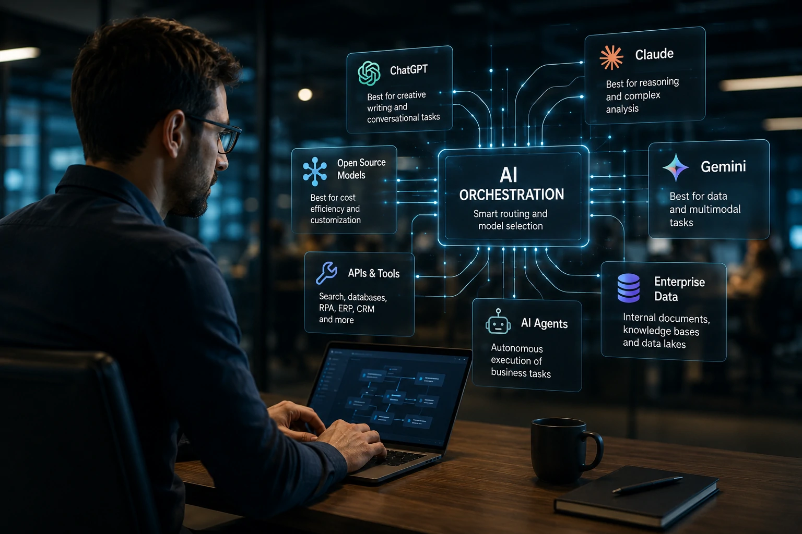
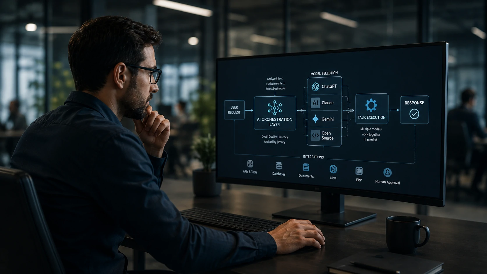
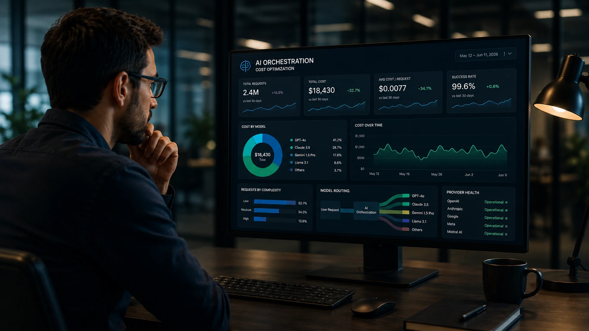

*As empresas deixaram de perguntar qual é o melhor modelo de inteligência artificial. A nova prioridade é descobrir como combinar diferentes modelos, ferramentas e agentes em uma única arquitetura inteligente. É exatamente nesse contexto que surge a AI Orchestration, uma abordagem que vem ganhando espaço como a próxima etapa da transformação digital baseada em IA.*

Nos primeiros anos da inteligência artificial generativa, a disputa era simples: qual modelo entregava as melhores respostas.

Hoje, essa pergunta perdeu parte da relevância.

Empresas perceberam que nenhum modelo é superior em absolutamente todas as tarefas. Enquanto alguns apresentam melhor capacidade de raciocínio, outros oferecem menor custo operacional, maior velocidade ou melhor integração com sistemas corporativos.

Como resultado, cresce rapidamente a adoção da chamada **AI Orchestration**, uma arquitetura capaz de utilizar diversos modelos de inteligência artificial simultaneamente, selecionando automaticamente a melhor opção para cada atividade.

Mais do que escolher entre ChatGPT, Claude, Gemini ou modelos open source, organizações começam a construir ambientes onde todas essas tecnologias trabalham juntas.

## O que é AI Orchestration?

AI Orchestration é uma camada de software responsável por coordenar diferentes componentes de inteligência artificial dentro de uma mesma arquitetura.

Em vez de enviar todas as solicitações para um único modelo, a plataforma decide automaticamente qual serviço utilizar em cada situação.

Essa decisão pode considerar fatores como:

- custo da inferência;
- velocidade de resposta;
- qualidade esperada;
- tipo da tarefa;
- disponibilidade do serviço;
- requisitos de segurança;
- políticas internas da empresa.

Na prática, a AI Orchestration funciona como um maestro.

Ela não executa a música.

Ela coordena todos os instrumentos para que trabalhem em conjunto.

O mesmo acontece com modelos de linguagem, agentes inteligentes, APIs, bancos de dados, sistemas corporativos e ferramentas de automação.

## Por que as empresas estão abandonando a dependência de um único modelo?

Os primeiros projetos corporativos normalmente utilizavam apenas um modelo de IA.

Esse cenário era suficiente enquanto a inteligência artificial desempenhava funções simples, como geração de texto ou atendimento básico.

Hoje, porém, os fluxos empresariais são muito mais complexos.

Uma única solicitação pode envolver:

- consulta em banco de dados;
- recuperação de documentos internos;
- análise jurídica;
- geração de código;
- produção de conteúdo;
- aprovação humana;
- integração com CRM;
- envio automático para ERP.

Cada uma dessas etapas pode ser executada de maneira mais eficiente por ferramentas diferentes.

Além disso, organizações passaram a considerar fatores financeiros.

Executar milhões de consultas diariamente utilizando sempre o modelo mais caro pode tornar um projeto inviável.

A AI Orchestration resolve esse problema ao distribuir automaticamente cada tarefa para o recurso mais adequado.

Essa abordagem reduz custos, melhora desempenho e aumenta a escalabilidade da infraestrutura.

## Como funciona uma arquitetura multi-modelo?

Uma arquitetura multi-modelo utiliza diversos mecanismos de inteligência artificial trabalhando simultaneamente.

O fluxo normalmente segue algumas etapas:

1. O usuário envia uma solicitação.

2. A camada de AI Orchestration interpreta o objetivo.

3. São analisados critérios como custo, latência, contexto e qualidade esperada.

4. O sistema seleciona automaticamente o modelo mais adequado.

5. Caso necessário, vários modelos trabalham em sequência.

6. O resultado final é consolidado antes de ser entregue ao usuário.

Em muitos ambientes corporativos, essa decisão acontece em poucos milissegundos, sem qualquer intervenção humana.

Essa inteligência operacional é justamente o que diferencia uma arquitetura orquestrada de uma simples integração entre APIs.

## Onde entram ChatGPT, Claude, Gemini e modelos open source?

Um dos maiores equívocos sobre inteligência artificial corporativa é acreditar que existe um único modelo ideal para todas as aplicações.

Na prática, cada modelo possui pontos fortes específicos.

Por exemplo:

- modelos voltados para raciocínio complexo podem ser utilizados em análises estratégicas;
- modelos menores são excelentes para tarefas repetitivas e baixo custo;
- modelos especializados podem oferecer melhor desempenho em programação, pesquisa ou tradução;
- modelos open source permitem maior controle sobre privacidade e infraestrutura.

A AI Orchestration consegue combinar essas características em um único fluxo operacional.

Isso significa que uma mesma solicitação pode começar utilizando um modelo econômico, passar por outro especializado em análise técnica e terminar em um terceiro responsável pela revisão final.

Essa flexibilidade aumenta significativamente a eficiência dos processos empresariais.

## Benefícios da AI Orchestration para redução de custos

A redução de custos é um dos principais fatores que impulsionam a adoção dessa arquitetura.

Sem uma camada de orquestração, todas as solicitações costumam ser enviadas para o mesmo modelo, independentemente da complexidade da tarefa.

Esse comportamento gera desperdício de recursos.

Entre os principais benefícios financeiros estão:

- utilização inteligente de modelos mais baratos para tarefas simples;
- redução do consumo de APIs premium;
- balanceamento automático entre provedores;
- menor risco de indisponibilidade de serviços;
- otimização da infraestrutura de IA.

Além da economia direta, existe outro ganho importante.

A empresa reduz sua dependência de um único fornecedor, evitando o chamado *vendor lock-in*, situação em que toda a operação fica vinculada a apenas uma plataforma.

## Casos práticos de AI Orchestration nas empresas

A AI Orchestration pode ser aplicada em praticamente qualquer processo empresarial que envolva inteligência artificial.

Alguns exemplos incluem:

### Atendimento ao cliente

O sistema identifica a intenção do usuário, consulta bases internas, escolhe o modelo mais adequado para responder e registra automaticamente todas as informações no CRM.

### Vendas B2B

Agentes inteligentes qualificam leads, consultam histórico comercial, elaboram propostas, geram documentos e encaminham oportunidades para vendedores humanos.

### Desenvolvimento de software

Fluxos automatizados distribuem tarefas entre diferentes modelos para geração de código, revisão, documentação, testes automatizados e validação de segurança.

### Jurídico

A arquitetura consulta legislação, recupera contratos internos, resume documentos e produz análises preliminares antes da revisão por especialistas.

Em todos esses cenários, a decisão sobre qual modelo utilizar acontece automaticamente.

## Relação entre AI Orchestration, MCP e agentes de IA

Embora esses conceitos sejam frequentemente mencionados juntos, eles possuem funções diferentes.

A AI Orchestration atua como a camada de coordenação.

Os agentes de IA executam tarefas específicas de forma autônoma.

Já o MCP (Model Context Protocol) padroniza a comunicação entre modelos, ferramentas e fontes de dados.

Na prática, uma arquitetura moderna pode funcionar da seguinte maneira:

- o MCP conecta diferentes sistemas;
- os agentes executam tarefas específicas;
- a AI Orchestration decide qual agente deve atuar, em qual momento e utilizando qual modelo de inteligência artificial.

Essa combinação permite construir fluxos muito mais robustos, escaláveis e confiáveis.

## Tendências para os próximos anos

A evolução da inteligência artificial corporativa indica que a competição deixará de ocorrer apenas entre modelos individuais.

O diferencial competitivo estará na capacidade de integrar diferentes tecnologias dentro de uma arquitetura inteligente.

Empresas deverão adotar ambientes compostos por múltiplos modelos, agentes especializados, ferramentas externas e bancos de dados conectados por uma camada central de orquestração.

Essa abordagem oferece maior flexibilidade para incorporar novas tecnologias sem reconstruir toda a infraestrutura existente.

Em vez de escolher um vencedor definitivo entre ChatGPT, Claude, Gemini ou modelos open source, as organizações caminham para um cenário em que todos podem coexistir.

Quem define qual deles será utilizado em cada situação deixa de ser o usuário.

Passa a ser a própria arquitetura.

## Conclusão

A AI Orchestration representa uma mudança importante na forma como empresas implementam inteligência artificial.

Em vez de concentrar toda a operação em um único modelo, organizações passam a construir ambientes capazes de selecionar automaticamente a melhor tecnologia para cada tarefa.

Essa abordagem reduz custos, aumenta a escalabilidade, melhora a governança e torna a infraestrutura muito mais preparada para acompanhar a rápida evolução do mercado de IA.

Mais do que uma tendência tecnológica, a orquestração tende a se tornar um componente essencial das arquiteturas corporativas baseadas em inteligência artificial nos próximos anos.

---