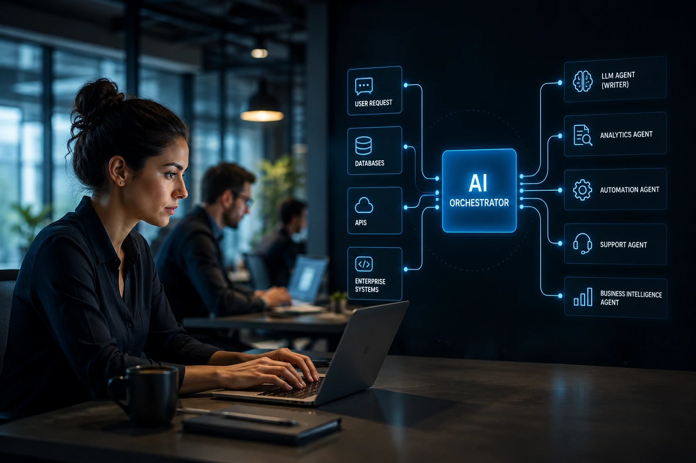
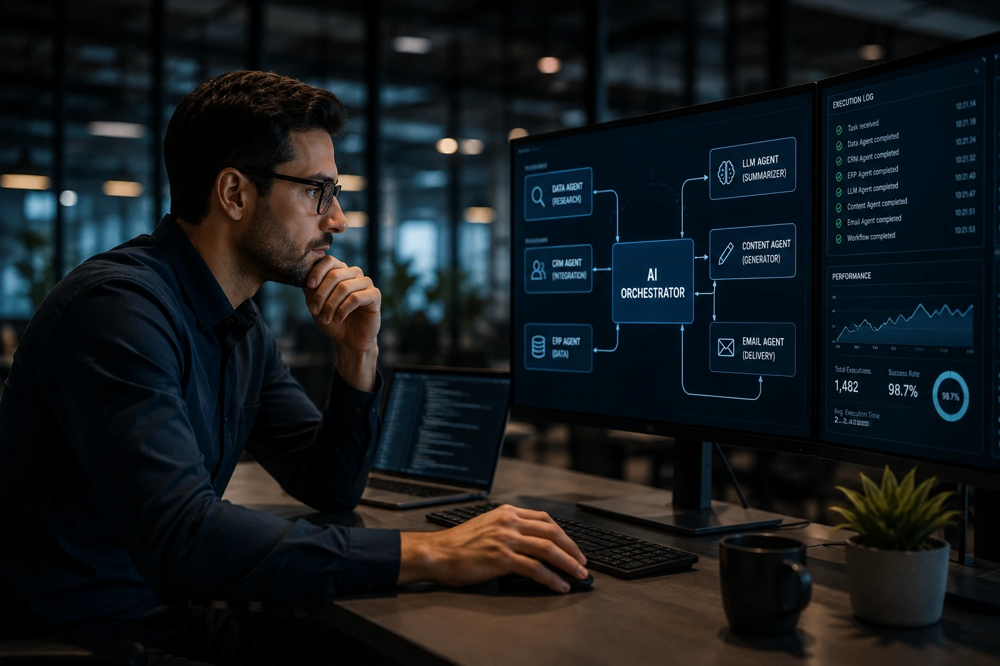
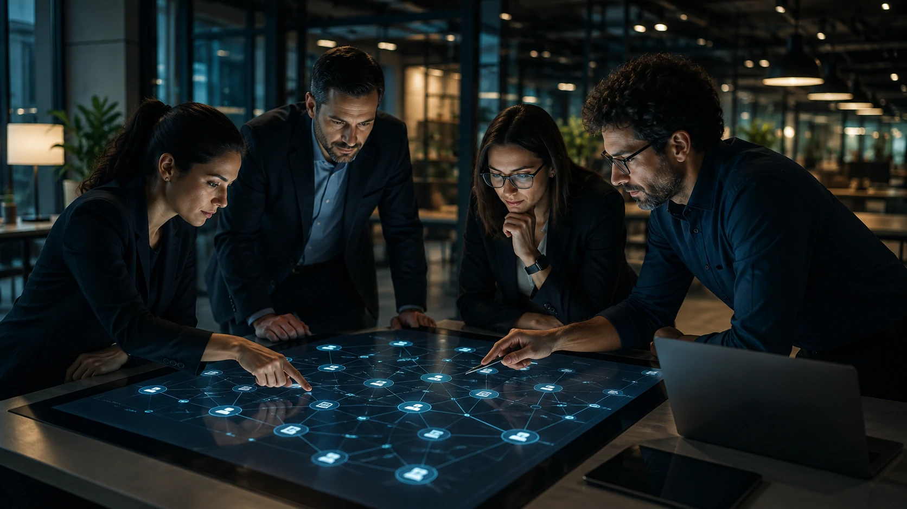

*À medida que empresas adotam diversos modelos de inteligência artificial ao mesmo tempo, surge um novo desafio: coordenar agentes especializados, sistemas internos e fluxos automatizados sem aumentar a complexidade operacional. É justamente nesse cenário que a AI Orchestration passa a ocupar um papel estratégico dentro da transformação digital.*

## O que é AI Orchestration e por que ela está ganhando importância



*Uma plataforma de orquestração distribui tarefas entre agentes especializados, sistemas corporativos e modelos de IA.*

A adoção de **ChatGPT**, **Claude**, **Gemini**, modelos open source e agentes especializados fez muitas empresas perceberem que possuir diversas inteligências artificiais não significa necessariamente possuir um processo inteligente.

É justamente para resolver esse problema que surge a **AI Orchestration**, responsável por coordenar modelos, agentes, APIs, bancos de dados e aplicações dentro de um fluxo único de tomada de decisão.

Enquanto anteriormente a preocupação era escolher "qual IA utilizar", agora o desafio passa a ser decidir **qual agente executará determinada tarefa, quando deverá ser acionado e como compartilhar informações entre todos eles**.

### Muito além de integrar APIs

Diferentemente de uma simples integração entre sistemas, a orquestração cria uma camada inteligente responsável por decidir qual modelo deve executar determinada atividade.

Um fluxo corporativo pode utilizar:

- **GPT** para gerar documentos;
- **Claude** para revisar contratos;
- um modelo local para analisar dados confidenciais;
- um agente interno para consultar o ERP;
- outro agente responsável pelo CRM.

Todos trabalhando dentro do mesmo processo.

### Uma mudança semelhante ao surgimento dos ERPs

Assim como os **ERPs** unificaram departamentos anteriormente isolados, a AI Orchestration tende a unificar ecossistemas de inteligência artificial que hoje funcionam de forma independente.

Essa visão complementa temas já abordados pelo **Notícia Tech**, como [Como criar um servidor MCP para empresas integrar IA aos sistemas](https://noticiatech.com.br/automacao/como-criar-servidor-mcp-empresas-integrar-ia-sistemas/) e [AI Process Automation substitui a automação tradicional nas empresas](https://noticiatech.com.br/automacao/ai-process-automation-substitui-automacao-tradicional-empresas/), mostrando que a evolução da automação passa agora pela coordenação inteligente dos próprios agentes. 


## Como funciona uma arquitetura moderna de AI Orchestration



*Os agentes recebem tarefas diferentes, compartilham contexto e retornam resultados para um orquestrador central.*

Na prática, a AI Orchestration funciona como um controlador responsável por distribuir atividades entre diferentes componentes da arquitetura.

Em vez de uma única IA resolver tudo, cada agente assume uma especialidade, aumentando qualidade, velocidade e escalabilidade.

### Exemplo de fluxo operacional

Um fluxo típico pode seguir a seguinte lógica:

1. Um formulário gera um novo lead.
2. O orquestrador recebe o evento.
3. Um agente consulta o CRM.
4. Outro agente pesquisa informações públicas da empresa.
5. Um modelo de IA resume os dados.
6. Outro modelo cria um e-mail personalizado.
7. O CRM recebe automaticamente o resultado final.

Em vez de um único modelo realizando todas as etapas, diversos agentes colaboram dentro de um processo coordenado.

### Exemplo de prompt utilizado pelo orquestrador

```text
Objetivo:
Preparar um resumo executivo para a equipe comercial.

Contexto:
Utilize os dados retornados pelo CRM, informações públicas da empresa e histórico de atendimento.

Formato esperado:
- Resumo da empresa
- Principais oportunidades
- Possíveis objeções
- Próximos passos sugeridos
```

Esse tipo de arquitetura reduz retrabalho e melhora significativamente a qualidade das respostas produzidas pelos agentes.

### Human-in-the-Loop continua sendo obrigatório

Mesmo arquiteturas sofisticadas ainda apresentam riscos.

Os modelos podem interpretar informações incorretamente, utilizar dados desatualizados ou gerar recomendações inconsistentes.

Por isso, empresas mais maduras adotam o conceito de **Human-in-the-Loop**, no qual decisões críticas continuam sendo revisadas por profissionais antes da execução final.

Essa combinação entre automação inteligente e supervisão humana é um dos fatores que diferencia projetos experimentais de implementações corporativas realmente escaláveis.

## Quais ferramentas estão liderando a AI Orchestration nas empresas



*As plataformas de orquestração conectam agentes de IA, APIs e aplicações corporativas em um único ambiente operacional.*

O crescimento da AI Orchestration impulsionou o surgimento de plataformas especializadas em coordenar agentes inteligentes, fluxos de trabalho e integrações empresariais.

Embora existam dezenas de soluções disponíveis, algumas ferramentas vêm se consolidando como referência para diferentes perfis de empresas.

### Plataformas mais utilizadas

Entre as principais soluções estão:

- **LangGraph**, voltado para aplicações complexas com múltiplos agentes.
- **CrewAI**, focado na colaboração entre agentes especializados.
- **n8n**, bastante utilizado para integrar IA com sistemas corporativos.
- **Make**, conhecido pela facilidade de criação de fluxos automatizados.
- **Microsoft Copilot Studio**, direcionado ao ecossistema Microsoft.
- **OpenAI Agents SDK**, utilizado para construir agentes baseados nos modelos da **OpenAI**.

Cada plataforma possui características próprias, mas todas compartilham um objetivo comum: permitir que diferentes agentes trabalhem juntos de maneira coordenada.

### A lógica por trás da orquestração

Independentemente da ferramenta utilizada, a arquitetura normalmente segue um padrão semelhante:

1. Receber um evento inicial.
2. Identificar o contexto da solicitação.
3. Escolher qual agente executará cada etapa.
4. Compartilhar informações entre os agentes.
5. Consolidar os resultados.
6. Registrar a execução para auditoria e melhoria contínua.

Essa camada de coordenação reduz duplicidade de tarefas, melhora a qualidade das respostas e torna o ambiente muito mais escalável.

### Governança também faz parte da arquitetura

À medida que dezenas de agentes passam a executar tarefas críticas, cresce também a necessidade de governança.

As empresas precisam controlar:

- permissões de acesso;
- uso de dados sensíveis;
- rastreabilidade das decisões;
- versionamento dos prompts;
- custos por execução;
- monitoramento dos resultados.

Esse movimento acompanha a evolução da governança apresentada em [O que é AI Governance e por que as empresas precisarão dela nos próximos anos](https://noticiatech.com.br/inteligencia-artificial/o-que-e-ai-governance-governanca-ia-empresas/), mostrando que a coordenação técnica precisa caminhar junto com políticas de segurança e conformidade.


## Por que AI Orchestration tende a se tornar a próxima camada estratégica da IA

Durante os primeiros anos da inteligência artificial generativa, a disputa concentrou-se em descobrir qual modelo era mais poderoso.

Hoje, essa discussão começa a perder importância.

O diferencial competitivo passa a ser a capacidade de combinar diversos modelos especializados dentro de um mesmo processo de negócio.

### O foco muda do modelo para a arquitetura

Empresas mais maduras deixam de perguntar:

*"Qual IA devo utilizar?"*

E passam a perguntar:

*"Como todos os meus agentes podem trabalhar juntos para entregar melhores resultados?"*

Essa mudança representa uma evolução semelhante à transição entre aplicações isoladas e plataformas integradas que ocorreu na computação corporativa nas últimas décadas.

### O verdadeiro ativo passa a ser o fluxo de trabalho

Modelos de IA podem ser substituídos rapidamente.

Já uma arquitetura bem construída de AI Orchestration acumula conhecimento operacional, integrações, regras de negócio e histórico de execução.

É justamente esse conjunto que tende a se transformar em um dos ativos tecnológicos mais valiosos das organizações.

Empresas que estruturarem essa camada desde cedo estarão mais preparadas para incorporar novos modelos, reduzir custos de migração e acelerar a adoção das próximas gerações de inteligência artificial sem reconstruir toda a operação.

Em vez de disputar qual modelo produz a melhor resposta isoladamente, o mercado caminha para um cenário em que o verdadeiro diferencial competitivo será a capacidade de coordenar inteligentemente dezenas de agentes, aplicações e sistemas. Nesse contexto, a **AI Orchestration** deixa de ser apenas uma tecnologia complementar e passa a representar a infraestrutura que sustentará a próxima fase da transformação digital baseada em inteligência artificial.

---