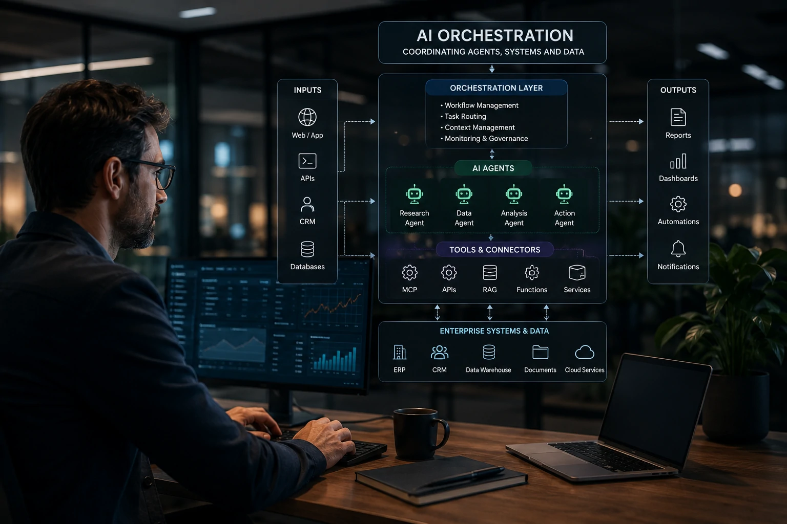
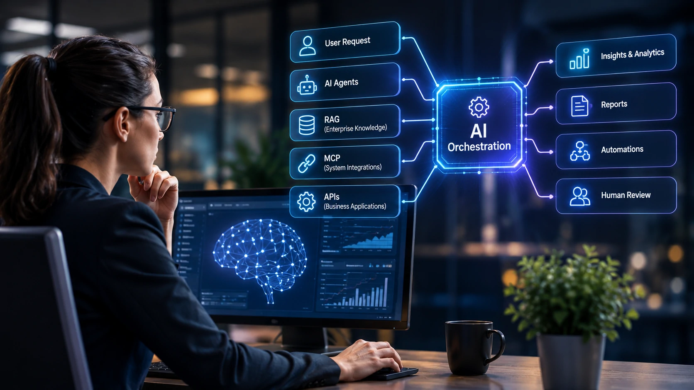
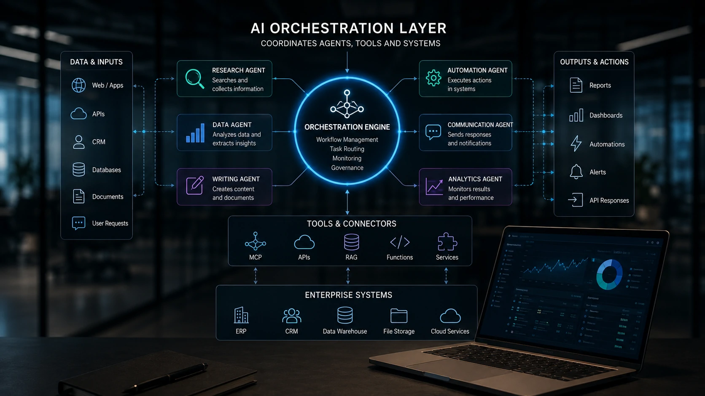

*À medida que as empresas deixam de utilizar apenas um chatbot e passam a operar dezenas de agentes especializados, surge um novo desafio: coordenar todas essas inteligências. É justamente nesse cenário que a **AI Orchestration** deixa de ser um conceito técnico e passa a ocupar um papel estratégico na transformação digital.*

## O que é AI Orchestration e por que ela ganhou tanta importância



*Uma camada de orquestração coordena agentes especializados, aplicações corporativas e modelos de IA em um único fluxo operacional.*

Durante os primeiros anos da **IA Generativa**, a maior parte das empresas concentrou seus esforços em escolher o melhor modelo, como **ChatGPT**, **Claude** ou **Gemini**. Hoje, essa discussão perdeu protagonismo.

O desafio passou a ser conectar diferentes inteligências, sistemas internos e processos empresariais em uma única arquitetura operacional.

É exatamente essa função que a **AI Orchestration** desempenha.

Em vez de permitir que cada agente trabalhe isoladamente, uma plataforma de orquestração distribui tarefas, define prioridades, acompanha resultados e garante que todas as etapas do processo ocorram na sequência correta.

### Uma camada acima dos modelos de IA

A orquestração não substitui modelos de linguagem.

Ela atua acima deles.

Enquanto um modelo responde perguntas, a orquestração decide:

- qual agente executará determinada tarefa;
- qual sistema será consultado;
- quais documentos deverão ser utilizados;
- quando outro agente deve assumir o processo.

Esse conceito aproxima a IA do funcionamento de uma equipe humana, na qual diferentes especialistas colaboram sob a coordenação de um gestor.

### Por que esse conceito está crescendo rapidamente

À medida que empresas adotam múltiplos agentes de IA, surgem problemas como:

- duplicação de tarefas;
- respostas inconsistentes;
- falta de contexto;
- dificuldade de auditoria;
- ausência de governança.

A **AI Orchestration** resolve exatamente esse ponto, permitindo que diferentes agentes atuem de forma coordenada, reduzindo erros e aumentando previsibilidade.

## Como funciona uma arquitetura de AI Orchestration



*Os dados percorrem diferentes agentes especializados antes de retornar ao usuário ou alimentar sistemas corporativos.*

Em uma arquitetura moderna, a orquestração funciona como um centro de controle.

Ela recebe uma solicitação e decide qual caminho seguir até a entrega do resultado.

### Exemplo prático de fluxo empresarial

Imagine um pedido recebido pelo setor comercial.

O fluxo pode ocorrer desta forma:

1. O formulário do site dispara um evento.
2. Um agente interpreta a solicitação.
3. Outro agente consulta o CRM.
4. Um terceiro pesquisa documentos internos via **RAG**.
5. O **MCP** conecta a IA aos sistemas corporativos.
6. Um agente cria a proposta comercial.
7. O resultado é enviado ao vendedor para revisão humana.

Nesse cenário, nenhum agente conhece todo o processo.

Cada um executa apenas sua especialidade.

Quem coordena toda essa operação é a camada de **AI Orchestration**.

### Exemplo de prompt utilizado por um agente

```text
Você é responsável por analisar novos leads.

Contexto:
- Empresa B2B
- CRM integrado
- Histórico disponível

Objetivo:
Classifique o potencial do cliente em Alto, Médio ou Baixo.

Formato da resposta:
- Score
- Justificativa
- Próxima ação recomendada
```

Esse tipo de especialização reduz erros e melhora significativamente a qualidade das respostas produzidas pelos agentes.

## AI Orchestration não substitui MCP, RAG nem agentes de IA



*Na arquitetura corporativa moderna, AI Orchestration coordena tecnologias complementares em vez de substituí-las.*

Um erro bastante comum é imaginar que **AI Orchestration**, **MCP**, **RAG** e **Agentes de IA** disputam espaço entre si. Na prática, cada tecnologia resolve um problema diferente.

É justamente a combinação dessas camadas que permite construir soluções robustas para empresas.

### O papel de cada tecnologia

Uma forma simples de visualizar essa arquitetura é separar cada componente pela função que desempenha.

- **Agentes de IA** executam tarefas específicas.
- **RAG** fornece conhecimento atualizado e contextualizado.
- **MCP** conecta modelos de IA aos sistemas corporativos.
- **APIs** transportam informações entre aplicações.
- **AI Orchestration** coordena todo esse ecossistema.

Essa separação facilita manutenção, escalabilidade e governança.

Não por acaso, grandes fornecedores de tecnologia estão deixando de vender apenas modelos de linguagem e passaram a oferecer plataformas completas de orquestração.

### O papel do Human-in-the-Loop

Mesmo com fluxos altamente automatizados, decisões críticas continuam exigindo supervisão humana.

Esse conceito é conhecido como **Human-in-the-Loop**.

Alguns exemplos incluem:

- aprovação de contratos;
- liberação de pagamentos;
- envio de propostas comerciais;
- decisões jurídicas;
- análise de risco.

A orquestração permite definir exatamente em quais etapas uma pessoa deve validar o processo antes da continuidade do fluxo.

Essa combinação aumenta a confiança na automação sem eliminar o controle humano.

## Como as empresas podem começar a implementar AI Orchestration

A adoção da **AI Orchestration** não exige que toda a operação seja transformada de uma única vez.

Na maioria dos casos, as empresas começam automatizando apenas um processo de alto impacto e, gradualmente, expandem a arquitetura.

Um bom ponto de partida é identificar atividades repetitivas que já utilizam documentos, sistemas internos e tomadas de decisão.

### Um roteiro prático

Uma estratégia bastante utilizada envolve cinco etapas.

1. Mapear um processo empresarial.
2. Identificar quais tarefas podem ser executadas por agentes especializados.
3. Integrar documentos e bases internas utilizando **RAG**.
4. Conectar sistemas corporativos por meio de **MCP** ou APIs.
5. Criar uma camada de orquestração responsável por distribuir as tarefas entre os agentes.

Esse modelo reduz riscos porque cada nova automação aproveita componentes já implementados anteriormente.

Para entender melhor como conectar aplicações corporativas à inteligência artificial, vale conhecer o guia **[Como criar um servidor MCP para integrar IA aos sistemas da empresa](https://noticiatech.com.br/automacao/como-criar-servidor-mcp-empresas-integrar-ia-sistemas/)**.

Já quem deseja compreender como diferentes tecnologias formam uma arquitetura completa pode aprofundar a leitura em **[Arquitetura de IA empresarial: guia completo sobre MCP, RAG, agentes, workflows, copilotos e APIs](https://noticiatech.com.br/inteligencia-artificial/arquitetura-ia-empresarial-mcp-rag-apis-agentes-workflows-copilotos/)**.

### O futuro pertence à coordenação inteligente

Nos próximos anos, a vantagem competitiva das empresas provavelmente deixará de depender apenas do modelo de IA utilizado.

Organizações poderão utilizar simultaneamente **ChatGPT**, **Claude**, **Gemini**, modelos open weight e agentes especializados.

O diferencial estará na capacidade de fazer todas essas inteligências colaborarem de maneira eficiente.

Nesse cenário, a **AI Orchestration** tende a assumir um papel semelhante ao que os sistemas ERP desempenharam na integração dos processos empresariais nas últimas décadas: tornar tecnologias distintas parte de uma única operação.

Para gestores, profissionais de tecnologia e empresas que desejam escalar a inteligência artificial com segurança, compreender esse conceito hoje representa uma preparação estratégica para uma realidade que já começa a ser adotada pelos principais fornecedores do mercado.

---