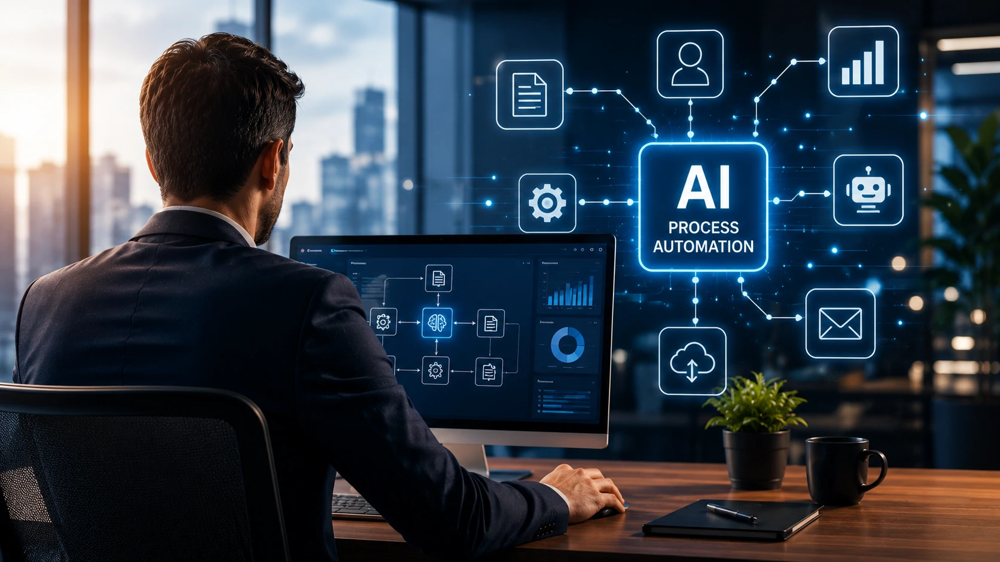

*Empresas estão descobrindo que automatizar tarefas já não é suficiente. A nova geração da automação utiliza inteligência artificial para interpretar informações, aprender continuamente e tomar decisões em tempo real. Essa evolução ficou conhecida como AI Process Automation.*

# O que é AI Process Automation?

A **AI Process Automation**, ou **Automação de Processos com Inteligência Artificial**, é a evolução da automação tradicional.

Enquanto soluções convencionais automatizam tarefas repetitivas seguindo regras fixas, a AI Process Automation combina diferentes tecnologias de inteligência artificial para permitir que sistemas compreendam informações, identifiquem padrões e executem decisões de forma muito mais inteligente.

Na prática, isso significa que um processo deixa de simplesmente seguir um roteiro previamente programado e passa a adaptar suas ações conforme o contexto.

Por esse motivo, muitas empresas enxergam essa tecnologia como um dos principais pilares da transformação digital.

## Como funciona a AI Process Automation?

A AI Process Automation normalmente reúne diversas tecnologias trabalhando em conjunto.

Entre as principais estão:

- Inteligência Artificial Generativa;
- Machine Learning;
- Processamento de Linguagem Natural (NLP);
- Visão Computacional;
- OCR inteligente;
- Modelos preditivos;
- Agentes de IA;
- Plataformas de automação de workflows.

Esses componentes permitem que a plataforma execute atividades que antes dependiam exclusivamente de intervenção humana.

Por exemplo, um sistema pode:

- interpretar um contrato;
- identificar cláusulas importantes;
- validar informações;
- consultar bases internas;
- decidir o próximo passo do fluxo;
- registrar automaticamente toda a operação.

Tudo isso ocorre praticamente em tempo real.

## AI Process Automation vai além da automação tradicional

A maior diferença está na capacidade de interpretar dados não estruturados.

Em uma automação convencional, qualquer informação fora do padrão costuma interromper o processo.

Já uma solução baseada em IA consegue analisar:

- PDFs;
- e-mails;
- imagens;
- planilhas;
- documentos digitalizados;
- mensagens de clientes;
- históricos corporativos.

Depois dessa análise, ela decide automaticamente qual ação executar.

Essa inteligência reduz significativamente a necessidade de intervenção manual.

## Diferença entre AI Process Automation e RPA

Uma das maiores dúvidas das empresas é entender onde termina o RPA e onde começa a AI Process Automation.

Embora ambas automatizem processos, elas possuem objetivos diferentes.

| RPA | AI Process Automation |
|------|----------------------|
| Executa regras fixas | Aprende padrões |
| Não interpreta contexto | Analisa contexto |
| Trabalha com dados estruturados | Trabalha com dados estruturados e não estruturados |
| Depende de programação | Pode utilizar modelos de IA treinados |
| Automatiza tarefas | Automatiza decisões e processos completos |

Em muitos projetos modernos, as duas tecnologias trabalham juntas.

O RPA continua responsável por tarefas altamente repetitivas, enquanto a inteligência artificial assume atividades que exigem interpretação e tomada de decisão.

## Principais benefícios para empresas

A adoção da AI Process Automation traz ganhos que vão muito além da redução de custos.

Entre os principais benefícios estão:

### Aumento da produtividade

Processos que antes levavam horas podem ser concluídos em poucos minutos.

Além disso, equipes deixam de executar atividades repetitivas para focar em trabalhos de maior valor estratégico.

### Redução de erros operacionais

Ao eliminar grande parte das atividades manuais, a empresa reduz falhas humanas e melhora a consistência dos processos.

Isso também fortalece áreas de auditoria e compliance.

### Decisões mais rápidas

Modelos de IA conseguem analisar milhares de informações simultaneamente.

Como consequência, decisões operacionais acontecem muito mais rapidamente do que em fluxos tradicionais.

### Escalabilidade

Uma vez implementada, a solução consegue processar volumes muito maiores sem necessidade de aumentar proporcionalmente a equipe.

### Melhor experiência do cliente

Solicitações podem ser analisadas automaticamente, reduzindo o tempo de resposta e aumentando a satisfação dos clientes.

## Onde a AI Process Automation já está sendo utilizada?

A tecnologia já faz parte da rotina de empresas em diversos segmentos.

Alguns exemplos incluem:

- aprovação automática de crédito;
- processamento de notas fiscais;
- validação de documentos;
- análise de contratos;
- atendimento inteligente ao cliente;
- automação de RH;
- processamento de reembolsos;
- monitoramento de compliance;
- automação financeira;
- qualificação de oportunidades comerciais.

Em muitos casos, o cliente sequer percebe que existe inteligência artificial operando nos bastidores.

## AI Process Automation e agentes de IA

A chegada dos agentes de IA acelerou ainda mais essa evolução.

Enquanto uma automação tradicional executa um fluxo previamente definido, agentes inteligentes conseguem:

- planejar tarefas;
- consultar múltiplas fontes de informação;
- utilizar diferentes ferramentas;
- conversar com outros sistemas;
- executar ações de forma autônoma.

Essa combinação amplia significativamente o potencial da AI Process Automation, tornando processos empresariais muito mais flexíveis e inteligentes.

## Como implementar AI Process Automation na empresa

Embora a tecnologia tenha se tornado muito mais acessível nos últimos anos, a implementação exige planejamento.

O erro mais comum é tentar automatizar todos os processos ao mesmo tempo.

O caminho mais eficiente costuma seguir estas etapas.

### 1. Mapear os processos atuais

Antes de qualquer automação, é necessário entender como os fluxos funcionam hoje.

A empresa deve identificar:

- gargalos;
- tarefas repetitivas;
- atividades manuais;
- processos sujeitos a erros;
- etapas que dependem de múltiplas aprovações.

Esse diagnóstico serve como base para todo o projeto.

### 2. Priorizar processos de maior impacto

Nem toda atividade precisa receber inteligência artificial imediatamente.

Os melhores candidatos normalmente apresentam:

- alto volume de execução;
- baixo valor estratégico;
- regras parcialmente repetitivas;
- grande quantidade de documentos;
- necessidade frequente de análise de informações.

Esses processos costumam gerar retorno mais rápido sobre o investimento.

### 3. Escolher as ferramentas adequadas

Atualmente existem diversas plataformas capazes de integrar IA com automação.

Entre elas estão soluções de workflow, plataformas de integração, sistemas de RPA e ferramentas voltadas para agentes de IA.

A escolha deve considerar:

- facilidade de integração;
- segurança;
- escalabilidade;
- governança;
- suporte aos modelos de IA utilizados pela empresa.

### 4. Medir continuamente os resultados

Depois da implementação, acompanhar indicadores é indispensável.

Algumas métricas importantes incluem:

- tempo médio de execução;
- redução de custos;
- diminuição de erros;
- produtividade das equipes;
- satisfação dos clientes;
- retorno sobre investimento (ROI).

A melhoria contínua faz parte da própria filosofia da AI Process Automation.

## Exemplos de AI Process Automation em diferentes setores

A aplicação da tecnologia varia conforme o segmento.

### Financeiro

Instituições financeiras utilizam IA para:

- análise de crédito;
- prevenção a fraudes;
- validação documental;
- processamento de pagamentos;
- atendimento automatizado.

### Recursos Humanos

Departamentos de RH conseguem automatizar:

- triagem de currículos;
- análise de perfis;
- onboarding;
- atendimento interno;
- geração de documentos.

### Saúde

Hospitais e clínicas utilizam IA para:

- análise de exames;
- organização de prontuários;
- autorização de procedimentos;
- gestão de agendas;
- atendimento inicial aos pacientes.

### Varejo

Empresas do varejo aplicam AI Process Automation para:

- previsão de demanda;
- controle de estoque;
- atendimento ao consumidor;
- recomendações personalizadas;
- processamento de pedidos.

### Indústria

Na manufatura, a tecnologia auxilia em:

- manutenção preditiva;
- inspeção visual;
- controle de qualidade;
- planejamento de produção;
- monitoramento operacional.

## Desafios da AI Process Automation

Apesar dos benefícios, algumas barreiras ainda precisam ser consideradas.

Entre elas:

- qualidade dos dados;
- integração com sistemas legados;
- governança da inteligência artificial;
- privacidade das informações;
- conformidade regulatória;
- capacitação das equipes.

Projetos bem-sucedidos normalmente começam com objetivos claros e evoluem gradualmente.

## Tendências para os próximos anos

A evolução da AI Process Automation está diretamente ligada ao avanço dos modelos de IA e dos agentes inteligentes.

As principais tendências incluem:

- agentes capazes de executar processos completos sem intervenção humana;
- integração entre múltiplos modelos de IA especializados;
- automação baseada em linguagem natural;
- workflows empresariais autônomos;
- maior utilização de IA multimodal;
- decisões em tempo real utilizando dados corporativos.

À medida que essas tecnologias amadurecem, a tendência é que empresas automatizem não apenas tarefas isoladas, mas cadeias inteiras de processos.

## AI Process Automation representa uma nova fase da automação empresarial

A automação tradicional revolucionou a execução de tarefas repetitivas.

Agora, a AI Process Automation amplia esse conceito ao incorporar inteligência, interpretação de contexto e capacidade de tomada de decisão.

Em vez de apenas executar comandos previamente programados, os sistemas passam a compreender informações, aprender continuamente e colaborar com pessoas em processos cada vez mais complexos.

Para empresas que buscam aumentar produtividade, reduzir custos e acelerar a transformação digital, essa tecnologia tende a desempenhar um papel estratégico nos próximos anos.

Ela não substitui totalmente o trabalho humano, mas redefine como pessoas e inteligência artificial atuam juntas para construir operações mais eficientes, escaláveis e preparadas para o futuro.

---