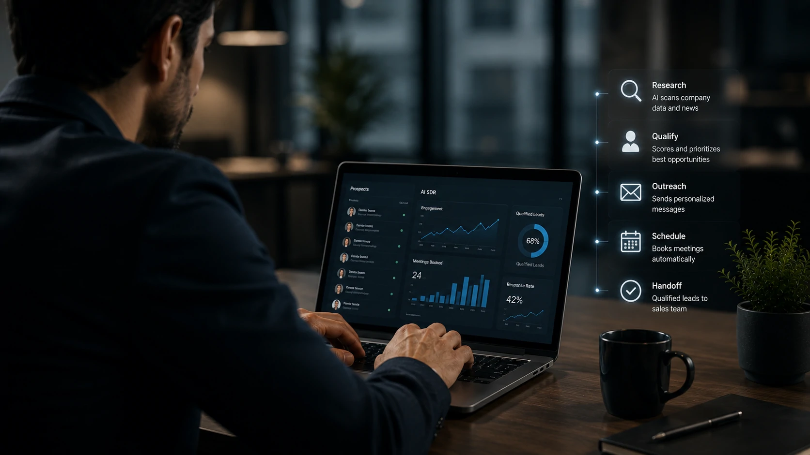
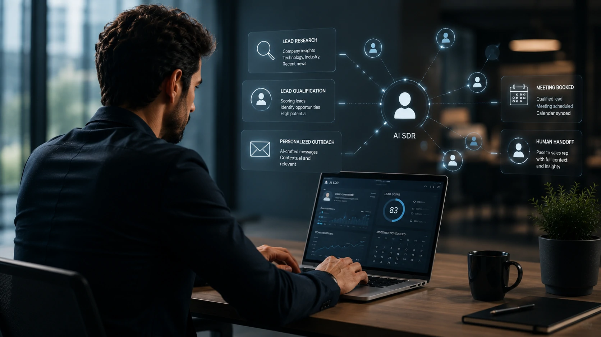
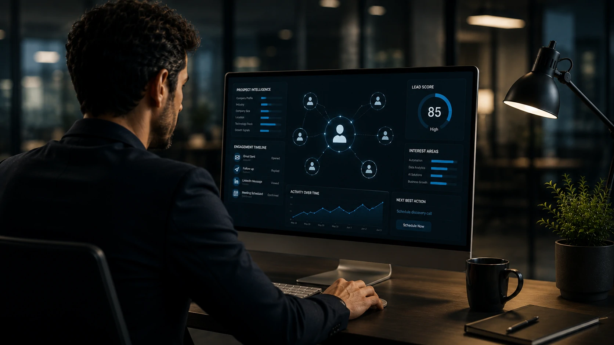

*Enquanto muitas empresas ainda utilizam automações tradicionais para gerar oportunidades comerciais, uma nova geração de agentes inteligentes está mudando completamente a prospecção B2B. O AI SDR combina inteligência artificial, automação e análise de dados para transformar uma das etapas mais caras e demoradas do processo de vendas.*

# O que é AI SDR?

O **AI SDR (Artificial Intelligence Sales Development Representative)** é um agente de inteligência artificial desenvolvido para executar atividades normalmente realizadas por um profissional de pré-vendas (SDR).

Seu objetivo é identificar potenciais clientes, analisar informações disponíveis sobre empresas, personalizar abordagens comerciais, iniciar conversas e qualificar oportunidades antes que elas cheguem ao vendedor responsável pelo fechamento.

Na prática, o AI SDR funciona como um colaborador digital disponível continuamente, realizando milhares de interações simultaneamente sem comprometer a consistência do processo comercial.

Essa evolução representa um dos maiores avanços recentes na automação de vendas B2B.

## Por que o AI SDR ganhou tanta importância?

Nos últimos anos, as empresas passaram a enfrentar alguns desafios comuns:

- aumento do custo de aquisição de clientes;
- crescimento do volume de leads;
- necessidade de respostas mais rápidas;
- dificuldade para contratar SDRs experientes;
- maior concorrência em praticamente todos os mercados.

Ao mesmo tempo, os modelos de inteligência artificial evoluíram significativamente.

Hoje eles conseguem compreender contexto, produzir textos naturais, resumir informações, interpretar páginas da internet, analisar dados corporativos e adaptar comunicações conforme o perfil de cada prospect.

Isso tornou possível automatizar atividades que antes dependiam exclusivamente de profissionais humanos.

O resultado é uma mudança estrutural na forma como equipes comerciais trabalham.

## Como funciona um AI SDR?

Embora cada plataforma utilize tecnologias diferentes, o fluxo costuma seguir etapas semelhantes.

### Pesquisa automática de empresas

O agente coleta informações disponíveis em sites institucionais, redes profissionais, bancos públicos e outras fontes autorizadas.

Com isso, consegue entender:

- segmento da empresa;
- tamanho do negócio;
- localização;
- possíveis necessidades;
- tecnologias utilizadas;
- momento de crescimento.

Essa etapa reduz significativamente o tempo gasto em pesquisas manuais.

### Qualificação inteligente de leads

Depois da coleta de dados, o AI SDR avalia se aquele contato realmente possui potencial para se tornar cliente.

Entre os fatores analisados estão:

- perfil da empresa;
- aderência ao produto;
- histórico de mercado;
- características do decisor;
- sinais de intenção de compra.

Em vez de simplesmente enviar mensagens para milhares de contatos, a inteligência artificial prioriza aqueles com maior probabilidade de conversão.

### Personalização em escala

Uma das maiores limitações da automação tradicional sempre foi a falta de personalização.

O AI SDR muda completamente esse cenário.

Antes de iniciar uma conversa, ele pode analisar:

- notícias recentes da empresa;
- lançamentos;
- crescimento do negócio;
- desafios do setor;
- informações públicas do executivo.

Com essas informações, cria abordagens muito mais relevantes do que mensagens genéricas.

### Comunicação inicial

O agente pode iniciar conversas utilizando diferentes canais, como:

- e-mail;
- chat corporativo;
- formulários inteligentes;
- plataformas de relacionamento;
- mensagens automatizadas integradas ao CRM.

Em muitos casos, o prospect sequer percebe que a primeira interação foi realizada por inteligência artificial.

## Principais benefícios para empresas

A adoção de AI SDR vai além da simples redução de custos.

Os ganhos aparecem em praticamente todas as etapas da prospecção comercial.

### Maior produtividade

Enquanto um SDR humano possui limitações naturais de tempo, o AI SDR pode pesquisar milhares de empresas simultaneamente.

Isso amplia significativamente a capacidade operacional da equipe.

### Atendimento contínuo

Os agentes operam vinte e quatro horas por dia.

Leads capturados durante a madrugada ou em finais de semana podem receber atendimento praticamente imediato.

Essa velocidade reduz perdas de oportunidades.

### Qualificação mais consistente

Critérios objetivos evitam decisões baseadas apenas em percepção individual.

Todos os leads passam pelo mesmo processo de análise.

Isso melhora a previsibilidade do funil comercial.

### Melhor aproveitamento dos vendedores

Com menos tempo dedicado à pesquisa e prospecção inicial, os vendedores podem focar em atividades de maior valor, como apresentações, negociações e fechamento de contratos.

## AI SDR substitui o profissional de vendas?

Essa é uma das dúvidas mais frequentes.

Na maioria dos casos, a resposta é não.

O AI SDR automatiza principalmente tarefas repetitivas e operacionais.

Já o vendedor continua responsável por atividades que exigem relacionamento humano, negociação complexa, construção de confiança e tomada de decisão estratégica.

Na prática, muitas empresas estão adotando um modelo híbrido.

Nesse formato:

- o AI SDR identifica oportunidades;
- qualifica os contatos;
- agenda reuniões;
- entrega contexto ao vendedor.

O profissional comercial entra justamente na etapa em que sua experiência gera maior impacto.

Esse modelo aumenta a produtividade sem eliminar a importância das equipes de vendas.

## Quais tecnologias compõem um AI SDR?

Os AI SDRs modernos normalmente combinam diferentes tecnologias para entregar uma experiência próxima da atuação humana.

Entre elas estão:

- modelos de linguagem (LLMs);
- processamento de linguagem natural (NLP);
- análise de dados em tempo real;
- integração com CRMs;
- automação de workflows;
- mecanismos de busca corporativa;
- sistemas de enriquecimento de dados.

Quando essas tecnologias trabalham em conjunto, o agente consegue compreender contexto, responder dúvidas, adaptar mensagens e tomar pequenas decisões conforme regras previamente definidas.

Essa combinação representa uma evolução significativa em relação às antigas automações baseadas apenas em regras fixas.

## AI SDR e CRM trabalham juntos?

Sim.

Na verdade, um dos maiores diferenciais dessa tecnologia está justamente na integração com plataformas já utilizadas pelas equipes comerciais.

Entre as integrações mais comuns estão:

- CRM;
- plataformas de automação de marketing;
- e-mail corporativo;
- calendário;
- ferramentas de videoconferência;
- sistemas internos da empresa.

Essa integração permite que todas as informações coletadas durante a prospecção sejam registradas automaticamente, evitando retrabalho e mantendo o histórico completo de cada oportunidade.

## Quais setores mais utilizam AI SDR?

Embora qualquer empresa possa utilizar agentes comerciais inteligentes, alguns segmentos têm apresentado adoção mais acelerada.

Entre eles estão:

- empresas SaaS;
- tecnologia;
- consultorias;
- agências;
- empresas de serviços B2B;
- fintechs;
- healthtechs;
- empresas industriais com vendas consultivas.

Negócios que dependem de prospecção recorrente costumam obter os maiores ganhos com esse tipo de automação.

## Quais desafios existem na implementação?

Apesar dos benefícios, implementar um AI SDR exige planejamento.

Os principais desafios incluem:

### Definição da estratégia comercial

A inteligência artificial depende de objetivos claros.

Sem processos bem definidos, o agente tende a reproduzir falhas já existentes na operação comercial.

### Qualidade dos dados

Informações desatualizadas ou incompletas reduzem significativamente a eficiência da prospecção.

Por isso, manter CRM e bases de dados organizados continua sendo uma etapa fundamental.

### Supervisão humana

Mesmo com alto nível de autonomia, agentes inteligentes precisam de monitoramento.

Equipes comerciais devem acompanhar indicadores como:

- taxa de resposta;
- reuniões geradas;
- qualidade dos leads;
- conversão em vendas;
- feedback dos clientes.

Esse acompanhamento permite ajustes contínuos e melhora os resultados ao longo do tempo.

## O futuro do AI SDR

O mercado caminha para agentes cada vez mais autônomos.

Em vez de apenas enviar mensagens, esses sistemas deverão executar fluxos completos de prospecção, pesquisar empresas, atualizar CRMs, responder objeções iniciais, sugerir estratégias comerciais e colaborar diretamente com vendedores humanos.

Outro movimento importante é a integração com plataformas de agentes de IA capazes de compartilhar contexto entre diferentes departamentos, como marketing, atendimento, pós-venda e sucesso do cliente.

Isso permitirá que a jornada comercial seja muito mais integrada e personalizada.

Empresas que começarem a estruturar esse modelo desde agora tendem a ganhar vantagem competitiva à medida que essas tecnologias amadurecem.

## Vale a pena investir em AI SDR?

Para organizações que realizam prospecção B2B de forma constante, a resposta tende a ser positiva.

O AI SDR não elimina a importância dos profissionais de vendas, mas reduz tarefas repetitivas, acelera a qualificação de oportunidades e aumenta a produtividade da equipe.

Quando combinado com processos comerciais bem definidos, dados confiáveis e supervisão humana, o agente inteligente pode contribuir para reduzir custos operacionais, melhorar a experiência dos potenciais clientes e aumentar a eficiência do funil de vendas.

Mais do que uma tendência passageira, o AI SDR representa uma evolução na forma como empresas utilizam inteligência artificial para construir relacionamentos comerciais em escala.

## Conclusão

A evolução da inteligência artificial está transformando praticamente todas as áreas das empresas, e a prospecção comercial é uma das que mais rapidamente incorporam essa mudança.

O AI SDR demonstra como agentes inteligentes podem assumir atividades operacionais de alto volume sem substituir o papel estratégico dos vendedores.

Ao automatizar pesquisa, qualificação e primeiro contato com potenciais clientes, essa tecnologia permite que equipes comerciais concentrem seus esforços onde realmente geram valor: compreender necessidades, negociar soluções e construir relacionamentos duradouros.

À medida que modelos de IA se tornam mais capazes e as integrações com CRMs e plataformas empresariais evoluem, a tendência é que o AI SDR deixe de ser um diferencial competitivo para se tornar parte da infraestrutura padrão das operações de vendas modernas.

---