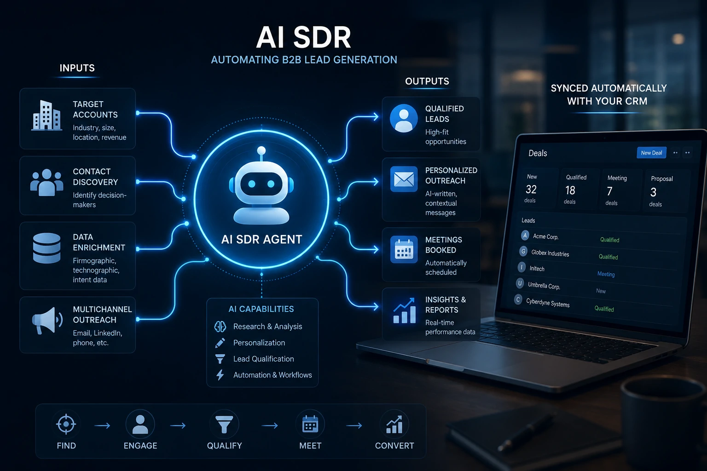
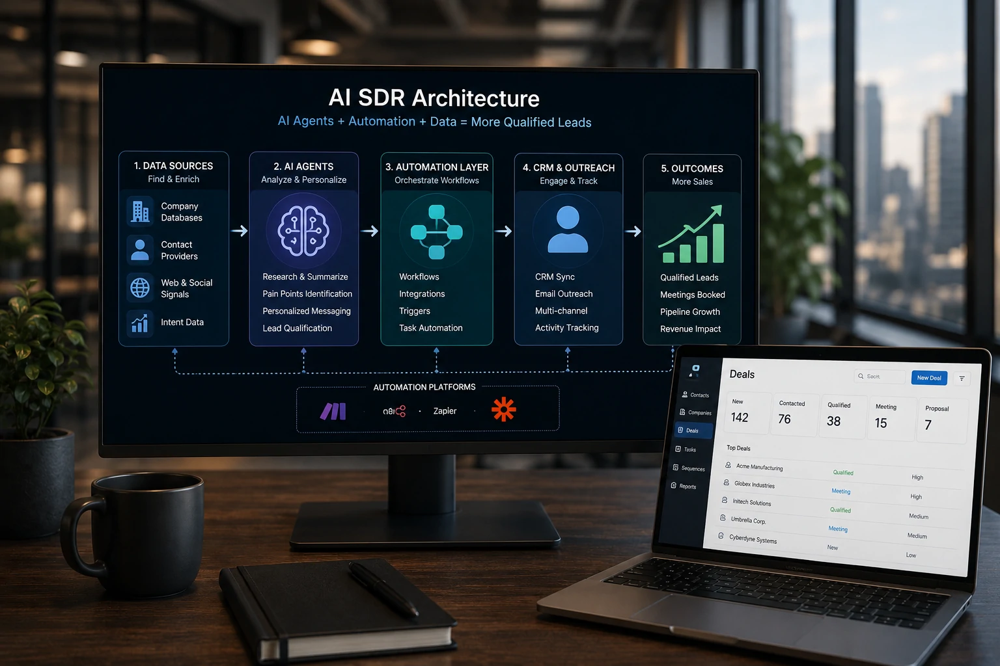
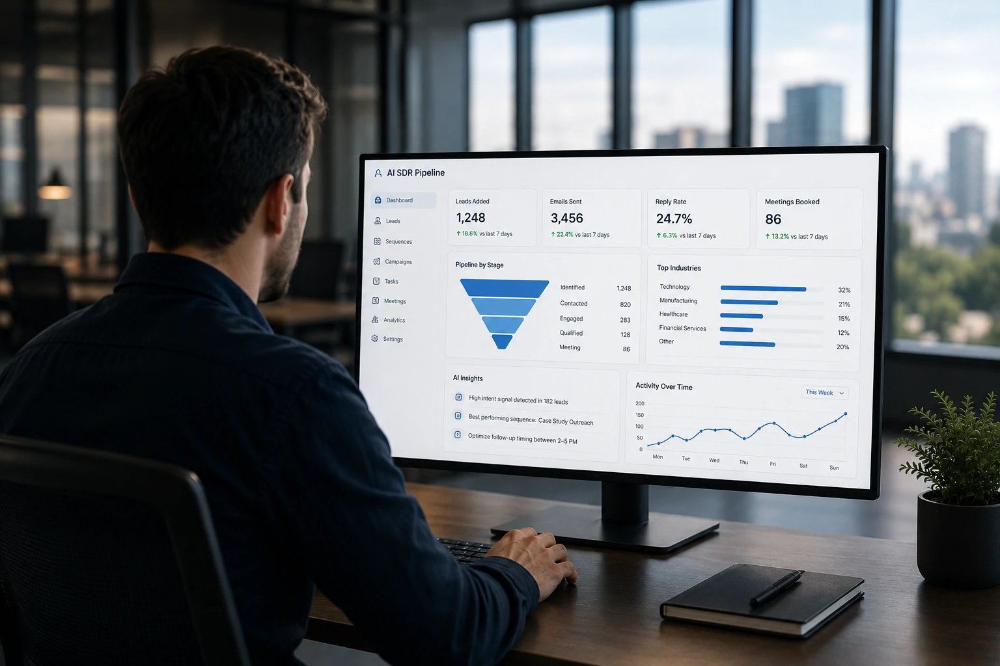

*Enquanto muitas empresas ainda discutem como utilizar inteligência artificial nas vendas, organizações mais maduras já automatizam praticamente toda a prospecção comercial. O AI SDR representa uma das aplicações mais promissoras da IA para geração de leads B2B e tende a ganhar espaço nos próximos anos.*

## O que é um AI SDR

Um **AI SDR** (Artificial Intelligence Sales Development Representative) é um sistema composto por **agentes de IA**, automações e integrações capazes de executar grande parte do trabalho realizado por um SDR tradicional.

Em vez de depender exclusivamente de profissionais pesquisando empresas, qualificando contatos e enviando mensagens manualmente, o AI SDR realiza essas atividades utilizando inteligência artificial, bancos de dados e fluxos automatizados.

Essa evolução acompanha o crescimento da **AI Process Automation**, tema que já vem ganhando relevância entre empresas que buscam reduzir tarefas repetitivas e aumentar produtividade.

### Como funciona na prática

Um AI SDR recebe critérios de prospecção definidos pela empresa.

A partir deles, identifica empresas compatíveis, encontra decisores, analisa informações públicas, personaliza abordagens e registra toda a atividade no CRM automaticamente.

### Por que o mercado está adotando AI SDR

A pressão por maior eficiência comercial fez com que equipes de vendas buscassem maneiras de gerar mais oportunidades sem aumentar proporcionalmente o número de funcionários.

Com agentes inteligentes trabalhando continuamente, o tempo gasto com atividades operacionais diminui significativamente.

## Como funciona um sistema completo de geração de leads B2B

*Fluxo de um AI SDR integrando inteligência artificial, automação e CRM para geração de leads B2B.*

Um AI SDR normalmente não é apenas uma ferramenta.

Ele representa um ecossistema conectado entre **IA**, **CRM**, automação de processos e enriquecimento de dados.

### Etapa 1: identificação das empresas

O sistema pesquisa empresas que atendem ao perfil ideal do cliente utilizando filtros de segmento, tamanho, localização, faturamento ou tecnologia utilizada.

Esses critérios permitem reduzir desperdícios e aumentar a qualidade da prospecção.

### Etapa 2: enriquecimento dos contatos

Após localizar empresas, plataformas especializadas identificam responsáveis por compras, tecnologia, marketing ou operações.

Os dados são automaticamente organizados no CRM.

### Etapa 3: qualificação inteligente

Modelos de linguagem analisam informações públicas da empresa.

Eles conseguem identificar sinais de compra, maturidade digital, desafios do negócio e oportunidades para personalizar futuras abordagens.

Essa etapa complementa estratégias apresentadas anteriormente no guia sobre qualificação de leads com IA, ampliando o uso de agentes inteligentes ao longo de todo o processo comercial.

## AI SDR versus SDR tradicional

Embora ambos tenham o mesmo objetivo, existem diferenças importantes entre os modelos.

| Característica | SDR Tradicional | AI SDR |
|----------------|-----------------|---------|
| Pesquisa de empresas | Manual | Automatizada |
| Qualificação inicial | Manual | Inteligência Artificial |
| Personalização | Limitada pelo tempo | Escalável |
| Disponibilidade | Horário comercial | 24 horas por dia |
| Escalabilidade | Depende da equipe | Muito alta |
| Integração com CRM | Manual | Automática |

Embora o **AI SDR** execute grande parte das atividades operacionais, isso não significa o fim do vendedor.

Na prática, o profissional comercial passa a dedicar mais tempo para negociações estratégicas, reuniões consultivas e fechamento de contratos, enquanto a inteligência artificial assume atividades repetitivas.

## Ferramentas para montar um AI SDR

*Um AI SDR depende da integração entre CRM, automação, IA e enriquecimento de dados para funcionar de forma eficiente.*

A escolha das ferramentas determina o nível de automação que será alcançado.

### CRM

O CRM centraliza todas as informações dos leads.

Entre as opções mais utilizadas estão **HubSpot**, **Pipedrive** e **ActiveCampaign**, que oferecem integração com agentes de IA e plataformas de automação.

### Automação

Ferramentas como **Make**, **n8n** e **Zapier** conectam diferentes aplicações.

Essas plataformas permitem criar fluxos capazes de receber novos contatos, consultar bancos de dados, executar prompts e atualizar automaticamente o CRM.

### Inteligência Artificial

Modelos como **ChatGPT**, **Claude** e **Gemini** podem interpretar informações sobre empresas, resumir pesquisas, criar mensagens personalizadas e apoiar decisões comerciais.

## Fluxo completo de automação comercial

Imagine uma empresa que vende software para indústrias.

O AI SDR identifica empresas que atendem ao perfil desejado.

Em seguida, localiza diretores ou gestores responsáveis.

Depois, analisa o site institucional, identifica possíveis desafios do negócio e produz uma abordagem personalizada.

Automaticamente, todas essas informações são registradas no CRM.

Caso o lead demonstre interesse, o sistema agenda reuniões ou encaminha a oportunidade para um vendedor humano.

Esse fluxo reduz significativamente o tempo gasto com prospecção e aumenta a consistência do processo comercial.

## Benefícios para pequenas e médias empresas

*Mesmo pequenas empresas conseguem utilizar AI SDR para aumentar produtividade comercial sem ampliar a equipe.*

Durante muitos anos, automações comerciais eram restritas a grandes organizações.

Hoje, pequenas e médias empresas conseguem implementar soluções de AI SDR utilizando plataformas SaaS acessíveis.

### Mais produtividade

Um único profissional pode acompanhar centenas de oportunidades simultaneamente.

A inteligência artificial executa tarefas repetitivas enquanto a equipe concentra esforços nas negociações.

### Melhor qualidade dos leads

A IA consegue analisar muito mais informações antes da abordagem inicial.

Isso reduz contatos pouco qualificados e aumenta a probabilidade de conversão.

### Redução de custos

Automações diminuem atividades operacionais e permitem crescimento comercial sem expandir proporcionalmente o número de colaboradores.

## Quanto custa implementar um AI SDR

Os custos variam conforme a complexidade da operação.

Pequenas empresas podem iniciar utilizando planos básicos de CRM, automação e modelos de IA.

À medida que o volume de oportunidades cresce, novas integrações e agentes especializados podem ser adicionados.

O investimento normalmente é compensado pela redução do tempo gasto em prospecção e pelo aumento da eficiência comercial.

## Vale a pena investir em AI SDR em 2026?

O avanço dos **agentes de IA** indica que a automação comercial deixará de ser um diferencial para se tornar parte da operação das empresas.

Organizações que começarem agora terão mais tempo para estruturar processos, treinar equipes e criar vantagem competitiva.

Mais do que substituir profissionais, o AI SDR amplia a capacidade operacional das equipes comerciais e transforma dados em oportunidades de negócio de forma contínua.

Empresas que já utilizam **CRM com IA**, **AI Process Automation** e agentes inteligentes estarão mais preparadas para competir em um mercado cada vez mais orientado por automação e inteligência artificial.

---