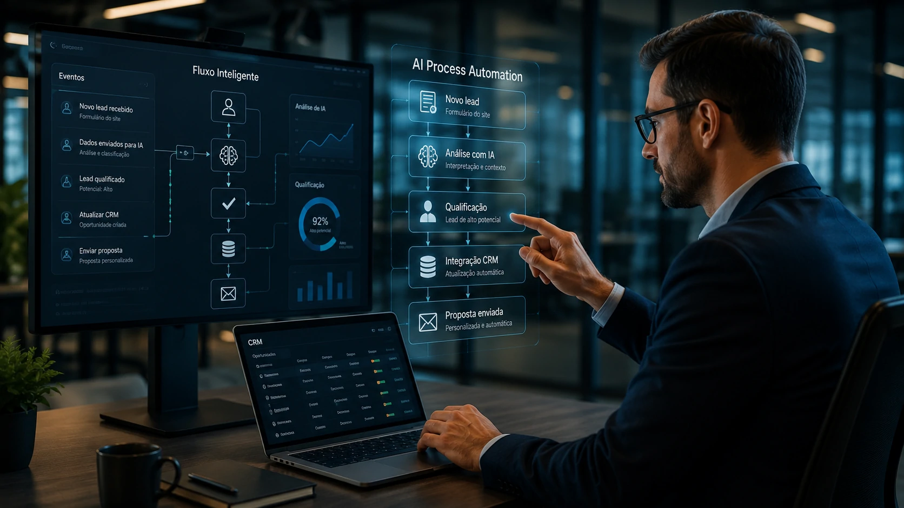
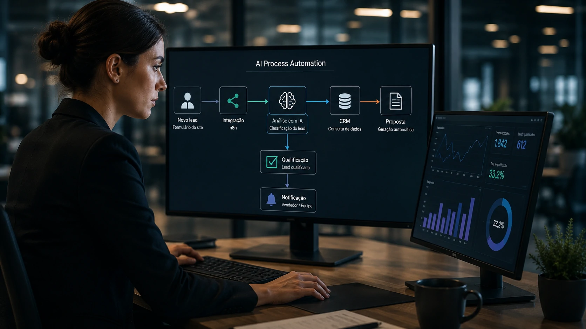
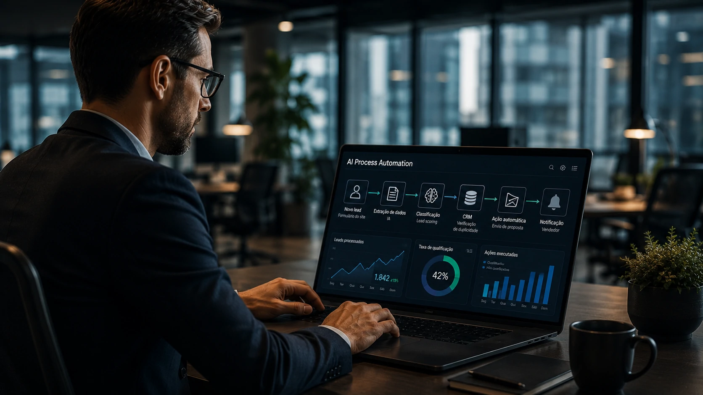

*Durante muitos anos, automatizar significava apenas eliminar tarefas repetitivas. Agora, empresas começam a migrar para uma nova geração de processos capazes de interpretar informações, tomar decisões e adaptar fluxos automaticamente. Essa mudança está transformando a forma como organizações operam e representa uma das maiores oportunidades atuais para ganho de produtividade.*

## AI Process Automation inaugura uma nova geração da automação empresarial



*Fluxos inteligentes permitem que diferentes sistemas compartilhem contexto e executem processos com autonomia cada vez maior.*

A evolução da **Inteligência Artificial** mudou completamente o conceito de automação empresarial. Se antes um fluxo automatizado apenas executava regras previamente definidas, agora ele consegue compreender linguagem natural, interpretar documentos, classificar informações e decidir qual ação executar em seguida.

Essa abordagem passou a ser conhecida como **AI Process Automation**, conceito que une **IA generativa**, automação de processos, APIs corporativas e integração entre sistemas para criar operações muito mais inteligentes.

Na prática, isso significa que um processo deixa de depender exclusivamente de decisões humanas para tarefas operacionais e passa a executar grande parte delas automaticamente, preservando apenas a supervisão necessária.

### Da automação baseada em regras para decisões inteligentes

Durante muitos anos, plataformas de **RPA** resolveram problemas importantes ao automatizar tarefas repetitivas.

Entretanto, bastava surgir uma exceção para que todo o fluxo precisasse de intervenção humana.

Com modelos como **GPT**, **Claude** e **Gemini**, o cenário mudou. Agora os sistemas conseguem interpretar contexto, identificar intenção e adaptar respostas sem depender exclusivamente de regras rígidas.

### A inteligência passa a fazer parte do processo

O maior diferencial da **AI Process Automation** não está apenas em automatizar atividades.

O verdadeiro avanço acontece porque a inteligência passa a fazer parte da própria lógica operacional da empresa.

Um processo pode analisar um e-mail recebido, identificar seu assunto, consultar um CRM, gerar uma resposta personalizada, atualizar sistemas internos e encaminhar o caso para um colaborador apenas quando realmente necessário.

Esse modelo complementa tendências apresentadas anteriormente pelo **Notícia Tech**, como em [O que é AI Orchestration? Por que ela substitui a disputa entre modelos de IA nas empresas](https://noticiatech.com.br/automacao/o-que-e-ai-orchestration-substitui-disputa-modelos-ia-empresas/), onde a coordenação entre diferentes modelos torna-se tão importante quanto o próprio modelo utilizado.

## Como funciona uma arquitetura moderna de AI Process Automation



*Integrações entre plataformas de IA, bancos de dados, CRMs e sistemas internos tornam possível automatizar processos completos.*

Ao contrário da automação tradicional, um fluxo moderno normalmente envolve diversos componentes trabalhando simultaneamente.

A lógica deixa de ser apenas "se acontecer X, faça Y" para incorporar análise contextual durante toda a execução do processo.

### Exemplo prático de fluxo inteligente

Um fluxo empresarial pode funcionar da seguinte maneira:

1. Um cliente envia um formulário pelo site.
2. O **n8n** identifica o novo cadastro.
3. Os dados são enviados para uma API da **OpenAI**.
4. A IA classifica o perfil do cliente.
5. O sistema consulta o **CRM**.
6. Caso o lead seja qualificado, uma proposta personalizada é criada automaticamente.
7. O vendedor recebe apenas oportunidades com maior potencial de fechamento.

Nesse cenário, a IA participa da tomada de decisão, enquanto a plataforma de automação coordena todas as integrações entre os sistemas.

### Um exemplo de prompt utilizado nesse processo

```text
Você é um analista comercial.

Analise os dados do lead abaixo.

Classifique o potencial de compra entre Alto, Médio ou Baixo.

Explique o motivo da classificação.

Sugira a próxima ação comercial mais adequada.

Retorne o resultado em formato JSON.
```

Esse tipo de arquitetura amplia significativamente a eficiência operacional e também reduz o tempo necessário para responder clientes e atualizar sistemas internos.

Empresas que já investem em **CRMs inteligentes** conseguem potencializar ainda mais esses resultados ao integrar processos semelhantes aos apresentados no guia [Como implementar um CRM com IA nas empresas](https://noticiatech.com.br/ferramentas/como-implementar-crm-com-ia-empresas-guia-pratico/).

## Onde AI Process Automation gera mais impacto dentro das empresas



*Processos inteligentes começam a conectar departamentos antes isolados, reduzindo gargalos e aumentando a produtividade operacional.*

Embora muitas empresas associem **AI Process Automation** apenas ao atendimento ao cliente, seu impacto é muito mais amplo. A tecnologia vem sendo utilizada para automatizar processos complexos que antes exigiam interação constante entre diferentes equipes.

À medida que plataformas de **IA generativa** se tornam mais confiáveis, cresce também a capacidade de executar fluxos completos envolvendo análise, tomada de decisão e integração entre sistemas corporativos.

O resultado é uma operação mais rápida, consistente e preparada para lidar com grandes volumes de informação.

### Principais áreas beneficiadas

As aplicações mais comuns incluem:

- **Comercial:** qualificação automática de leads, geração de propostas e atualização do CRM.
- **Financeiro:** leitura de notas fiscais, conferência de documentos e conciliação financeira.
- **Recursos Humanos:** triagem de currículos, classificação de candidatos e geração de relatórios.
- **Atendimento:** respostas inteligentes, classificação de chamados e direcionamento automático.
- **Operações:** monitoramento de processos, abertura de tarefas e comunicação entre diferentes sistemas.

Em praticamente todos esses cenários, a **Inteligência Artificial** reduz atividades repetitivas e libera profissionais para funções de maior valor estratégico.

### Human-in-the-Loop continua sendo indispensável

Apesar do avanço da tecnologia, empresas ainda não devem eliminar completamente a supervisão humana.

Modelos de linguagem podem interpretar informações de forma incorreta, produzir respostas inconsistentes ou cometer alucinações quando recebem dados insuficientes.

Por isso, o conceito de **Human-in-the-Loop** permanece essencial.

A melhor estratégia consiste em permitir que a IA execute as tarefas operacionais enquanto decisões críticas, aprovações financeiras, contratos e informações sensíveis continuam sob responsabilidade dos profissionais.

Esse equilíbrio aumenta produtividade sem comprometer segurança, governança e qualidade das decisões.

## AI Process Automation deve acelerar a transformação digital nos próximos anos

A adoção de **AI Process Automation** representa uma evolução natural da transformação digital iniciada com RPA, integração de sistemas e computação em nuvem. A diferença é que agora a inteligência deixa de ser apenas um recurso isolado e passa a integrar cada etapa do processo empresarial.

Empresas que investirem cedo nessa arquitetura tendem a reduzir custos operacionais, responder mais rapidamente aos clientes e construir processos mais escaláveis. Ao mesmo tempo, cresce a necessidade de definir políticas claras de governança, auditoria e supervisão humana para garantir o uso responsável da IA.

Mais do que substituir ferramentas tradicionais, **AI Process Automation** amplia o potencial da automação corporativa ao conectar pessoas, dados e modelos de inteligência artificial em um único fluxo operacional. Para gestores e equipes de tecnologia, o desafio deixa de ser apenas automatizar tarefas e passa a ser desenhar processos capazes de aprender, adaptar-se e gerar vantagem competitiva continuamente.

Nesse cenário, organizações que compreenderem essa mudança antes da concorrência estarão mais preparadas para uma nova fase da transformação digital, na qual a automação deixa de executar apenas comandos e passa a participar ativamente das decisões do negócio.

---