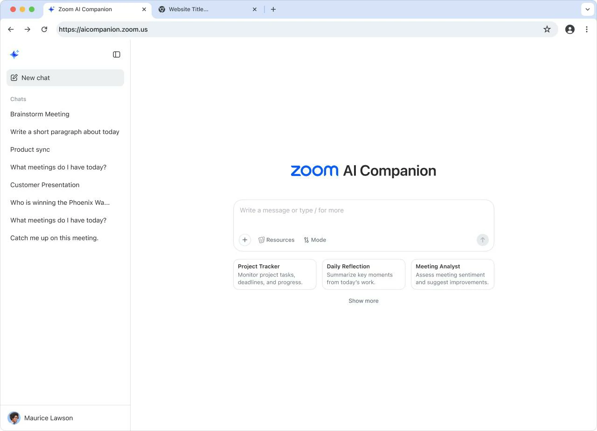

A Zoom está acelerando sua transformação para além das videoconferências.

A empresa anunciou a expansão de sua plataforma de inteligência artificial corporativa com foco em agentes autônomos e automação de fluxos de trabalho.

O movimento mostra como plataformas tradicionais de comunicação estão se reposicionando para competir em um mercado cada vez mais orientado por IA.

A nova estratégia busca transformar reuniões, chamadas e interações com clientes em gatilhos automáticos para execução de tarefas empresariais.

## O que a Zoom anunciou para empresas

A empresa expandiu sua plataforma agentic AI para atuar em diferentes áreas do ecossistema corporativo.

Entre as novidades estão:

- agentes personalizados sem código  
- automação de fluxos entre sistemas  
- integração com ferramentas externas  
- expansão do AI Companion  
- automação em atendimento e colaboração  

A proposta é transformar conversas em ações operacionais.

Isso reduz tarefas manuais e acelera processos internos.

## Como os agentes da Zoom funcionam na prática

Os agentes podem atuar em múltiplas etapas operacionais.

Isso inclui:

### Follow-up automático

Após reuniões, a IA pode gerar tarefas e e-mails automaticamente.

### Integração entre ferramentas

A plataforma conecta sistemas internos e ferramentas externas.

### Automação comercial

Equipes de vendas podem acelerar processos com fluxos automáticos.

### Atendimento ao cliente

Demandas podem ser classificadas e direcionadas automaticamente.

## Por que a Zoom está apostando forte em IA agora

O mercado de IA corporativa está se tornando um dos principais motores de crescimento para empresas de software.

A Zoom percebeu que o modelo tradicional de reuniões já não é suficiente para sustentar expansão.

Agora, a empresa busca posicionar sua plataforma como infraestrutura operacional.

Isso muda seu papel dentro das empresas.

De ferramenta de comunicação para ferramenta de execução.

## O impacto para empresas

A expansão da Zoom mostra um movimento importante do mercado.

Plataformas empresariais estão deixando de apenas conectar pessoas.

Agora começam a executar tarefas e automatizar operações.

Para empresas, isso significa:

### Mais produtividade

Menos tempo gasto em tarefas repetitivas.

### Mais velocidade

Processos operacionais acontecem com menos atraso.

### Mais integração

Áreas diferentes passam a operar de forma conectada.

### Menos dependência operacional

Parte da execução passa para agentes inteligentes.

O avanço da Zoom reforça uma tendência clara.

A inteligência artificial está deixando de ser suporte.

E está se tornando parte ativa da operação empresarial.