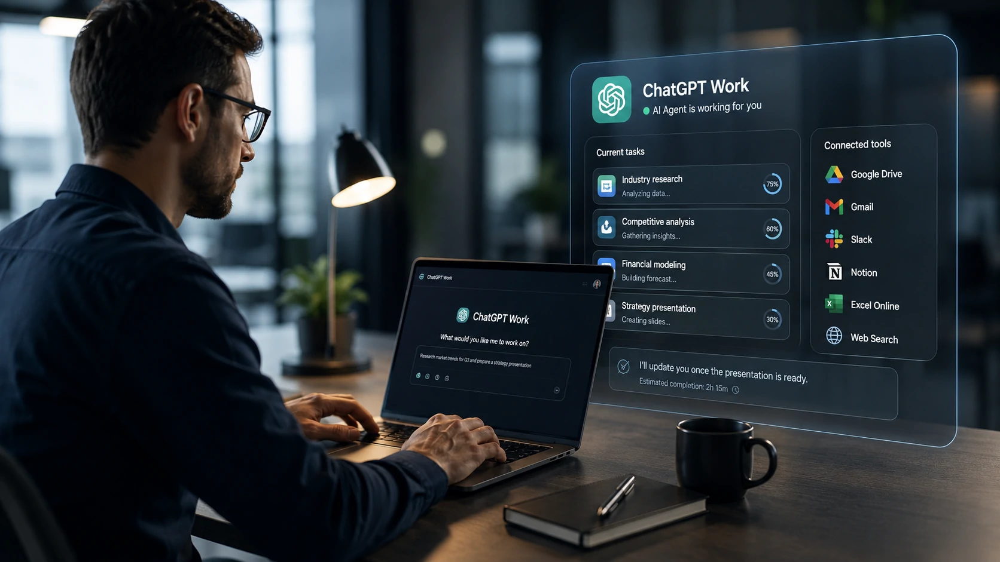
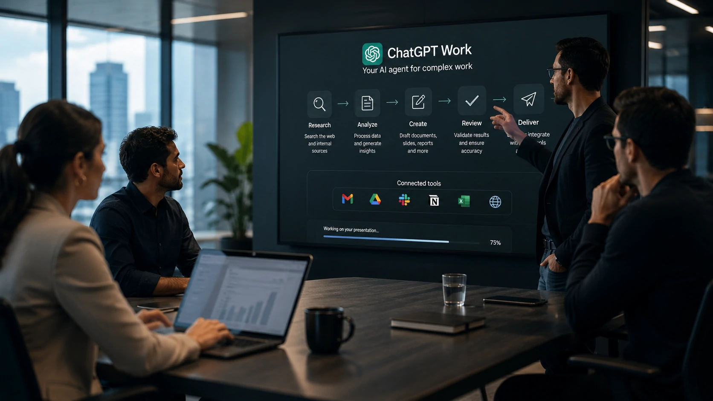
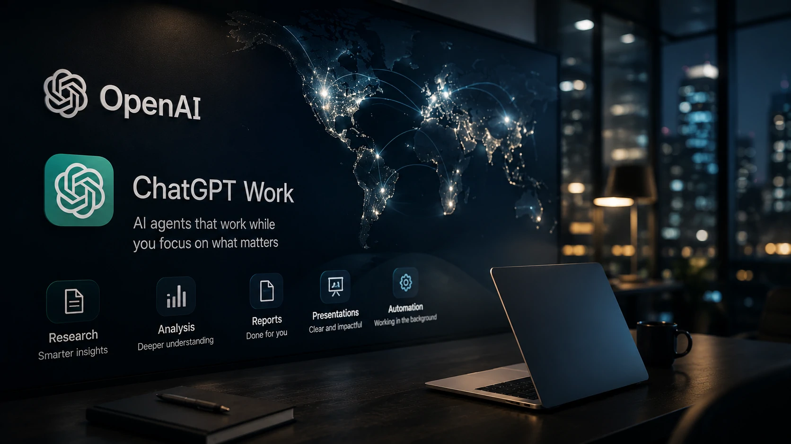

*Over the past two years, the Artificial Intelligence race has been defined by increasingly capable language models. Now the competition is entering a new phase: the company that succeeds in transforming AI into a true digital coworker could establish the next standard for enterprise productivity.*

## ChatGPT Work represents ChatGPT's evolution into an enterprise AI agent

*ChatGPT Work expands the concept of a conversational assistant by bringing AI closer to becoming a digital employee capable of handling complex business workflows.*

**OpenAI** has introduced **ChatGPT Work**, a new **Artificial Intelligence** agent designed to perform professional tasks for extended periods without requiring constant user supervision.

Unlike the traditional **ChatGPT**, which primarily responds to individual prompts, the new agent receives broader objectives and automatically organizes the steps required to deliver complete business outcomes.

In practice, this allows organizations to generate documents, presentations, research, data analysis and other enterprise deliverables while integrating with workplace tools and business ecosystems.

### An AI agent instead of just another chatbot

The defining characteristic of **ChatGPT Work** is its evolution into an AI agent.

Rather than simply answering questions, the system can execute structured workflows, bringing businesses closer to the vision of digital coworkers that major AI companies have been pursuing.

### OpenAI shifts its competitive strategy

The launch demonstrates that **OpenAI** is no longer competing solely on model intelligence.

Instead, its strategy increasingly focuses on practical business automation and the ability to complete real knowledge work inside organizations.

## The real impact is enterprise automation

*Organizations are beginning to view AI agents as part of their daily operations rather than simple productivity assistants.*

The impact of **ChatGPT Work** extends far beyond personal productivity.

The announcement reinforces a trend already emerging across workflow automation platforms, intelligent CRM solutions and enterprise AI systems: the creation of hybrid workforces composed of people and autonomous AI agents.

In this model, entire departments may rely on specialized AI agents to generate reports, organize information, respond to customers, prepare presentations and support business decision-making.

This evolution complements other trends previously covered by **Notícia Tech**, including the rise of **AI Orchestration** and multi-agent enterprise architectures.

Readers interested in this topic can also learn more about **AI Orchestration**:

https://noticiatech.com.br/en/tools/what-is-ai-orchestration-replacing-ai-model-competition-business/

Organizations already investing in intelligent sales automation will also find strong synergies with **AI-powered CRM** platforms, where autonomous agents increasingly support customer engagement and sales operations.

https://noticiatech.com.br/en/tools/how-to-implement-ai-crm-business-practical-guide/

### Productivity no longer depends entirely on people

The enterprise workflow is changing fundamentally.

Instead of employees performing every operational task manually, professionals increasingly supervise specialized AI agents capable of completing a significant share of repetitive knowledge work.

### Human expertise remains essential

Although automation continues to advance rapidly, strategic thinking, validation, creativity and customer relationships remain areas where human expertise continues to play a critical role.

## Competition between OpenAI, Google and Anthropic enters a new phase

*The competitive advantage is no longer defined only by the smartest AI model, but by the AI agent capable of delivering meaningful business outcomes.*

The launch of **ChatGPT Work** signals that the next stage of the **Artificial Intelligence** race will not be determined solely by benchmark scores or conversational performance.

Instead, the market is increasingly rewarding AI platforms that can complete real business work with greater efficiency and lower operational costs.

**OpenAI**, **Google** with **Gemini**, and **Anthropic** with **Claude** are all expanding investments in AI agents equipped with persistent memory, tool integration, contextual reasoning and autonomous task execution.

Together, these developments suggest that AI is evolving from a conversational interface into an operational layer for modern enterprises.

### Enterprise AI agents become the industry's top priority

Virtually every major AI announcement in recent months points in the same direction.

Foundation models are gradually becoming execution platforms capable of managing complete business workflows rather than simply generating responses.

This trend also helps explain recent initiatives to establish open standards for interoperable AI agents.

Read more:

https://noticiatech.com.br/en/artificial-intelligence/openai-anthropic-block-open-standard-ai-agents-enterprise-automation/

### Return on investment becomes the key enterprise metric

For business leaders, the central question is no longer:

"Which AI writes better?"

Instead, organizations are increasingly asking:

"Which AI agent can complete more work with fewer operational resources?"

This shift is expected to accelerate enterprise investment in autonomous AI systems over the coming years.

## ChatGPT Work offers a glimpse into the future of enterprise work

The launch of **ChatGPT Work** represents much more than another update to **ChatGPT**.

It reflects **OpenAI's** ambition to transform its language models into intelligent agents capable of taking responsibility for an increasing share of operational knowledge work across modern organizations.

For businesses, this could mean fewer repetitive administrative tasks, higher productivity and entirely new ways of integrating employees with autonomous AI systems throughout the enterprise.

At the same time, the announcement increases competitive pressure on **Google**, **Anthropic**, **Microsoft**, **Amazon** and other technology companies racing to define the next generation of **enterprise Artificial Intelligence**.

The future of AI will no longer be measured only by how well a model answers questions.

It will increasingly be measured by how much valuable work autonomous AI agents can successfully perform inside real organizations.

---