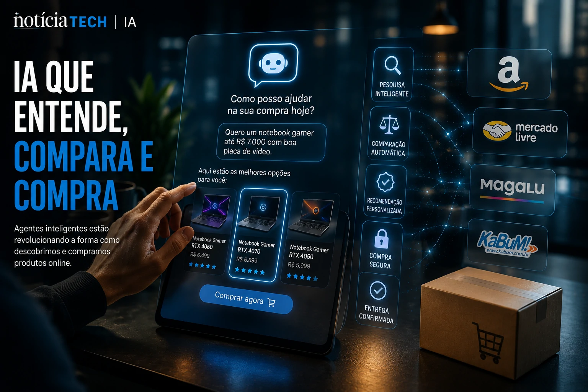
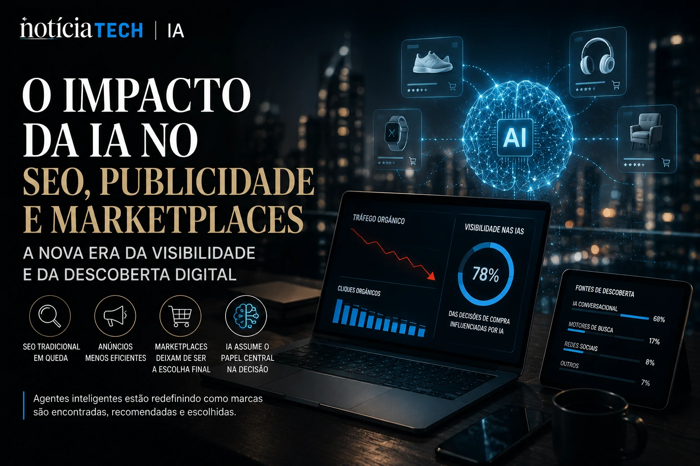

*The internet is officially entering a new era. The model based on manual searches, multiple open tabs and fragmented journeys is starting to give way to experiences driven by artificial intelligence agents capable of understanding intent, comparing products and completing purchases in seconds.*

*Behind the scenes, giants like **OpenAI**, **Google**, **Shopify**, **Microsoft**, **Walmart** and **PayPal** vie for control of the next strategic layer of the digital economy: the intelligent interface that will decide how consumers discover, choose and buy products online.*

*More than an evolution of e-commerce, the so-called “agentic commerce” inaugurates a new digital distribution model based on generative AI, contextual automation and personalization at scale.*

## The birth of agentic commerce changes the logic of e-commerce

The accelerating advancement of generative AI has begun to quietly transform the entire fabric of global e-commerce.

For more than two decades, the commercial internet operated based on:

- search engines;
- sponsored ads;
- marketplaces;
- Traditional SEO;
- manual navigation.

Now, this model is beginning to be replaced by conversational experiences guided by AI agents.

The change gained momentum following recent initiatives by **OpenAI**, which began expanding product discovery features directly within **ChatGPT**, enabling natural language-based shopping experiences.

Instead of searching manually, users simply start describing intentions.

Examples:

- “I want a gaming notebook for up to R$7,000”;
- “compare the best smartphones for photography”;
- “find a premium running shoe”.

AI then assumes multiple functions simultaneously:

- researcher;
- comparator;
- recommender;
- purchasing consultant;
- checkout intermediary.

This movement represents a structural transformation in the logic of the web itself.

Navigation stops being link-based and becomes intent-based.

According to industry experts, this new paradigm creates an “agent-driven internet”, where AI models begin to mediate a large part of the digital experience.

The impact of this can completely reset:

- SEO;
- paid media;
- marketplaces;
- product discovery;
- organic traffic;
- user retention.

This advance speaks directly to other recent transformations in the digital economy already analyzed by **Notícia Tech**:

[LinkedIn stops being a CV network and becomes a B2B distribution platform driven by AI](https://noticiatech.com.br/negocios/linkedin-deixa-de-ser-rede-de-curr%C3%ADculos-e-vira-plataforma-de-distribui%C3%A7%C3%A3o-b2b-impulsionada-por-ia/)
## OpenAI, Google and Microsoft start war over AI shopping interface

The current race is not just for generative AI leadership.

The true strategic objective is to control the consumer decision interface.

Whoever dominates this layer starts to influence:

- product discovery;
- purchasing behavior;
- digital monetization;
- user retention;
- commercial distribution.

**OpenAI** has accelerated this movement by integrating commerce experiences directly into **ChatGPT**, bringing AI closer to a true universal consumer assistant.

Meanwhile, **Microsoft** has expanded the concept of conversational checkout via **Copilot**, integrating simplified payment flows within the company's ecosystem.

**Google** has begun aggressive moves to transform **Gemini** and Search AI Mode into full AI-assisted commerce platforms.

The dispute intensified even more after the announcement of the so-called **Universal Commerce Protocol (UCP)**, an initiative supported by companies such as:

- **Google**;
- **Shopify**;
- **Walmart**;
- **Target**;
- **Etsy**.

The goal of the protocol is to create an open standard for communication between AI agents and e-commerce platforms.

In practice, this means enabling intelligent systems to:

- check stock;
- compare prices;
- validate availability;
- process payments;
- complete purchases automatically.

The movement inaugurates a new layer of internet infrastructure.

Instead of users manually navigating dozens of websites, AI agents will be able to execute complete journeys in just a few seconds.

This transformation can directly impact traditional traffic acquisition models.

Companies that today rely heavily on classic SEO and paid ads may face a scenario where AI becomes the main intermediary between brands and consumers.

The potential impact is reminiscent of the transformation caused by smartphones in the early 2010s.

## The impact on SEO, digital advertising and marketplaces could be huge

The advance of agentic commerce is beginning to generate concern across entire sectors of the digital economy.

The main reason is simple: if AI agents start to mediate most purchasing decisions, the traditional internet traffic model could change drastically.

Today, companies compete for attention through:

- advertisements;
- SEO;
- social media;
- marketplaces;
- influencers;
- sponsored campaigns.

But in a scenario dominated by conversational AI, the decision can start to happen before the user even accesses a website.

This creates a new market dynamic.

Instead of just optimizing pages for search engines, companies will need to optimize information for AI agents.

Experts are already beginning to discuss concepts such as:

### GEO (Generative Engine Optimization)

Strategy focused on optimizing content for generative engines and AI agents.

### AI Commerce Optimization

Strategies aimed at making catalogs, products and descriptions understandable for artificial intelligence models.

### Agent Visibility

The new fight for visibility within conversational systems.

This movement could create a profound redistribution of power within the digital ecosystem.

Companies that control AI interfaces now control:

- discovery;
- recommendation;
- intention;
- monetization;
- retention.

At the same time, traditional platforms may face relevant risks.

Among the main expected impacts are:

- reduction of traditional organic traffic;
- less dependence on marketplaces;
- decrease in clicks on ads;
- growth of conversational commerce;
- increased automation of recurring purchases.

The scenario also accelerates the race for corporate AI infrastructure.

Companies begin to realize that intelligent agents will no longer be just chatbots and will start to act as complete operators of digital tasks.

This trend speaks directly to the recent evolution of the so-called “AI Agents”, a topic that has been dominating the global technology market in 2026.

The most important thing is that this transformation is just beginning.

The next generation of the internet may not be based on traditional applications or search engines, but rather on intelligent agents capable of performing practically any digital task autonomously.

And at the center of this new economy, the dispute is no longer just about audience — and becomes about controlling the user's own decision-making.

---