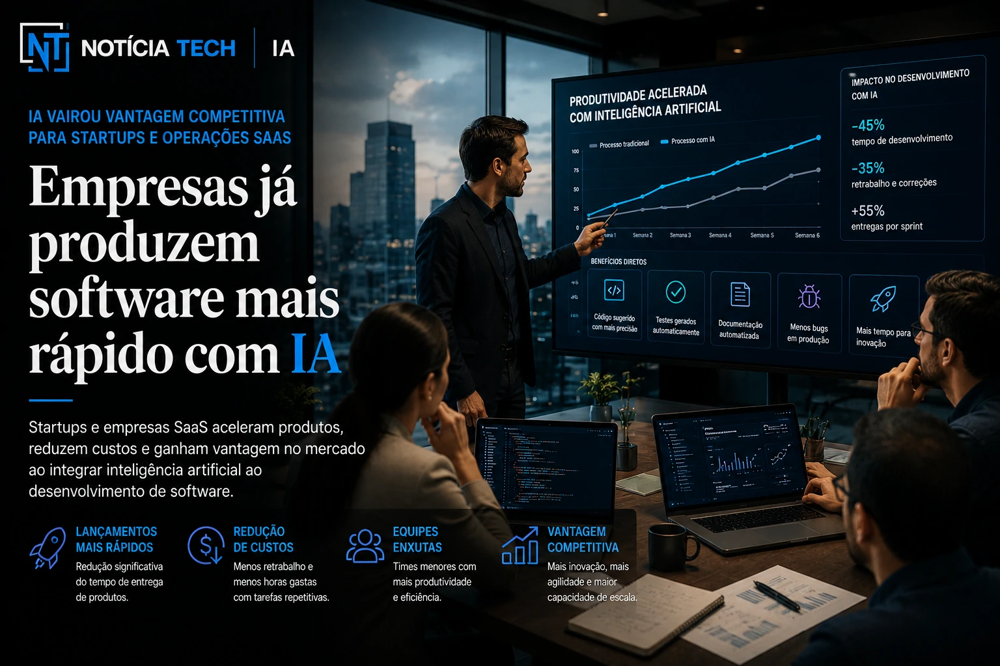

*The advancement of artificial intelligence tools for programming has begun to profoundly change the software development market. Platforms such as **GitHub Copilot**, **Claude**, **Codex** and new programming agents have started to accelerate technical tasks, automate parts of the code and redefine the role of programmers within companies.*

# The new generation of software development has begun

## AI stopped being an auxiliary tool and became part of the development flow

*AI tools have become part of the routine of development teams.*

The technology market has entered a new phase of software engineering.

In recent years, tools based on **generative AI** have stopped functioning just as experimental assistants and have become directly integrated into companies' development flows.

Today, platforms such as:
- **GitHub Copilot**;
- **Claude Code**;
- **OpenAI Codex**;
- autonomous programming agents;

can already:
- suggest complete codes;
- identify errors;
- automate documentation;
- create tests;
- speed up debugging;
- interpret code bases;
- assist software architectures.

This began to change the speed of production within technical teams.

Companies that previously needed weeks for certain deliveries are now able to speed up part of the process using AI as an operational co-pilot.

The impact is especially strong on:
- SaaS startups;
- B2B companies;
- digital platforms;
- corporate software;
- business automation;
- cloud products.

# Programmers didn't disappear, but the work changed

## The role of the developer began to migrate to strategic oversight

*Professionals began to supervise, validate and guide AI systems for development.*

One of the biggest questions on the market is:
Will AI replace programmers?

So far, the scenario points to something different.

Artificial intelligence has begun to automate repetitive development tasks, but it still relies heavily on human supervision.

This happens because current systems still have important limitations:
- logic errors;
- vulnerabilities;
- architectural problems;
- inconsistencies;
- low contextual understanding;
- failures in complex projects.

In practice, the role of the developer began to change.

The professionals began to work more in:
- supervision;
- validation;
- architecture;
- integration;
- technical strategy;
- decision making;
- context engineering.

Meanwhile, some operational work has started to be accelerated by AI.

This movement is reminiscent of other technological transformations in history:
- industrial automation;
- cloud computing;
- low-code platforms;
- DevOps.

Technology has not completely eliminated professionals, but it has profoundly changed the most valued roles and skills.

# Companies started producing software faster

## AI has become a competitive advantage for startups and SaaS operations

*Technology companies have started to accelerate development cycles using AI.*

The acceleration of software production began to create a new competitive advantage in the market.

Startups and SaaS companies have started using AI to:
- launch products faster;
- reduce development time;
- accelerate MVPs;
- reduce technical bottlenecks;
- automate maintenance;
- optimize lean teams.

This is especially important in a scenario where companies compete for speed of innovation.

Many smaller operations can now:
- develop faster;
- validate products beforehand;
- test features at a lower cost;
- compete with larger structures.

At the same time, large companies began to integrate AI into:
- internal platforms;
- corporate engineering;
- test automation;
- technical support;
- maintenance of legacy systems.

The impact of this could be huge on the Brazilian market.

# Brazil is still at the beginning of adopting AI for development

## Brazilian market began to accelerate training and integration

Despite global advancement, the structured use of AI in software engineering is still in its early stages in many Brazilian companies.

Most companies still face:
- lack of training;
- cultural resistance;
- fear of replacement;
- doubts about security;
- limited integration;
- lack of internal policies.

Even so, adoption began to grow rapidly.

Brazilian companies have already started to:
- train technical teams;
- test code copilots;
- integrate AI into workflows;
- accelerate development automation;
- create hybrid processes between AI and humans.

The movement also began to impact:
- freelancers;
- agencies;
- software houses;
- startups;
- internal technology departments.

This can create a new professional profile in the Brazilian market.

# Software engineering could enter an AI-first era

## Traditional development has begun to change

One of the strongest trends in the sector is the emergence of “AI-first” companies.

In this model, AI stops being just a support tool and becomes part of the operational development infrastructure.

This could change:
- delivery speed;
- team structure;
- operating costs;
- technical productivity;
- creation of digital products.

In the coming years, the market should advance to:
- autonomous programming agents;
- automated maintenance;
- intelligent tests;
- predictive debugging;
- AI-assisted architecture;
- multimodal development.

At the same time, experts believe that the human factor will remain essential in:
- creativity;
- strategy;
- validation;
- security;
- user experience;
- complex decision making.

What seems increasingly clear is that software engineering has begun to enter a new phase — and companies that learn to integrate artificial intelligence into development can gain an important competitive advantage in the coming years.