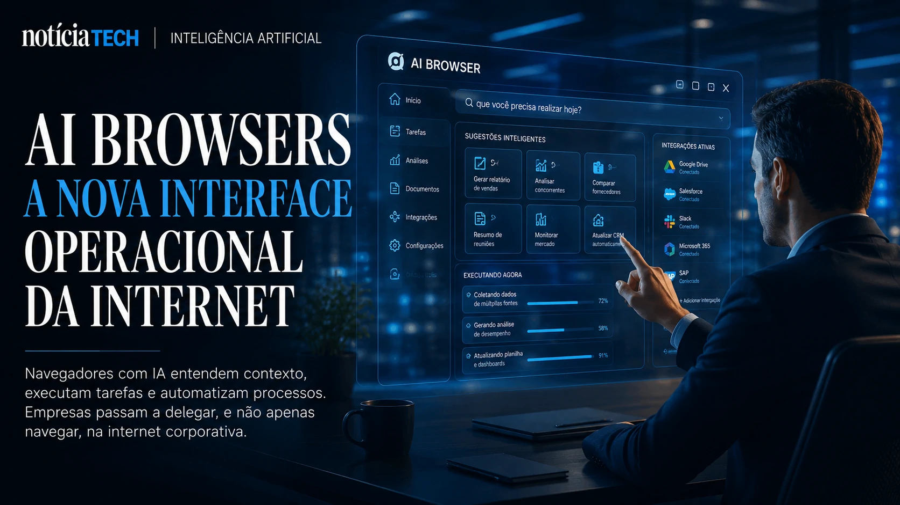

*Browsers with artificial intelligence are no longer just an experimental trend in Silicon Valley and are beginning to become a new operational layer within companies. The movement led by giants like **Google**, **OpenAI**, **Microsoft**, **Perplexity** and AI startups could change not only the way people browse the internet, but also how companies research, buy software, automate tasks and perform day-to-day digital operations.*

## AI Browsers are becoming the new operating interface of the internet

AI Browsers are intelligent browsers capable of understanding context, performing tasks, summarizing information, automating processes and interacting with digital platforms using natural language.

What was once just a tool for accessing pages is now beginning to evolve into a true corporate “operational co-pilot”.

The change happens because the traditional internet was built for humans to browse manually. New browsers with AI were designed to interpret intent, context and objectives.

Instead of:
- open dozens of tabs;
- search manually;
- copy information;
- switch between platforms;
- fill out repetitive forms;

the new AI Browsers begin to perform these tasks autonomously.

Companies like **OpenAI**, **Google** and **Microsoft** have realized that the browser can become the main point of interaction between users and artificial intelligence.

In practice, this creates a new strategic dispute:
- who controls the navigation interface;
- control information flow;
- behavioral data;
- corporate productivity;
- software discovery;
- digital distribution;
- online commerce;
- automated operations.

This movement expands a scenario previously discussed by NOTÍCIA TECH in:
[Google, OpenAI and Perplexity accelerate the race for AI browsers and threaten the traditional web economy](https://noticiatech.com.br/inteligencia-artificial/google-openai-e-perplexity-aceleram-riedade-pelos-navegadores-com-ia-e-amea%C3%A7am-a-economia-tradicional-da-web/)

### What changes in practice for companies?

Companies are starting to gain an AI-based operational layer directly in the browser.

This can allow:
- automatic generation of reports;
- comparison of suppliers;
- competitor analysis;
- intelligent filling of CRMs;
- purchasing automation;
- reading dashboards;
- market monitoring;
- contextual corporate support.

Instead of browsing, the user starts to “delegate”.

This is a structural change in the relationship between humans and software.

## The dispute over AI Browsers could redefine the corporate software market

AI Browsers begin to reduce the importance of traditional software interfaces.

Historically, companies needed to:
- learn complex systems;
- navigate through menus;
- access multiple platforms;
- operate software manually.

Now, AI models can act as an intermediate layer between user and corporate applications.

This means that:
- the browser understands the objective;
- access systems;
- executes commands;
- organizes responses;
- automates flows.

In practice, the software starts to be consumed via natural language.

This change threatens traditional SaaS models because it reduces dependence on the system's original interface.

Companies are beginning to realize that:
- AI can access different platforms;
- consolidate information;
- operate multiple systems at the same time;
- reduce operational friction.

The movement is directly connected to the advancement of so-called corporate autonomous systems, already analyzed by NOTÍCIA TECH in:
[The era of AI agents has begun: How Microsoft, OpenAI, and Google are turning companies into systems autonomous](https://noticiatech.com.br/inteligencia-artificial/a-era-dos-agentes-de-ia-j%C3%A1-come%C3%A7ou-como-microsoft-openai-e-google-est%C3%A3o-transformando-empresas-em-sistemas-aut%C3%B4nomos/)

### Why does this worry software giants?

The risk for traditional platforms is losing the direct relationship with the user.

If the AI browser:
- performs tasks;
- reads data;
- organizes processes;
- answers questions;
- automates operations;

the value of the traditional interface decreases.

This can transform:
- ERPs;
- CRMs;
- analytics platforms;
- customer service systems;
- productivity tools.

The dispute is no longer just “who has the best software”.

It becomes:
“who controls the operational intelligence layer”.

## Smart browsers begin to create a new economy based on contextual automation

AI Browsers don't just want to answer questions. They want to take actions.

This difference completely changes the role of the corporate internet.

Today, companies already use AI to:
- summarize meetings;
- write documents;
- generate presentations;
- automate marketing;
- respond to customers;
- create operational analyses.

But AI Browsers extend this to contextual execution.

Example:
- AI identifies a supplier;
- compare prices;
- access contracts;
- history consultation;
- suggests negotiation;
- performs operational tasks.

All within the browser.

This model begins to transform browsers into:
- operational hubs;
- productivity environments;
- autonomous interfaces;
- intelligent execution systems.

### What could happen in the next few years?

The market may enter a new phase where:
- websites are no longer navigated manually;
- AI starts to consume interfaces directly;
- companies optimize content for intelligent agents;
- software starts to compete for integration with AI;
- browsers become operating platforms.

This strengthens a new digital logic:
It is no longer enough to be found by humans.

Companies are now starting to need to be understood by artificial intelligence.

This scenario speaks directly to the rise of the B2A concept, already explored by NOTÍCIA TECH in:
[B2A: the new frontier of business where companies need to be understood by artificial intelligence](https://noticiatech.com.br/inteligencia-artificial/b2a-a-nova-fronteira-dos-neg%C3%B3cios-onde-empresas-precisam-ser-entendidas-por-intelig%C3%AAncias-artificiais/)

### AI Browsers Can Accelerate Enterprise Web Transformation

The race for smart browsers is beginning to reveal a quiet shift:
The internet is no longer just a visual interface and is becoming an operational environment interpreted by AI.

For companies, this could mean:
- massive productivity gains;
- reduction of operational friction;
- contextual automation;
- acceleration of processes;
- new strategic dependence on AI.

At the same time, it creates new challenges:
- governance;
- privacy;
- security;
- technological dependence;
- control of corporate data.

The dispute initiated by **Google**, **OpenAI**, **Microsoft**, **Perplexity** and other giants could end up redefining not only the browser, but the operational structure of the corporate internet itself in the coming years.

---