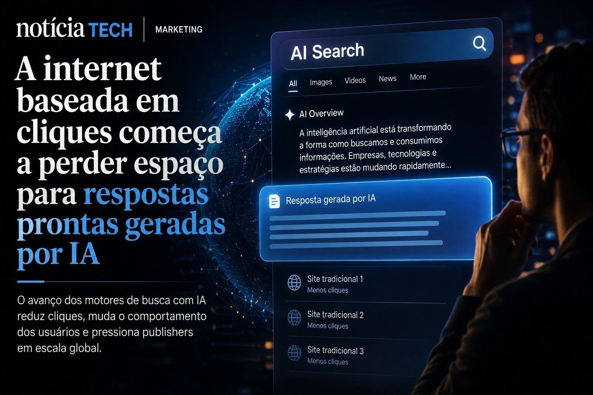
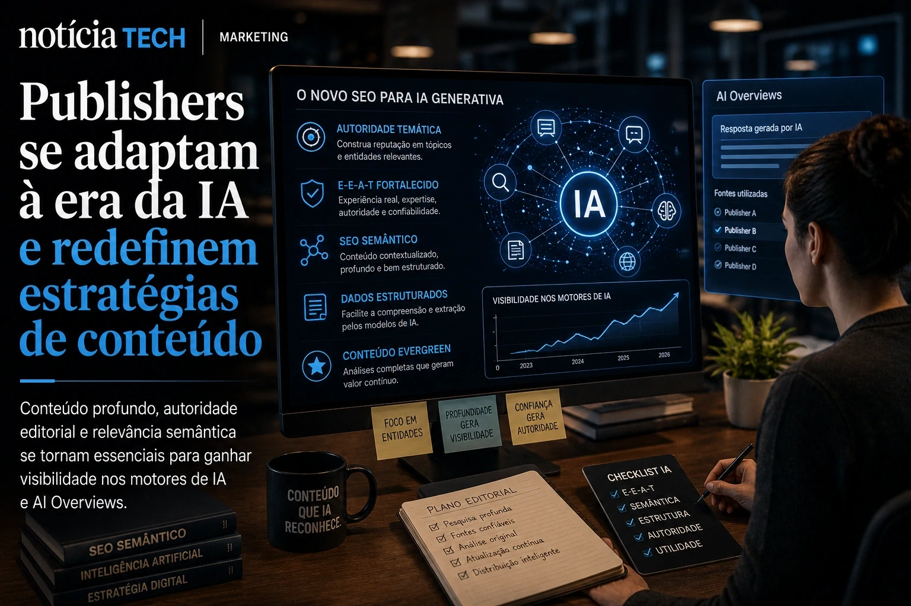

*The traditional internet model based on clicks, pages and organic traffic is beginning to face its biggest disruption since the emergence of Google. In 2026, platforms powered by **generative AI** are moving from just indicating links to taking on the role of direct information intermediaries — and this could profoundly change the economics of publishers, user behavior and the future of SEO.*

## The click-based internet begins to lose space for ready-made answers generated by AI

The rise of platforms like **ChatGPT**, **Perplexity**, **Google AI Overviews** and browser-integrated conversational assistants is accelerating a structural shift in users' digital behavior.

For more than two decades, the dominant model of the web worked in a relatively predictable way: users searched on Google, clicked on links, and navigated between sites to consume content. This flow has underpinned much of the modern digital economy.

Now, this cycle is beginning to be interrupted.

New search systems based on **generative AI** deliver complete answers directly to the interface, drastically reducing the need for external clicks. In practice, this means that the user spends more time within the AI ​​ecosystem itself and less time browsing the open web.

This transformation is already forcing media companies, independent creators and editorial platforms to review their entire digital distribution strategy.

The movement is directly related to the expansion of the so-called “Search Everywhere Optimization”, a concept that shows how brands are competing for attention not only on traditional Google, but also on intelligent assistants, conversational interfaces and social networks powered by AI.

[Search Everywhere Optimization: Why brands are abandoning traditional SEO to compete for attention in AI, social networks and assistants intelligent](https://noticiatech.com.br/inteligencia-artificial/search-everywhere-optimization-por-que-marcas-est%C3%A3o-abandonando-o-seo-tradicional-para-disputar-aten%C3%A7%C3%A3o-em-ia-redes-sociais-e-assistentes-inteligentes/)

The change also increases the importance of so-called semantic SEO, where context, editorial authority, analytical depth and reliability become worth more than simple isolated keywords.

### The silent problem of “zero-click internet”

The phenomenon known as “zero-click internet” initially gained strength on social media, but is now beginning to reach search engines directly.

Instead of sending traffic to websites, AI engines summarize information, synthesize analyzes and deliver canned responses.

For the user, the experience seems more efficient.

For publishers, the impact can be devastating.

Digital companies that depend on revenue based on ads, page views and stay on the website are beginning to face a new scenario where part of information consumption takes place without direct visits to the original pages.

This creates a silent structural crisis for blogs, newspapers, specialized portals and independent content producers.

## OpenAI, Google and Perplexity vie for control of the new web navigation layer

The current dispute goes far beyond simple online searches.

What's at stake is control of the internet's next dominant interface.

Companies like **OpenAI**, **Google**, **Microsoft** and **Perplexity** are trying to turn AI assistants into universal layers of digital navigation.

In practice, these platforms want to become permanent intermediaries between users and the web.

This movement has a strong connection with the race for smart browsers, a trend previously analyzed by **Notícia Tech**.

[Google, OpenAI and Perplexity accelerate the race for AI browsers and threaten the traditional web economy](https://noticiatech.com.br/inteligencia-artificial/google-openai-e-perplexity-aceleram-riedade-pelos-navegadores-com-ia-e-amea%C3%A7am-a-economia-tradicional-da-web/)

The strategic logic is clear:

- the longer the user stays within the AI;
- less dependence exists on external websites;
- greater control over data, advertising and purchase intention becomes.

This explains why big technology companies are investing billions in creating persistent conversational interfaces.

The goal is not just to answer questions.

It’s about controlling the user’s entire informational journey.

### The new war for digital attention

The internet is now entering a new phase of the fight for attention.

If platforms used to fight for clicks, now they fight for contextual permanence.

Smart assistants can:

- summarize content;
- compare products;
- interpret documents;
- negotiate services;
- generate analyses;
- organize information;
- perform tasks on multiple systems.

This scenario converges directly with the advancement of autonomous AI agents.

[The era of AI agents has begun: How Microsoft, OpenAI, and Google are turning companies into systems autonomous](https://noticiatech.com.br/inteligencia-artificial/a-era-dos-agentes-de-ia-j%C3%A1-come%C3%A7ou-como-microsoft-openai-e-google-est%C3%A3o-transformando-empresas-em-sistemas-aut%C3%B4nomos/)

The strategic consequence is profound:

The more intelligent these interfaces become, the less necessary the traditional model based on manual navigation between pages becomes.

## Publishers begin adapting content for generative AI and AI Overviews

The response from the publishing market has already begun.

Media companies and independent producers are adapting their operations to increase relevance within AI ecosystems.

This includes:

- production of more analytical content;
- strengthening E-E-A-T;
- semantic optimization;
- entity-based editorial architecture;
- reinforcement of topical authority;
- deep contextualization;
- creation of premium evergreen content.

In practice, shallow, generic articles produced just to rank for keywords tend to lose space.

Generative models favor content that offers:

- contextual depth;
- credibility;
- signs of authority;
- thematic consistency;
- strategic interpretation;
- structured data;
- real editorial experience.

This movement also accelerates the growth of new hybrid content formats between media, automation and contextual intelligence.

Companies are even beginning to replace traditional dashboards with conversational interfaces powered by AI.

[Companies begin to replace dashboards with analytical copilots powered by generative AI](https://noticiatech.com.br/negocios/empresas-come%C3%A7am-a-substituir-dashboards-por-copilotos-anal%C3%ADticos-movidos-por-ia-generativa/)

### The future of organic traffic could change permanently

Industry experts are already beginning to discuss a scenario where traditional organic traffic ceases to be the main indicator of digital relevance.

In the new information environment created by **generative AI**, contextual visibility may become more important than raw click volume.

This means brands will need to build:

- thematic authority;
- semantic recognition;
- digital reputation;
- multiplatform presence;
- distribution adapted for AI.

At the same time, the debate is growing about the remuneration of publishers whose content is used to feed generative models.

Large media groups are already beginning to negotiate licensing agreements with AI companies, while others are expanding access barriers and proprietary distribution systems.

The trend points to a possible reconfiguration of the economic architecture of the web itself.

What was once an internet based on links is slowly beginning to transform into an internet based on algorithmic synthesis.

And for digital companies, content creators and brands, understanding this transition can stop being just a competitive advantage — and become a matter of strategic survival in the new cycle of the attention economy.

---