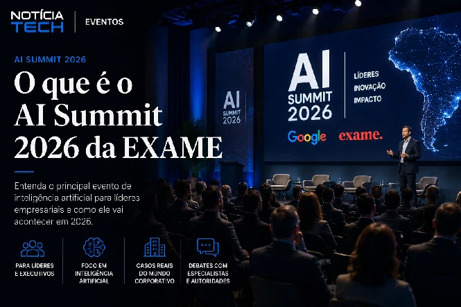

*The advancement of artificial intelligence has definitely entered a new phase in Brazil. The AI Summit 2026, promoted by EXAME in São Paulo, shows how large companies, startups and executives started to treat AI not just as a technological innovation, but as a strategic infrastructure for productivity, automation, corporate software and corporate digital transformation.*

## What is EXAME’s AI Summit 2026

*Event brings together industry leaders to discuss productivity, generative AI, automation and business digital transformation.*

The **AI Summit 2026**, organized by **EXAME**, emerges as one of the most relevant events on the Brazilian technology and business calendar.

The purpose of the meeting is to bring together experts, executives and companies to discuss how **artificial intelligence** is changing:

- companies;
- professions;
- marketing;
- productivity;
- corporate software;
- automation;
- creation of digital products;
- and business decision making.

The event takes place in São Paulo and brings together names linked to the AI ​​ecosystem, including representatives from **Google**, innovation experts and executives associated with the new generation of AI automation and development platforms.

More than a technology event, the AI ​​Summit symbolizes an important change in the market.

Artificial intelligence is no longer just an agenda for experimental innovation and has started to occupy a central space in corporate strategies.

## Artificial intelligence has officially entered the agenda of Brazilian companies

For a long time, AI was treated as a distant, expensive technology or restricted to large companies.

This scenario changed quickly.

In the last two years, tools based on:

- **generative AI**;
- intelligent automation;
- corporate copilots;
- data analysis;
- content generation;
- autonomous agents;
- and business productivity

began to gain real space within operations.

Today, Brazilian companies use AI to:

- automate service;
- create campaigns;
- generate reports;
- accelerate development;
- organize data;
- improve productivity;
- reduce costs;
- and increase operational efficiency.

This movement helps explain why events like the AI ​​Summit have grown so quickly.

The market stopped just asking:

“What is artificial intelligence?”

Now the question became:

“How to apply AI competitively within the company?”

## Brazil has become a strategic territory for the global AI race

*Big techs accelerate investments in corporate AI and infrastructure to compete in the Brazilian business market.*

**Google**'s presence at the event is one of the clearest signs that Brazil is now seen as a strategic market for the expansion of artificial intelligence.

The global race for AI leadership has become one of the biggest technology races in recent history.

Today, companies such as:

- **Google**;
- **OpenAI**;
- **Microsoft**;
- **Goal**;
- **Amazon**;
- **Anthropic**;
- and **NVIDIA**

invest billions of dollars in:

- infrastructure;
- language models;
- cloud computing;
- autonomous agents;
- chips;
- corporate platforms;
- and productivity ecosystems.

### The focus of the dispute has changed

In the early years of generative AI, the race was on who had the most advanced model.

Now, the market has changed.

The new dispute takes place around:

- business adoption;
- operational integration;
- productivity;
- infrastructure;
- corporate loyalty;
- and mastery of business software.

This explains why large companies began to aggressively compete for corporate contracts.

The goal now is not just to offer AI.

It is becoming the operational infrastructure of companies.

## Google tries to strengthen its position in enterprise software

The advancement of **Gemini** and Google's AI strategy shows that the company is trying to regain ground after the accelerated growth of **ChatGPT**.

In recent months, Google has increased investments in:

- Google Cloud;
- Gemini;
- AI agents;
- corporate productivity;
- Multimodal AI;
- and business automation.

This movement also appears in other recent market initiatives.

See also:

- [Google increases its bet on Anthropic, creator of IA Claude, and intensifies the dispute for corporate software](https://noticiatech.com.br/inteligencia-artificial/google-amplia-aposta-na-anthropic-criadora-da-ia-claude-e-acirra-disputa-pelo-software-corporativo/)

### The AI war is no longer just technological

The market is migrating from:

“Which AI is smarter?”

to:

“Which business ecosystem will dominate?”

This involves:

- cloud infrastructure;
- productivity;
- integration;
- automation;
- APIs;
- SaaS;
- and autonomous agents.

Whoever masters this layer can control an important part of the next generation of corporate software.

## Lovable represents one of the biggest trends in the new AI economy

*AI development tools accelerate software creation and reduce technical barriers for companies and creators.*

Another strategic highlight of the AI Summit is the presence of **Lovable**.

The startup gained international attention by enabling the creation of applications using prompts and AI-based automation.

In practice, platforms of this type allow users to create:

- interfaces;
- applications;
- MVPs;
- automations;
- operational flows;
- dashboards;
- and digital systems

with much less technical dependence.

### Prompt development began to change the market

In recent years, the market has seen accelerated growth in tools:

- no-code;
- low-code;
- Automated SaaS;
- business automation;
- and development copilots.

Now, a new layer has begun to emerge.

Systems capable of transforming natural language into functional software.

This completely changes the logic of traditional development.

### The impact can be huge for creators and small businesses

This type of technology can mainly benefit:

- creators;
- agencies;
- startups;
- small businesses;
- freelancers;
- marketing professionals;
- and companies without large technical teams.

AI-based tools are reducing:

- technical barriers;
- development time;
- operational cost;
- dependence on large teams;
- and launch complexity.

This can drastically accelerate the creation of digital products in Brazil.

## The next big market trend is AI agents

One of the most important issues in the sector today is the growth of so-called **AI agents**.

Unlike traditional chatbots, these systems can:

- interpret context;
- perform tasks;
- access tools;
- make decisions;
- automate processes;
- integrate platforms;
- and operate complex flows.

This new generation of AI begins to impact:

- support;
- marketing;
- sales;
- development;
- service;
- data analysis;
- CRM;
- and business productivity.

### Agentic AI can transform enterprise software

For years, software worked as passive systems.

The user needed:

- operate;
- click;
- configure;
- to analyze;
- and perform tasks manually.

Now that starts to change.

With AI agents, systems can:

- act;
- interpret;
- recommend;
- automate;
- and perform operational steps.

This change could completely redefine:

- ERPs;
- CRMs;
- marketing platforms;
- financial systems;
- corporate support;
- and business management.

## The paradox of artificial intelligence in Brazil

Despite the accelerated growth of AI, most Brazilian companies are still in the early stages of adoption.

This is one of the most important themes in the current market.

### Many companies still do not have a clear AI strategy

There is a huge difference between:

- use AI punctually;
- and integrate AI into the operation.

A large part of the market still faces problems such as:

- lack of professionals;
- difficulty of implementation;
- lack of governance;
- low digital maturity;
- fears about security;
- and lack of technical knowledge.

At the same time, companies that can integrate automation and artificial intelligence begin to quickly gain a competitive advantage.

## The Brazilian market could accelerate strongly in the coming years

There are some factors that can accelerate the adoption of AI in Brazil:

### Reduction of operational costs

Companies are seeking efficiency in an increasingly competitive environment.

AI reduces:

- repetitive tasks;
- rework;
- operational time;
- and manual dependency.

### Productivity growth

AI tools can accelerate:

- content creation;
- service;
- data analysis;
- marketing automation;
- support;
- and operational organization.

### Democratization of technology

AI is becoming more accessible.

Today, small companies are able to implement automations that were previously restricted to large corporations.

## AI is already changing marketing, sales and productivity

The transformation brought about by artificial intelligence does not just happen in the technical area.

It already directly impacts:

- digital marketing;
- sales;
- lead generation;
- advertisements;
- CRM;
- SEO;
- automation;
- and content production.

### Search behavior has changed

Users began to search for information directly in:

- ChatGPT;
- Gemini;
- Perplexity;
-Claude;
- and generative mechanisms.

This completely changes the logic of digital content.

Companies now need to be:

- understood;
- interpreted;
- contextualized;
- and recommended by AIs.

## AI events are transforming into strategic business hubs

The growth of the AI Summit shows another important change.

Technology events are no longer just networking environments.

Now they function as centers for:

- brand positioning;
- customer acquisition;
- building authority;
- expansion of ecosystems;
- and corporate relationship.

Today, companies compete for attention within the AI ​​market.

The logic is simple:

Whoever masters market perception first can gain a competitive advantage.

## What the AI Summit reveals about the future of artificial intelligence in Brazil

The AI Summit 2026 shows that the Brazilian market has officially entered a new phase of artificial intelligence.

The conversation no longer revolved solely around technological curiosity.

Now the focus is on:

- productivity;
- automation;
- business integration;
- autonomous agents;
- intelligent software;
- monetization;
- operational efficiency;
- and digital transformation.

At the same time, the advancement of platforms like **Lovable** shows that creating software could become much more accessible in the coming years.

This can speed up:

- startups;
- creators;
- business automation;
- micro SaaS;
- digital marketing;
- and new business models.

The tendency is for artificial intelligence to stop being a differentiator and start to function as a basic infrastructure for companies in practically all sectors.

And events like the AI ​​Summit show that this transformation has already begun.