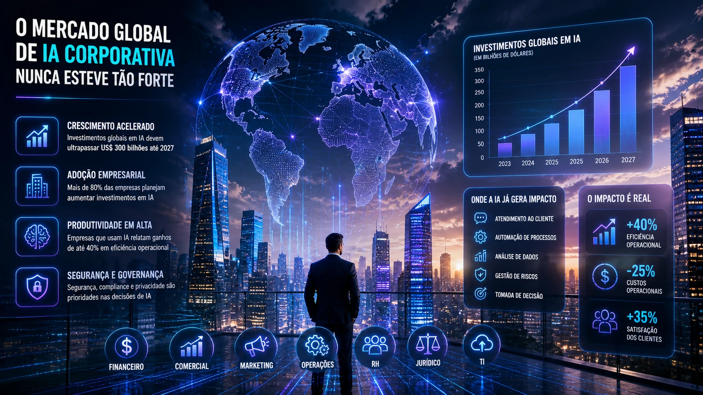
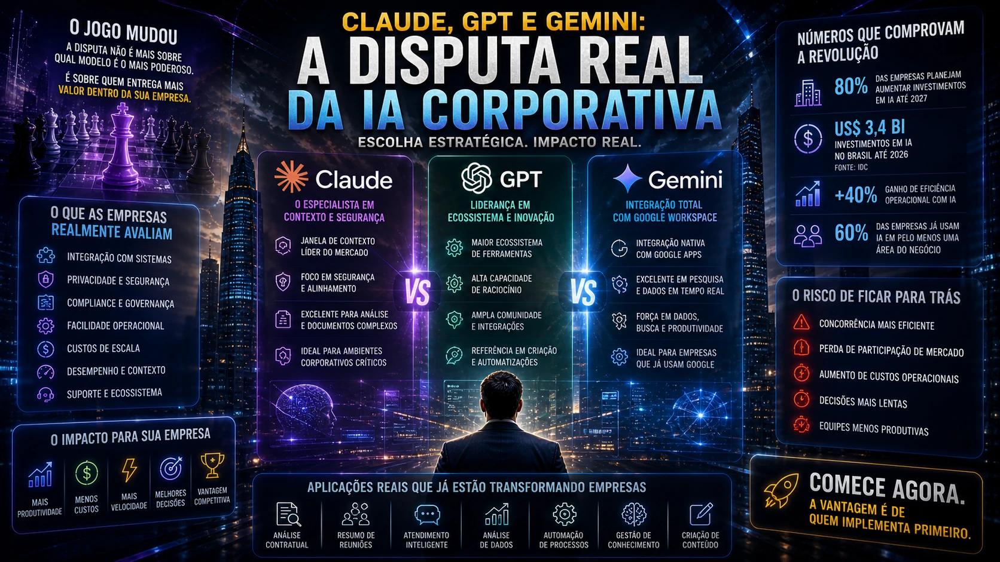

The dispute for leadership in artificial intelligence has entered a new phase — and now the battlefield is no longer just technological.

It's corporate.

Anthropic, one of the most aggressive companies in the generative AI space, accelerates its global expansion at a time when companies of all sizes begin to incorporate artificial intelligence into critical operations.

Movement is a clear signal:

The next AI war will be won within companies.

And this completely changes the game for Brazilian businesses.

## The new phase of the AI race

In recent years, the AI race seemed focused on who had the most powerful model.

Today that changed.

The market is beginning to understand that pure performance is not enough.

What matters now is:

operational integration  
cost reduction  
real automation  
business security  
scalability

Anthropic has been positioning its Claude model as an alternative strongly oriented towards the corporate environment.

This includes:

large analysis contexts  
document processing  
automation of internal flows  
advanced enterprise support

The focus is not just competing with GPT.

It's fighting for a corporate budget.

## AI left the innovation department

Many companies still treat AI as an experiment.

But the market has already changed.

Artificial intelligence is migrating from the laboratory to areas such as:

commercial  
marketing  
financial  
legal  
service  
operations

In practice, this means a structural change.

AI is no longer innovation.

It became infrastructure.

And this puts pressure on Brazilian companies.

Because the competition can gain operational efficiency first.

## Why Anthropic is targeting enterprises

There is a strategic reason.

The enterprise market is where the recurring money is.

While individual users generate scale, companies generate financial predictability.

In the B2B environment, AI can be applied to:

contractual analysis  
meeting summary  
automatic response to customers  
data analysis  
knowledge management  
creation of internal processes

This generates direct ROI.

And ROI sells.

That's why the giants' focus changed.

## The impact on Brazil

Brazil is accelerating its adoption of AI.

According to IDC, investments in artificial intelligence in the country are expected to reach US$3.4 billion in 2026.

This growth shows an important change:

Brazilian companies stopped asking “if” they are going to use AI.

Now they ask “how”.

And this creates a new competitive landscape.

Whoever implements it first can win:

more productivity  
less cost  
more speed  
more predictability

## Claude, GPT and Gemini: the real dispute

The market usually compares models based on technical capacity.

But the real dispute lies in other criteria.

Companies evaluate:

integration with systems  
privacy  
compliance  
governance  
operational ease  
scale costs

In this scenario:

Claude grows in context and security  
GPT leads in ecosystem  
Gemini advances integration with Google Workspace

The choice is no longer technical.

It became strategic.

## The new risk for companies: falling behind

Every new technology creates an advantage curve.

Those who enter early learn first.

Those who enter late pay more.

In AI this is even more aggressive.

Because operational learning generates a compound effect.

A company implementing AI today can accumulate months or years of efficiency ahead of the competition.

This impacts:

response time  
margin  
costs  
retention  
growth

## How Brazilian companies should react

The ideal time is not to wait for full maturity.

It’s about starting with practical applications.

### 1. Map operational bottlenecks

Where there is repetition, there is opportunity for AI.

### 2. Create internal use policy

Prevent Shadow AI and protect data.

### 3. Choose strategic stack

The tool needs to fit the operation.

### 4. Train teams

Technology without internal adoption fails.

### 5. Measure ROI quickly

AI needs to prove value early.

## The fight for corporate AI has already begun

Anthropic's accelerated expansion shows something important:

the AI war will not be won by the best model alone.

It will be won by whoever manages to enter more deeply into the companies' routine.

And that goes for any business.

Because while giants compete for technological space, companies compete for efficiency.

And efficiency, in the end, remains one of the most valuable currencies on the market.