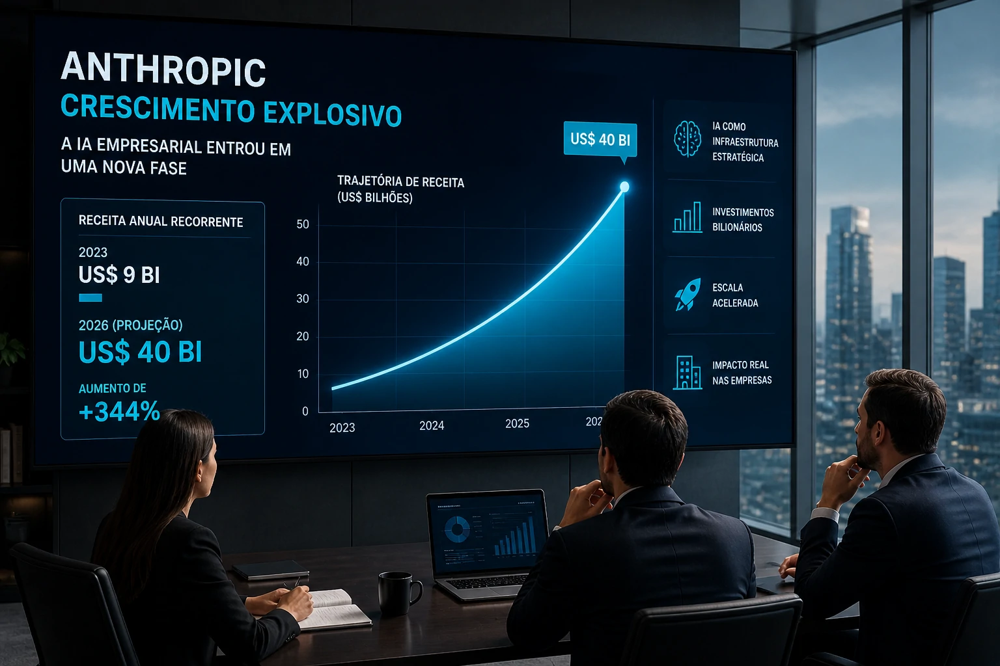
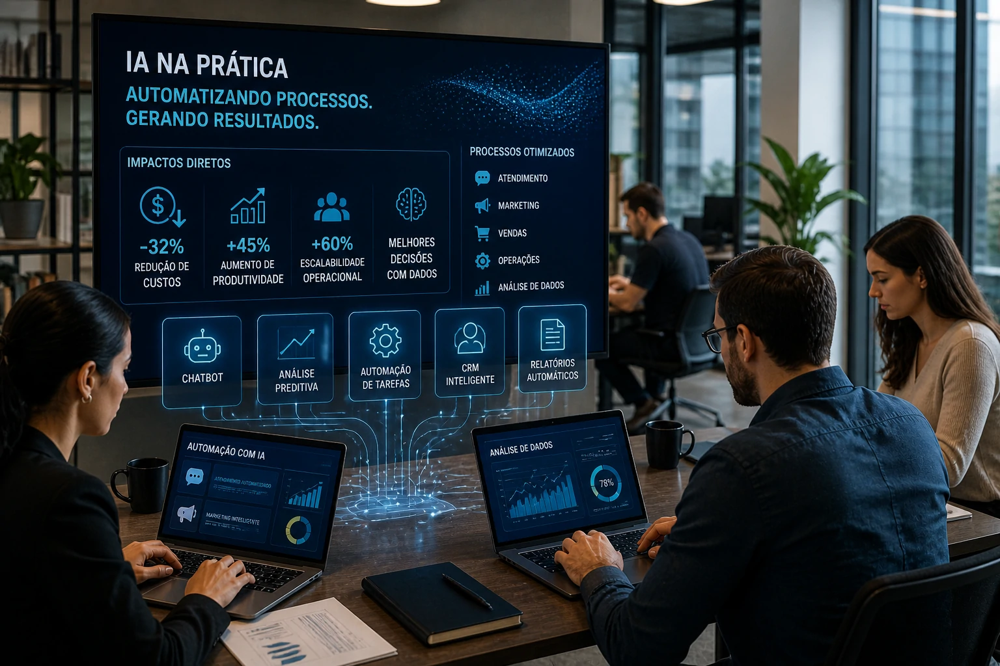

**Artificial intelligence has definitively entered the business consolidation phase.** The accelerated advancement of Anthropic, one of OpenAI's main competitors, reinforces a movement that many executives still underestimate: AI is no longer an experiment and has become critical business infrastructure.

While many Brazilian companies are still discussing where to apply AI, global giants are already competing for position, market and operational efficiency on an aggressive scale.

This new scenario changes the competitive logic.

## Anthropic's leap and the new stage of artificial intelligence

Anthropic went from a stage of strong growth to a level of expansion considered strategic in the global AI market. The movement signals something important: investors are no longer just betting on innovation, but on real monetization capacity.

This completely changes the profile of the sector.

Until recently, many AI tools were seen as complementary solutions. Today, they are being incorporated directly into the central operations of companies.

This same movement can be observed in the ecosystem of OpenAI, Microsoft and Google, which are increasingly expanding their artificial intelligence offerings for productivity, automation and business operations.

The trend is clear:

Companies that master intelligent automation will gain an operational advantage.

## Why the market is pouring billions into AI now

The central point is not technology.

It's efficiency.

AI is directly impacting four critical areas:

### Reduction of operational costs

Automation of service, support, document analysis and repetitive processes.

This is one of the main vectors of corporate adoption.

### Increased productivity

Teams can produce more in less time.

AI-based tools already accelerate:

- content production  
- data analysis  
- CRM  
- commercial prospecting  
- internal support

### Scalability

Companies can grow without proportionally expanding their structure.

This is especially relevant for small and medium-sized businesses.

### Decision intelligence

AI is not just about execution.

It's strategic analysis.

Today, platforms can identify sales patterns, customer behavior and internal bottlenecks.

## The real impact for Brazilian companies

The common mistake in Brazil is to think that AI is an exclusive matter for Big Tech.

It is not.

Small businesses are already using AI to:

### Automated service

Smart chatbots reduce operational burden.

### Performance marketing

Segmentation, copy, analysis and personalization.

AI is already transforming campaigns and customer acquisition.

### Sales

Automatic lead qualification.

Reduction of commercial time.

Conversion improvement.

### Internal processes

HR, finance, documentation and operational flow.

Companies that start now are still in a competitive window.

But that window is shortening.

## The cost of waiting can be high

Anthropic’s growth reveals an important message for the market:

The AI race has already begun.

And she's not waiting for anyone.

The historical pattern is known:

Those who adopt technology early learn sooner.

Those who learn first perform better.

Whoever performs best dominates the market.

It was like that with cloud.

It was like that with automation.

Now it's happening with AI.

## What companies should do now

The right question is not:

“Is it worth using AI?”

The correct question is:

“Which process in my company can be optimized first?”

The smartest way is to start small:

- service  
- marketing  
- sales  
- operation  
- data analysis

Enterprise AI is no longer trendy.

It became a competitive variable.

And Anthropic’s numbers show exactly that:

The market has already understood.

Now it remains to be seen who will act first.