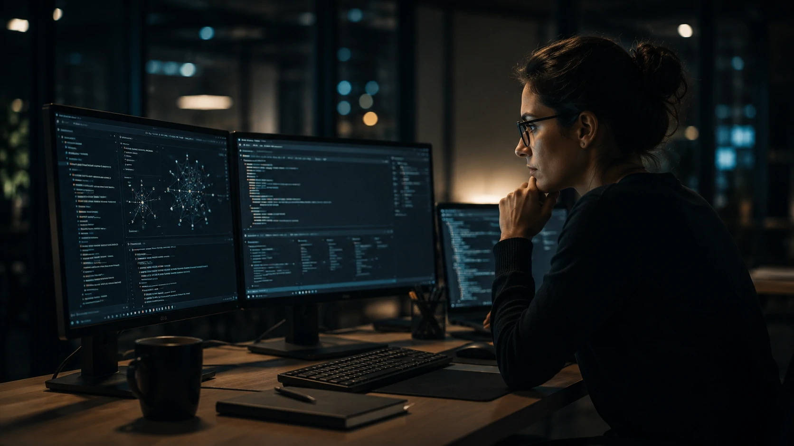

*For years, the artificial intelligence race has been measured by chatbots, benchmarks, and text generation capabilities. In 2026, the dispute begins to migrate to a much more strategic layer: whoever can transform AI into real operational work within companies will be able to control a significant part of the next generation of the digital economy.*

## Claude Code shows that AI agents are moving from being assistants to becoming software operators

The new phase of **Claude Code** signals a structural change in the corporate artificial intelligence market.

Instead of just suggesting code or answering questions, **Anthropic**'s latest models start running long tasks, validating results, coordinating multiple agents, and operating end-to-end development flows.

The **Claude Opus 4.8** update reinforces exactly this direction.

According to the company, the model was designed to handle complex engineering work, coordination of parallel agents and processes that require prolonged execution.

### The market is moving from assistance to execution

The difference seems small, but it has a huge economic impact.

The previous generation of AI helped professionals.

The new generation begins to perform relevant parts of the work.

This changes productivity, team structure and even the way companies hire technical talent.

### The software becomes an environment operated by agents

Software development has always required intense human coordination.

Now systems are emerging capable of:

- review code;
- identify vulnerabilities;
- document applications;
- test functionalities;
- validate results;
- automatically correct errors.

The consequence is that the software is no longer just developed by people and starts to be partially operated by ecosystems of agents.

## Anthropic's strategy advances on territory that OpenAI and Google also dispute

The current dispute is no longer just about smarter models.

The competition now involves who will be able to control companies' workflows.

**Anthropic** has been expanding its presence exactly in this territory.

The company launched new multi-agent capabilities, dynamic workflows and features aimed at large-scale enterprise operations.

### Development has become AI’s main battlefield

Programmers became one of the first professional groups directly impacted by agents.

Not because they will be replaced.

But because they start to work together with systems capable of carrying out tasks that previously took hours or days.

Recent studies show significant growth in the productivity and technological expansion of developers who use advanced code agents.

### The dispute is no longer chatbot versus chatbot

While ordinary users are still watching the evolution of conversational assistants, companies are looking at another metric.

The focus now is:

- autonomy;
- reliability;
- execution;
- operational integration.

This movement brings AI closer to ERP systems, CRMs and corporate infrastructure.

The trend already appears in previous movements discussed by Notícia Tech, such as [The era of AI agents has begun: how Microsoft, OpenAI and Google are transforming companies into systems autonomous](https://noticiatech.com.br/inteligencia-artificial/a-era-dos-agentes-de-ia-j%C3%A1-come%C3%A7ou-como-microsoft-openai-e-google-est%C3%A3o-transformando-empresas-em-sistemas-aut%C3%B4nomos/) and [AI Operating Systems: why companies are starting to replace isolated software with autonomous AI ecosystems](https://noticiatech.com.br/negocios/ai-operating-systems-por-que-empresas-come%C3%A7am-a-substituir-softwares-isolados-por-ecossistemas-aut%C3%B4nomos-de-ia/).

## Agent reliability begins to become more important than raw intelligence

Companies don't just need intelligent models.

They need predictable models.

That's why **Anthropic** started to strongly highlight metrics related to honesty, transparency and validation of responses.

The company claims that Opus 4.8 presents significant improvements in identifying uncertainties and reducing incorrect answers presented with overconfidence.

### The next problem for companies will not be capacity

The challenge begins to migrate to governance.

As agents take on more critical tasks, companies need to answer questions like:

- who validates decisions?
- who audits results?
- who is responsible for failures?
- how to control excessive autonomy?

These discussions connect directly to the growth of AI governance.

The movement also speaks to trends observed in [AI Compliance Officers: why companies are starting to create AI agents specialized in auditing and corporate governance](https://noticiatech.com.br/negocios/ai-compliance-officers-por-que-empresas-come%C3%A7am-a-criar-agentes-de-ia-especializados-em-auditoria-e-governan%C3%A7a-corporativa/) and [Shadow AI: companies discover that the invisible use of artificial intelligence has already become an operational risk in 2026](https://noticiatech.com.br/negocios/shadow-ai-empresas-descobrem-que-uso-invis%C3%ADvel-de-intelig%C3%AAncia-artificial-j%C3%A1-virou-risco-operacional-em-2026/).

### Trust can become the main competitive differentiator

During the early years of generative AI, the market prized speed.

Now start rewarding reliability.

Companies that operate financial, legal, industrial and infrastructure sectors need agents capable of justifying decisions and reducing risks.

In this scenario, models that demonstrate operational transparency can gain a competitive advantage.

## Anthropic's growth shows that investors believe in the era of corporate agents

The recent appreciation of **Anthropic** reinforces that the financial market sees economic potential in this transition.

The company achieved one of the highest valuations ever recorded in the artificial intelligence sector following strong growth in corporate customers and demand for advanced automation solutions.

The most relevant data is not just the market value.

It's why investors are betting billions.

### The focus is on the operational layer of companies

Capital is migrating to platforms capable of:

- perform work;
- integrate systems;
- operate processes;
- coordinate agents;
- transform corporate knowledge into production.

This is exactly the layer where the next billion-dollar dispute in artificial intelligence begins to take place.

### Software can no longer be just a tool

The vision that begins to emerge is deeper.

Software is no longer just a product used by people.

They start to function as environments inhabited by specialized digital agents.

In this scenario, companies don't just buy technology.

They buy automated operational capacity.

Recent developments at Claude Code suggest that this transformation is progressing faster than much of the market anticipated. And if the next cycles confirm this trajectory, the next big war in artificial intelligence may not happen in the interfaces that users see daily, but behind the scenes that move companies' software, processes and infrastructure.

---