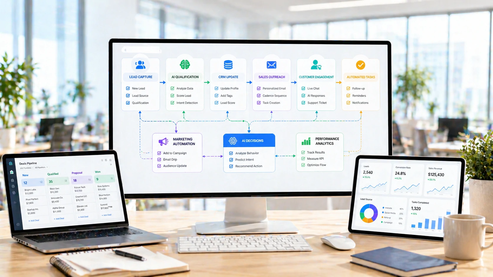

The global race for the next generation of artificial intelligence has entered a new chapter.

French startup **<u>AMI (Advanced Machine Intelligence)</u>** announced raising **<u>US$ 1 billion</u>** to accelerate the development of autonomous artificial intelligence systems — a new technological layer that goes beyond content generation and aims to execute complex tasks without constant supervision.

The project is led by **<u>Yann LeCun</u>**, one of the most respected names in modern artificial intelligence and a historical reference in deep neural networks.

The movement draws attention not only because of the amount invested, but because of the strategic direction of this capital.

If in recent years the market has focused efforts on generative AI, now the focus is beginning to migrate to something even more ambitious:

**<u>operational autonomy.</u>**

## What is autonomous AI?

**<u>Autonomous AI</u>** represents a practical evolution of generative artificial intelligence.

While traditional models depend on frequent commands, autonomous systems can interpret context, make decisions, execute multiple steps and adjust strategies throughout the process.

In practice, this completely changes the role of technology.

Before, AI worked as an assistant.

Now, she begins to act as an operator.

Practical example:

Before:

“Write a business email.”

Now:

“Analyze leads, select opportunities, send initial contact and automatically update the CRM.”

The difference is not in intelligence.

It is in **<u>execution.</u>**

## Why are investors changing focus?

The billion-dollar investment in AMI shows a clear market trend.

Capital is migrating to solutions with more direct operational returns.

In recent years, much of the investment in AI has been directed towards text, image generation and creative automation tools.

Now, the market is starting to look for technologies with a deeper impact on internal processes.

The reason is simple:

**<u>more efficiency</u>**  
**<u>less operating cost</u>**  
**<u>more scale</u>**

For investors, this expands the monetization potential.

For companies, it increases productivity without proportional team growth.

## The impact on Brazilian companies

For the Brazilian market, especially small and medium-sized companies, this evolution could have a relevant impact.

Most companies in Brazil still operate with lean teams, manual processes and low operational standardization.

Autonomous AI can accelerate an important transformation.

### Commercial

Lead qualification automation.

Smart follow-up.

Automatic CRM update.

### Service

Customer screening.

More contextualized automatic responses.

Intelligent prioritization of urgent demands.

### Marketing

Automated campaign execution.

Continuous ad optimization.

Automatic performance analysis.

### Operations

Automation of internal processes.

Real-time operational monitoring.

Execution of repetitive routines without human intervention.

The main gain is clear:

**<u>more productivity without proportional team expansion.</u>**

## The new phase of business automation

The advancement of autonomous AI could represent a profound change in the way companies operate.

If the first phase of artificial intelligence was marked by content generation, the next tends to be marked by **<u>operational execution.</u>**

This completely changes business logic.

AI stops just supporting.

And it starts operating.

For Brazilian companies, following this movement early on can mean a real competitive advantage.

Especially in markets where margin, speed and efficiency define survival.

AMI's billion-dollar investment could be just the beginning of a new technological race.

And this time, the goal is not to talk better.

It's about operating better.