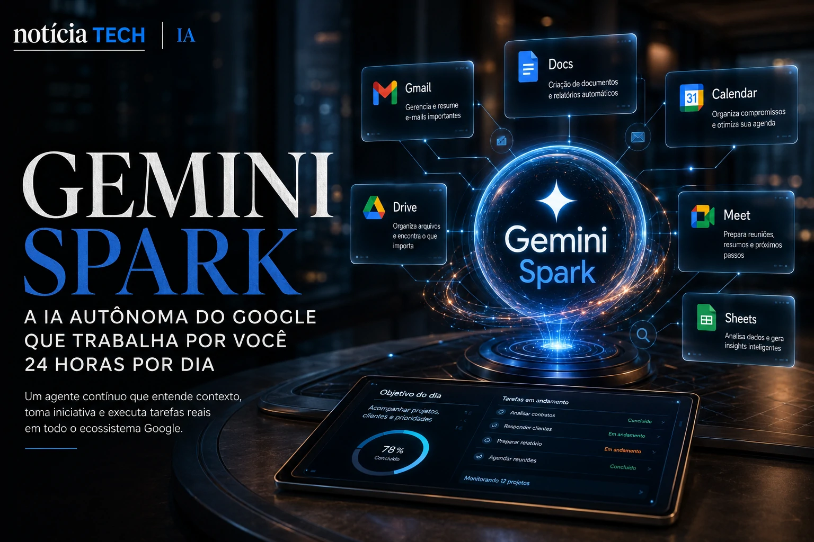
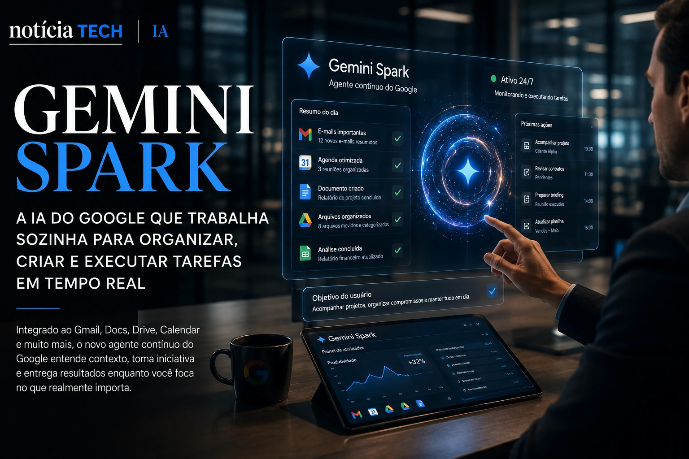
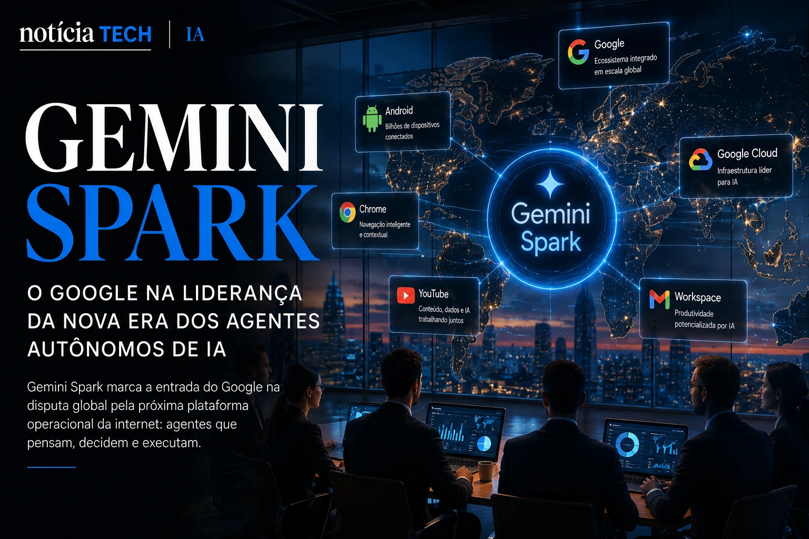

*The launch of **Gemini Spark** marks one of the most important changes in the artificial intelligence industry since the popularization of generative chatbots. Instead of just responding to isolated commands, the new **Google** system inaugurates a new stage of AI: continuous agents capable of operating, monitoring and executing digital tasks practically autonomously. The announcement made at **Google I/O 2026** does not just represent a technological update. It signals a direct contest for control of the next operational layer of the internet.*

## What is Gemini Spark and why Google considers the project strategic

**Gemini Spark** is a new continuous agent model developed by **Google** to act persistently in the cloud. Unlike traditional chatbots, which wait for manual user requests, Spark was designed to function as a kind of “permanent operational assistant”.

In practice, this means that AI can:

- monitor tasks continuously;
- interpret context between applications;
- act proactively;
- automate complex processes;
- make small operational decisions;
- execute flows without constant intervention.

According to **Google** itself, Spark's objective is to transform the current concept of digital productivity.

Instead of opening dozens of tabs, copying information and switching between applications, the user delegates objectives to the AI ​​— and the agent starts operating in the background.

The launch comes at a time when the entire market is moving towards so-called “AI Agents”, considered the next major evolution of commercial artificial intelligence.

Companies like **OpenAI**, **Anthropic**, **Microsoft** and **Amazon** were already investing in this direction, but **Google** decided to accelerate the dispute with deep integration within the **Workspace**, **Android**, **Chrome** and cloud services ecosystem.

The movement reinforces the perception that the AI ​​war is no longer just about conversational models.

Now the race is about who will control the user's digital operational flows.

## How Gemini Spark works in practice within the Google ecosystem

What sets **Gemini Spark** apart is its persistent context capability.

While traditional systems “forget” part of the information between interactions, Spark maintains continuous working memory to keep track of projects, tasks, objectives and recurring activities.

In the **Google I/O 2026** demonstration, the system showed integration with:

- **Gmail**;
- **Google Docs**;
- **Google Sheets**;
- **Google Meet**;
- **Google Calendar**;
- **Google Drive**;
- Android applications;
- browsers;
- external corporate tools.

The proposal is simple, but extremely powerful:

The user doesn’t just ask “summarize this email”.

He might say something like:

> “Follow my conversations with clients, organize important meetings, highlight priority contracts and notify me if a project is delayed.”

From then on, Spark operates continuously.

### The model stops being a chatbot and starts operating as an autonomous system

This change completely alters the logic of current generative AI.

Today, most users still use AI in short, isolated sessions.

With Spark, the concept changes to:

- Persistent AI;
- Contextual AI;
- Operational AI;
- Executive AI;
- Multitasking AI;
- Predictive AI.

This brings the market closer to a concept that experts have been calling “agent-driven computing”.

In this scenario, traditional interfaces begin to lose relevance.

The user no longer manually navigates between applications because the AI ​​starts to operate directly on the services.

This movement can profoundly affect:

- SaaS software;
- productivity platforms;
- CRMs;
- management systems;
- search engines;
- mobile applications;
- digital marketplaces.

In fact, the launch speaks directly to the transformation of the corporate ecosystem itself driven by AI, a topic that we have previously explored in Notícia Tech in:
[AI in companies stops being an experiment and becomes an operational priority in 2026](https://noticiatech.com.br/inteligencia-artificial/empresas-dobram-investimentos-em-ia-corporativa-e-brasil-acelera-ado%C3%A7%C3%A3o-de-agentes-inteligentes/)

## Gemini Spark puts Google at the center of the global race for autonomous agents

The launch of **Gemini Spark** also has a huge strategic component.

In recent months, the dispute between **Google**, **OpenAI**, **Microsoft**, **Anthropic** and **Meta** no longer revolves solely around the textual quality of the models.

The new market priority became:

who will be able to build the AI operating system.

And that completely changes the game.

### The future of AI will be defined by the ability to perform actions

Current models can already:

- write;
- summarize;
- to look for;
- programming;
- analyze data;
- generate images.

But the next step involves operational autonomy.

In other words:

- AI that schedules meetings;
- AI that negotiates processes;
- AI that manages internal flows;
- AI that tracks corporate metrics;
- AI that performs recurring tasks;
- AI that makes supervised decisions.

In this context, **Gemini Spark** appears as **Google**'s attempt to transform its gigantic digital infrastructure into an operational platform powered by agents.

The company's greatest competitive advantage lies precisely in the volume of integration that already exists.

**Google** controls:

- Android;
- Chrome;
- Gmail;
- Workspace;
- YouTube;
- Search;
- Cloud;
- Maps;
- global mobile ecosystem.

This offers an advantage that is extremely difficult to replicate.

In fact, the advancement of autonomous agents is also directly connected to the change in the behavior of social platforms and digital distribution, something that we analyze in:
[LinkedIn stops being a CV network and becomes a B2B distribution platform driven by AI](https://noticiatech.com.br/negocios/linkedin-deixa-de-ser-rede-de-curr%C3%ADculos-e-vira-plataforma-de-distribui%C3%A7%C3%A3o-b2b-impulsionada-por-ia/)

## The impact of Gemini Spark on the digital job market

The launch also reignites important debates about productivity and operational replacement.

Although **Google** presents Spark as an assistance tool, experts already see the potential for mass automation for repetitive administrative and cognitive activities.

Among the potentially affected areas are:

- operational support;
- digital service;
- administrative coordination;
- document analysis;
- organization of agendas;
- email management;
- production of reports;
- intermediate office tasks.

At the same time, a new layer of opportunities emerges.

Companies will demand professionals capable of:

- supervise AI agents;
- structure automations;
- validate autonomous processes;
- create intelligent operational flows;
- integrate AI into business.

The trend reinforces a movement that had already been gaining strength since 2025:

AI stops being just a creative tool and starts to play an operational role within companies.

## Security, privacy and operational risks are at the center of the debate

The more autonomy agents receive, the greater the risks become.

**Google** itself acknowledged during the event that Spark will require advanced layers of authorization, control and human oversight.

This is because a continuous agent has potential access to:

- emails;
- documents;
- diaries;
- corporate data;
- browsing history;
- business tasks;
- sensitive information.

The challenge now is not just developing powerful AI.

It’s about developing trustworthy AI.

Digital security experts warn that autonomous agents could usher in a new generation of cyber risks if companies do not implement robust governance policies.

At the same time, the corporate market tends to accelerate investments in:

- compliance for AI;
- algorithmic audit;
- decision tracking;
- contextual authentication;
- continuous human supervision.

## Gemini Spark could redefine the next generation of the internet

The most important thing about the launch of **Gemini Spark** may not be the technology itself.

But what it represents.

For years, the internet was based on separate applications, multiple interfaces and manual navigation.

Autonomous agents propose another scenario:

the user sets goals;
the AI ​​executes the paths.

If this model really advances, the market could undergo a transformation as profound as the arrival of smartphones or cloud computing.

And this time, the center of the dispute will not just be who has the best conversational AI.

It will be the one who controls the agents who start to operate the entire digital environment.

---