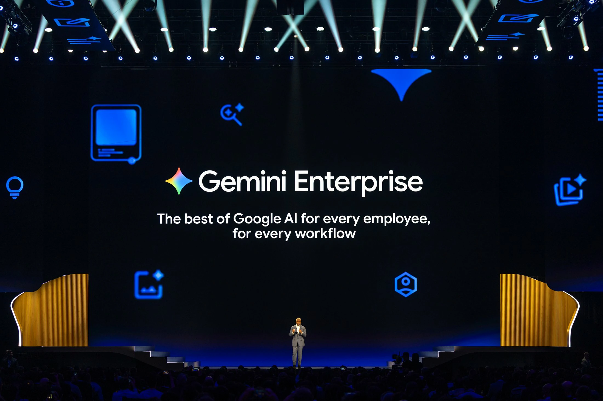
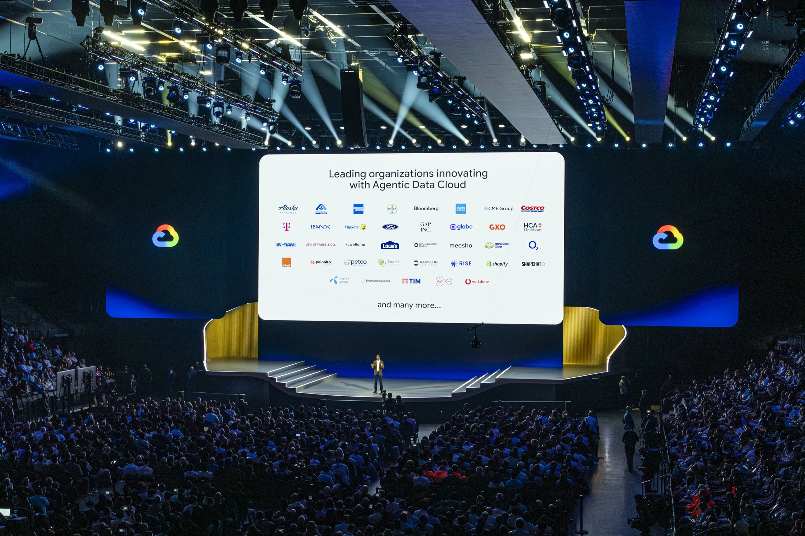
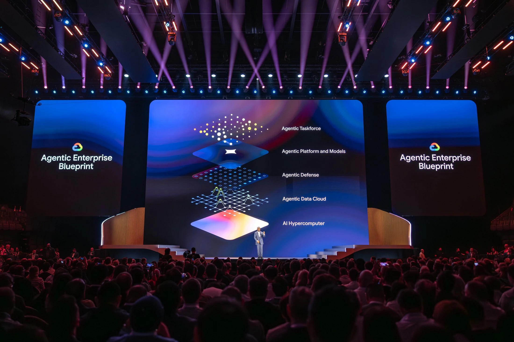

Enterprise artificial intelligence is entering a new phase.

Google announced a strategic expansion of its enterprise AI solutions, placing autonomous agents at the center of business operations.

The change shows an important transformation in the market.

The testing phase with generative AI begins to give way to real operational applications, focusing on productivity, automation and scalability.

The move puts Google in a direct dispute with Microsoft and OpenAI within the corporate environment.

But with a clear strategy: less focus on simple assistants and more focus on operational agents.

## What Google announced for businesses

Google has consolidated its enterprise artificial intelligence strategy within the Gemini Enterprise ecosystem.

The proposal is to integrate creation, automation and operation in a single corporate environment.

Among the main features are:

- creation of custom agents  
- automation of business processes  
- integration with internal systems  
- intelligent data analysis  
- operational monitoring

In practice, this reduces barriers for companies that want to implement artificial intelligence without major technical structures.

## What changes with AI agents

AI agents operate differently than traditional chatbots.

While assistants answer questions, agents perform complete tasks.

### Interpretation of objectives

AI understands context and goals.

### Multi-step execution

Processes no longer depend on isolated commands.

### Operational integration

Agents can access internal systems and execute flows.

### Automation at scale

Companies can automate repetitive tasks more quickly.

This model reduces costs and increases efficiency.

## Why Google is accelerating this market

The corporate market has become the main space for monetizing artificial intelligence.

Large companies are competing to lead this new operational layer.

Google wants to position its agents as business infrastructure.

This changes the logic of automation.

Before, companies bought tools.

Now, they are starting to hire automated operations.

## The impact for companies

The adoption of AI agents can directly change the operational structure of businesses.

### Cost reduction

Repetitive processes start to consume less time and less staff.

### More productivity

Operational flows gain speed.

### Better decision making

Data analysis becomes faster.

### Scalability

Companies can grow with leaner structures.

Google's advance reinforces a clear movement in the market.

The dispute over artificial intelligence is no longer just technological.

Now, the focus is on transforming AI into real business operations.

And this should accelerate competitive pressure between companies that adopt automation and those that still operate in a traditional way.