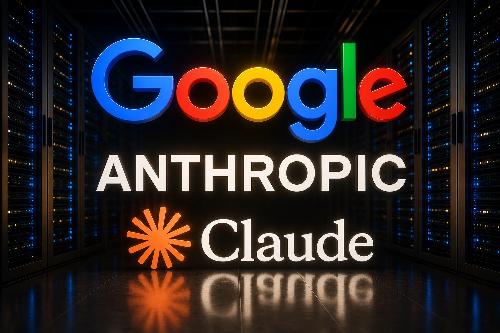

*Google decided to expand its investment in Anthropic, the company that created Claude, one of the fastest growing artificial intelligence models in the corporate market. The movement reinforces the global race for infrastructure, software and business contracts — and could accelerate important changes for Brazilian companies.*

The corporate artificial intelligence market is becoming even more competitive.

**__Google__** increased its investment in **__Anthropic__**, the startup responsible for **__Claude__**, a model that has been gaining ground in business operations and competing directly in the market with **__ChatGPT__** and other AI platforms. The movement reinforces an important change in the sector: the dispute is no longer just about technology and is now about infrastructure, corporate adoption and dominance of enterprise software.

To those looking from the outside, it may seem like just another billion-dollar investment in the sector.

But for companies, this is a clear sign of transformation.

## Who is Anthropic and why is it growing so fast?

**__Anthropic__** was created by former members of **__OpenAI__**, led by **__Dario Amodei__**, with a different proposal: building artificial intelligence with a focus on security, predictability and business use.

Its main product is **__Claude__**.

In practice, Claude has positioned itself as a strong alternative for companies that need AI applied in:

- document analysis  
- service automation  
- content production  
- internal support  
- technical operations

The difference is in the corporate focus.

While many AIs are still vying for attention in the general market, Anthropic is moving directly into enterprise contracts.

## What does Google gain from this?

The investment goes beyond financial participation.

Google strengthens its AI ecosystem within **__Google Cloud__**.

This means that the more companies use Claude, the greater Google's infrastructure consumption.

It's a powerful model.

The logic is simple:

- AI drives demand for cloud  
- cloud generates operational dependence  
- dependence generates loyalty

This movement happens at the same time that the dispute between large players accelerates.

Microsoft, Amazon and OpenAI are also expanding their bets on enterprise artificial intelligence.

The market is consolidating around a few large ecosystems.

## Enterprise software is changing

For years, companies bought software based on features.

Now, software is starting to sell intelligence.

ERPs, CRMs, support platforms and productivity tools are being redesigned to incorporate AI as a central part of the operation.

This movement also appears on other fronts.

Google itself has been expanding its bet on AI agents for companies, showing that corporate automation is entering a new phase.

The model is changing from:

operating software

to:

intelligent software.

## What does this mean for Brazilian companies?

The impact could appear quickly in Brazil.

### More efficient tools

Competition accelerates innovation.

This improves:

- quality of responses  
- contextual accuracy  
- operational capacity

### More options on the market

With more competition, companies gain power of choice.

This can reduce dependence on a single platform.

### Competitive pressure

Companies that adopt AI earlier can gain operational efficiencies, reduce costs, and scale faster.

The main change is strategic.

Artificial intelligence is no longer a complement.

It is becoming a central part of business operations.

And Google's investment in Anthropic reinforces that this transformation is just beginning.

---