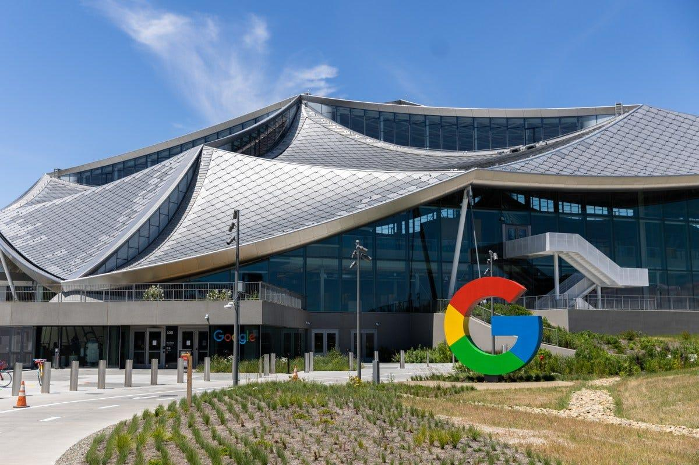
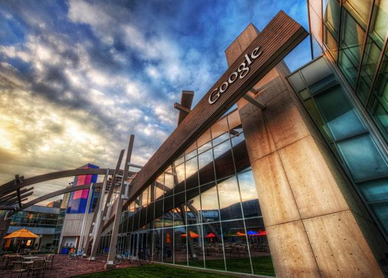

Google has begun transforming its search experience by incorporating artificial intelligence directly into results.

The change alters one of the pillars of the modern internet: the click-based model.

For businesses, blogs and digital operations that rely on organic traffic, this changes the logic of SEO and content production.

## Google now responds within the search itself

The traditional link-based search model is starting to lose ground to AI-generated answers.

Now, the user asks a question and receives a contextualized summary on the results page itself.

In many cases, the need to access other sites decreases.

### How this new experience works

Artificial intelligence interprets the question, cross-references sources and generates a consolidated answer.

In practice, this speeds up the delivery of information.

But it reduces the flow of visits to sites that previously captured this traffic.

## The direct impact for companies and content producers

For many years, the goal was simple: reach the top of Google.

This positioning generated predictable and constant traffic.

Now, this model is starting to change.

### Being first may not be enough

Even with a good position, the user can resolve their question without accessing the original content.

This reduces CTR, reduces conversion opportunities and affects strategies based on volume of visits.

### Generic content loses strength

Basic and superficial answers tend to be absorbed by the search engine's AI.

The difference now lies in the depth, originality and authority of the content.

## What Google is looking for with this change

The strategic objective is clear: to keep the user within the ecosystem for longer.

The more answers that are delivered internally, the greater retention and more control over the search journey.

### Retention became a strategic asset

By reducing output to external sites, Google strengthens its first-party environment.

This increases the staying value and expands your ownership of the information experience.

## The new SEO scenario in 2026

The change is already starting to put pressure on companies that rely heavily on organic traffic.

Content blogs, information portals and digital businesses are reviewing strategies.

### The competition is no longer just about ranking

Before, winning at SEO meant outperforming competitors on the SERP.

Now, it means creating something that AI can't easily summarize.

### Authority and depth gain weight

Analysis, studies, real experiences, own data and strategic interpretations become worth more.

This type of content generates value beyond the immediate response.

## What companies need to do now

Anyone who depends on content to generate business needs to quickly adapt their strategy.

The new scenario requires more strategic production.

### Create more in-depth content

Superficial content tends to lose relevance.

More complete and specialized materials gain a competitive advantage.

### Bet on differentiation

Expert opinion, market context, and practical application create barriers against automated responses.

### Build Brand Authority

The more recognized the source, the greater the chance of being used as a reference and generating trust.

The integration of AI into the search engine does not represent the end of SEO, but it redefines its logic.

Organic traffic remains relevant, but now it depends less on position and more on the real value delivered.