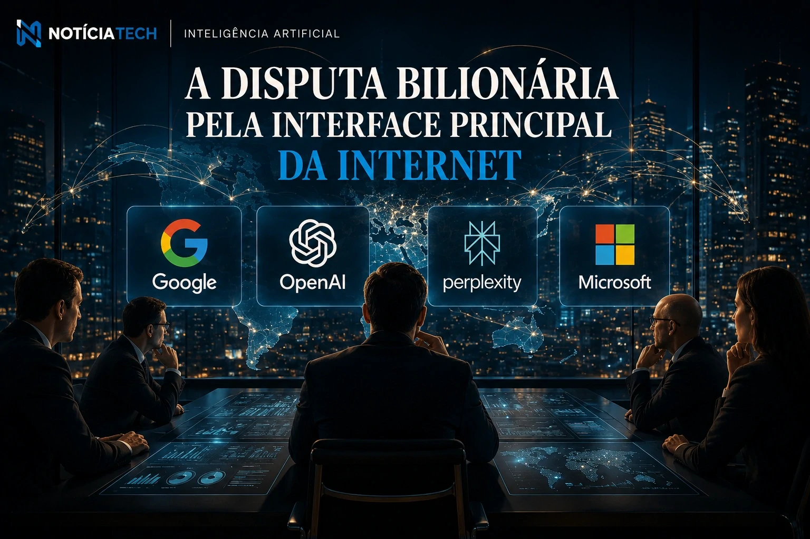

*After the race for generative models, the technology market entered a new strategic dispute: controlling the main interface of the internet. In 2026, companies like **Google**, **OpenAI**, **Perplexity** and **Microsoft** will accelerate investments in AI browsers capable of interpreting context, performing tasks and replacing part of the traditional navigation based on tabs, searches and multiple applications. The movement begins to change the dynamics of digital advertising, SEO and the corporate web economy itself.*

## Browsers with AI are no longer an experiment and become the central strategy of big tech

The traditional browser began to lose prominence as a simple internet access tool. Instead of opening dozens of tabs, copying information and switching between platforms, new AI-based systems begin to operate as true digital agents.

The change is strategic because the browser has always been one of the most valuable layers of the internet economy. Whoever controls navigation controls:

- searches;
- content distribution;
- advertising;
- product discovery;
- user behavior;
- intent data.

Now, AI companies want to transform this space into an intelligent conversational interface.

The movement already appears in experimental products and advanced integrations developed by **OpenAI**, **Google**, **Microsoft** and emerging startups in the generative AI sector.

At the same time, the market is seeing accelerated growth in platforms capable of automating tasks directly in navigation, reducing operational friction in companies.

This scenario is directly connected to the advancement of autonomous corporate agents already discussed in:

- [Companies begin to replace traditional software with AI agents](https://noticiatech.com.br/automacao/empresas-come%C3%A7am-a-substituir-softwares-tradicionais-por-agentes-de-ia/)
- [OpenAI wants to transform VS Code into the central platform of the new AI economy](https://noticiatech.com.br/inteligencia-artificial/openai-quer-transformar-o-vs-code-na-plataforma-central-da-nova-economia-da-ia/)
- [Cursor, Windsurf and GitHub Copilot are changing the development market](https://noticiatech.com.br/inteligencia-artificial/cursor-windsurf-e-github-copilot-est%C3%A3o-mudando-o-mercado-de-desenvolvimento/)

### The browser starts to perform complete tasks

The new generation of AI browsers begins to incorporate capabilities previously restricted to specialized platforms.

Among the most relevant functions are:

- contextual autocomplete;
- intelligent page reading;
- product comparison;
- process automation;
- generation of reports;
- summary of meetings;
- interpretation of dashboards;
- automated search.

In practice, navigation stops being manual and starts to become operational.

This movement worries SaaS companies because part of the value of various software can migrate to agents integrated directly into the browser.

## The impact on SEO, digital media and advertising has already begun

The rise of smart browsers also creates a profound disruption to the traditional model of internet traffic.

For two decades, the dominant model of the web was based on:

- search;
- click;
- page;
- announcement;
- conversion.

With generative AI integrated into navigation, the user now receives ready-made answers without necessarily accessing the original website.

This can directly affect:

- news portals;
- blogs;
- e-commerce;
- marketplaces;
- comparators;
- review platforms;
- programmatic media.

Companies are beginning to realize that the competition for organic audiences can change drastically.

The trend reinforces the growth of the so-called GEO (Generative Engine Optimization), an editorial model focused on optimization for generative AI.

This new digital behavior also speaks directly to the transformation of B2B distribution and the economy of owned audiences:

- [LinkedIn stops being a CV network and becomes a B2B distribution platform driven by AI](https://noticiatech.com.br/negocios/linkedin-deixa-de-ser-rede-de-curr%C3%ADculos-e-vira-plataforma-de-distribui%C3%A7%C3%A3o-b2b-impulsionada-por-ia/)
- [The growth of newsletters is creating a new war for its own audience](https://noticiatech.com.br/negocios/o-crescimento-das-newsletters-est%C3%A1-criando-uma-nova-guerra-por-audi%C3%AAncia-pr%C3%B3pria/)

### Companies begin to review dependence on traditional traffic

The change is already beginning to provoke strategic reviews in areas such as:

- digital marketing;
- inbound marketing;
- paid media;
- acquisition funnel;
- Technical SEO;
- editorial production.

The reason is simple: when the AI ​​responds directly to the user, the click is no longer mandatory.

This forces companies to develop:

- stronger brands;
- thematic authority;
- own distribution;
- premium content;
- closed ecosystems;
- communities.

For industry experts, traditional search traffic could enter a long process of reconfiguration in the coming years.

## The new billionaire war for the main internet interface

The race for AI browsers is not just technological. It involves economic control over the next layer of the internet.

Historically:

- the operating system controlled the computer;
- the browser controlled the web;
- the search engine controlled discovery;
- social networks controlled distribution.

Now, AI tries to control all these layers simultaneously.

This helps explain why tech giants are investing billions in infrastructure, chips, autonomous agents and intelligent interfaces.

The market is already beginning to see that the next big platform may not be an isolated application, but rather an AI ecosystem integrated into daily navigation.

This movement connects with the new phase of the industrialization of artificial intelligence:

- [2026 became the year of AI industrialization in Brazil](https://noticiatech.com.br/inteligencia-artificial/2026-virou-o-ano-da-industrializa%C3%A7%C3%A3o-da-ia-no-brasil/)
- [Companies double investments in corporate AI and Brazil accelerates adoption of intelligent agents](https://noticiatech.com.br/inteligencia-artificial/empresas-dobram-investimentos-em-ia-corporativa-e-brasil-acelera-ado%C3%A7%C3%A3o-de-agentes-inteligentes/)
- [OpenAI begins to reduce dependence on Microsoft and the AI market enters a new billion-dollar war](https://noticiatech.com.br/inteligencia-artificial/openai-come%C3%A7a-a-redutor-depend%C3%AAncia-da-microsoft-e-mercado-de-ia-entra-em-nova-guerra-bilion%C3%A1ria/)

### The browser could become the main corporate operating system for AI

In many companies, the browser already concentrates:

- CRM;
- ERP;
- communication;
- dashboards;
- automations;
- productivity;
- data analysis.

With intelligent agents integrated directly into navigation, the tendency is for part of corporate operations to take place within this new conversational layer.

In practice, this creates a new operating model:

- less fragmented interfaces;
- less switching between applications;
- fewer repetitive tasks;
- more contextual automation;
- more AI execution.

The result could be one of the biggest transformations in the digital economy since the emergence of the smartphone.

The dispute now not only involves who has the best AI model, but who will be able to control the main interaction interface between people, companies and the internet in the coming years.

---