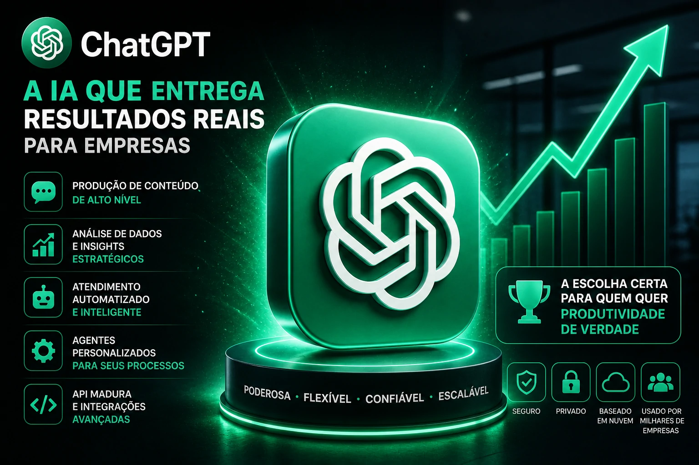
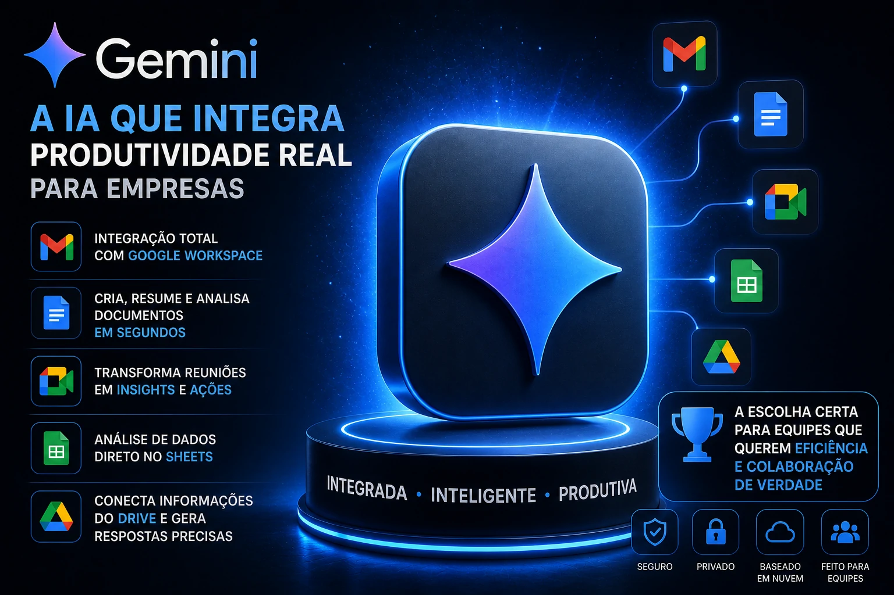
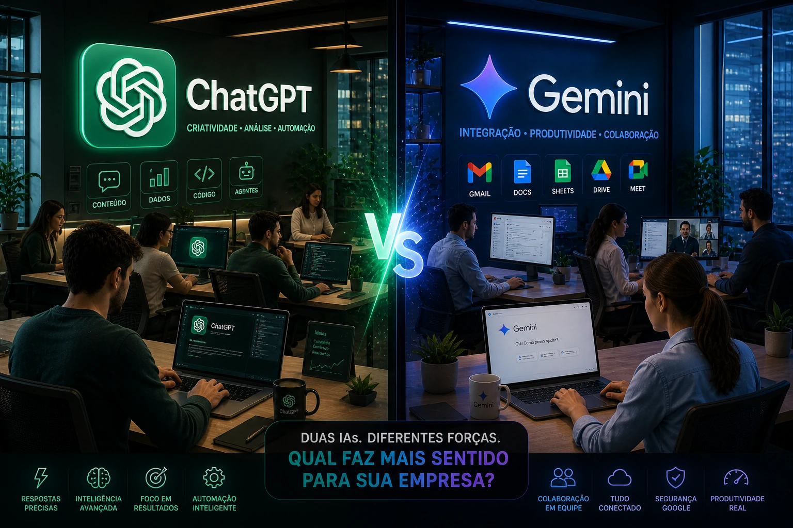

*Choosing an artificial intelligence platform is no longer just a technological decision. For companies, it has become an operational decision. Between ChatGPT and Gemini, which one makes more sense today?*

The dispute between **__OpenAI__** and **__Google__** became even more strategic.

On the one hand, **__ChatGPT__** has established itself as a reference in productivity, automation and business integration.

On the other, **__Gemini__** has been growing strongly by taking advantage of the entire structure of the Google ecosystem.

For companies, the question is practical:

Which platform generates the most results?

The answer depends less on popularity and more on the operational context.

## Where ChatGPT is strongest



**__ChatGPT__** excels in scenarios that require operational depth.

Today he is strong in:

- content production  
- data analysis  
- automated service  
- creation of custom agents  
- automation via API

Its advantage is in its flexibility.

Companies can adapt processes more freely.

Furthermore, the maturity of the ecosystem is a differentiator.

Today, many market tools already connect naturally to ChatGPT.

## Where Gemini makes the most sense



**__Gemini__** gains strength especially within the Google ecosystem.

Its difference appears in its integration with:

-Gmail  
-Docs  
- Meet  
- Sheets  
- Drive

For companies that already operate heavily on **__Google Workspace__**, this reduces friction.

Implementation tends to be more natural.

Less adaptation.

More immediate integration.

This point weighs heavily on internal operations.

## Which is best for small businesses?



For small businesses, the criteria is often speed.

In this scenario:

**ChatGPT** tends to be better when the focus is:

- marketing  
- sales  
- service  
- creation of processes

**Gemini** tends to be best when the focus is:

- internal organization  
- team productivity  
- collaboration

In other words:

Those who need to sell more can find more value in ChatGPT.

Those who need to better organize their operations may find more value in Gemini.

## And for larger companies?

Larger companies typically need:

- complex integrations  
- multiple streams  
- scalable automation  
- operational governance

In this scenario, **__ChatGPT__** still has an advantage due to the maturity of the API and the flexibility of implementation.

But Gemini is growing quickly because of the power of Google Cloud.

The dispute is open.

## Which one is more worth it today?

If the company needs:

**more creativity and advanced automation**  
→ ChatGPT

If the company needs:

**more integration with Google tools**  
→ Gemini

In the end, the best AI is not the most famous.

It is the one that best fits into the company's operational flow.

And for Brazilian businesses, this choice could impact productivity, costs and competitiveness in the coming months.
```