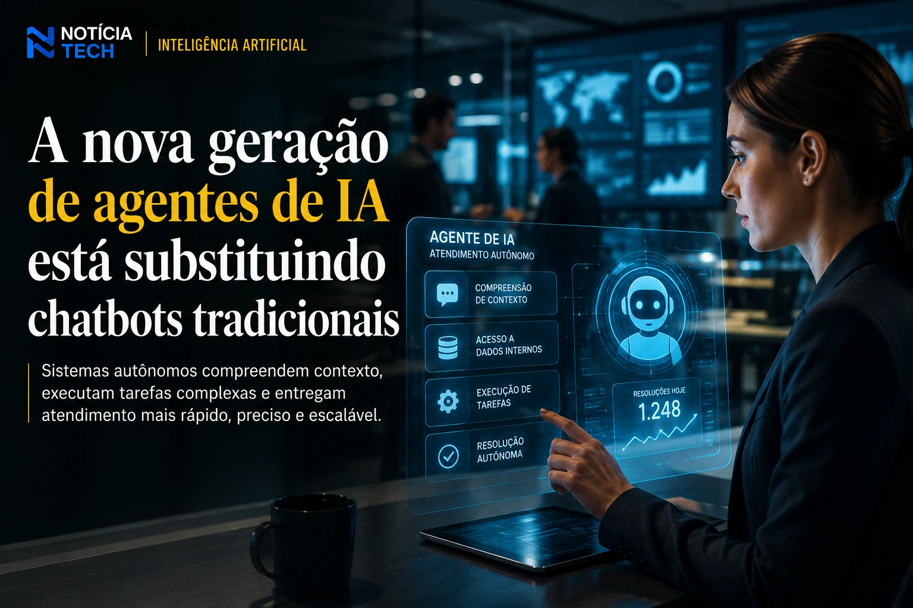
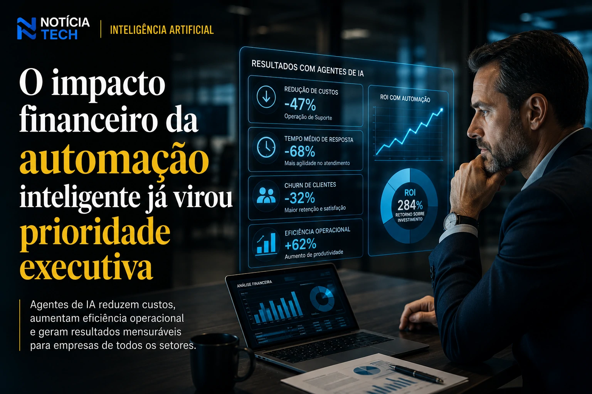
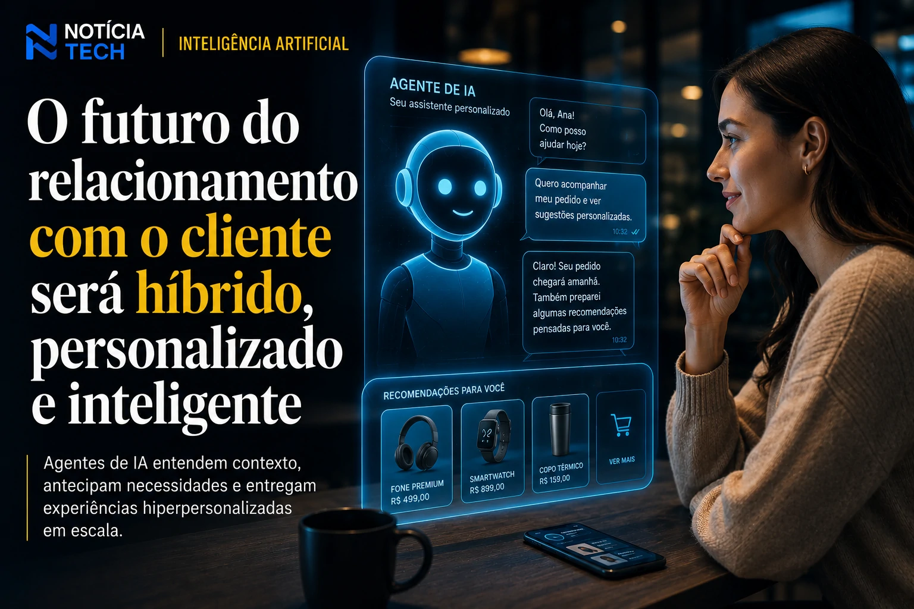

*The corporate market has definitively entered the era of autonomous artificial intelligence agents. What was previously limited to basic chatbots and rigid automation flows has now evolved into systems capable of interpreting context, performing complex tasks, making decisions and operating practically as digital collaborators. In 2026, technology giants, banks, retailers and SaaS companies will compete to see who can implement the most efficient agents, reducing operational costs while increasing retention, personalization and speed of service.*

## The new generation of AI agents is replacing traditional chatbots

Old corporate chatbots are quickly becoming obsolete. The main reason is simple: they relied on predictable decision trees, limited responses, and low contextual capacity.

New **AI agents** use advanced generative models to understand intent, contextual memory, and customer history in real time. This allows the system to perform complete tasks without relying on constant human intervention.

Companies like **OpenAI**, **Google Cloud**, **Microsoft** and **Salesforce** are accelerating the race for agentic platforms aimed at the corporate environment.

### Service stops being reactive

The most important movement is not just answering questions. The new systems can:

- analyze tickets automatically;
- prioritize emergencies;
- consult internal databases;
- execute integrations;
- create reports;
- update CRM;
- carry out consultative sales;
- resolve financial problems;
- anticipate consumer needs.

This completely changes the operational logic of corporate support.

Instead of relying on long human queues, companies are starting to operate hybrid models in which AI resolves most requests before an attendant even participates in the process.

This scenario reinforces a transformation similar to the advancement of AI in the corporate environment described in:
[Companies are replacing operational teams with autonomous AI agents](https://noticiatech.com.br/automacao/empresas-come%C3%A7am-a-substituir-softwares-tradicionais-por-agentes-de-ia/)

## The financial impact of intelligent automation has already become an executive priority

The advancement of corporate agents is no longer just technological innovation. Now it is a direct strategy to reduce costs and gain operational efficiency.

According to recent estimates from the SaaS and enterprise AI market, companies can drastically reduce:

- average response time;
- support costs;
- customer churn;
- operational bottlenecks;
- repetitive human errors.

### AI starts to operate as a digital employee

The big change in 2026 is that agents no longer just act as auxiliary tools.

In many industries, they practically operate as “digital employees.”

The systems can:
- access multiple software;
- navigate ERPs;
- interpret documents;
- create dynamic automations;
- perform complete administrative tasks.

This explains why the market started calling this new phase **Agentic AI**.

Large companies are creating entire teams dedicated exclusively to the governance of these agents.

The phenomenon also strengthens AI-based corporate productivity platforms, as already discussed in:
[LinkedIn stops being a CV network and becomes a B2B distribution platform driven by AI](https://noticiatech.com.br/negocios/linkedin-deixa-de-ser-rede-de-curr%C3%ADculos-e-vira-plataforma-de-distribui%C3%A7%C3%A3o-b2b-impulsionada-por-ia/)

### The SaaS market enters a new technological race

The enterprise software industry is being completely redesigned.

Traditional tools of:
- CRM;
- help desk;
- automation;
- analytics;
- operational management;

now compete for native integration with intelligent agents.

This creates a new competitive layer in the enterprise market.

Companies that are slow to integrate operational AI may quickly lose relevance in the face of competitors capable of delivering faster, cheaper and more personalized service.

## The future of the relationship between companies and consumers will be hybrid

The deepest transformation may not be operational, but behavioral.

Consumers are beginning to accept AI interactions as a natural part of the digital experience.

The trend is that, in the coming years, many users will not even know whether they are talking to humans or autonomous agents.

### Extreme customization becomes a competitive differentiator

Modern agents can:
- analyze behavior;
- predict intention;
- adapt language;
- personalize offers;
- anticipate problems;
- adjust service according to the consumer's profile.

This dramatically raises the level of retention and experience.

Companies that master this layer of personalization will have a significant competitive advantage.

The same movement is already starting to impact digital commerce and smart sales platforms, as explored in:
[Agentic commerce: how ChatGPT, Google and Shopify are transforming the internet into an AI shopping interface](https://noticiatech.com.br/inteligencia-artificial/com%C3%A9rcio-agentic-como-chatgpt-google-e-shopify-est%C3%A3o-transformando-a-internet-em-uma-interface-de-compras-por-ia/)

### The next dispute will be for trust

Despite accelerated progress, there is a central challenge: trust.

Companies will need to balance:
- automation;
- privacy;
- transparency;
- human supervision;
- operational security.

The more power agents receive, the greater the need for auditing and governance.

The market already realizes that the difference will not just be having AI, but having AI that is reliable, safe and integrated into the corporate ecosystem.

In this scenario, autonomous agents are no longer just a technological trend and start to represent a new operational infrastructure of the digital economy.