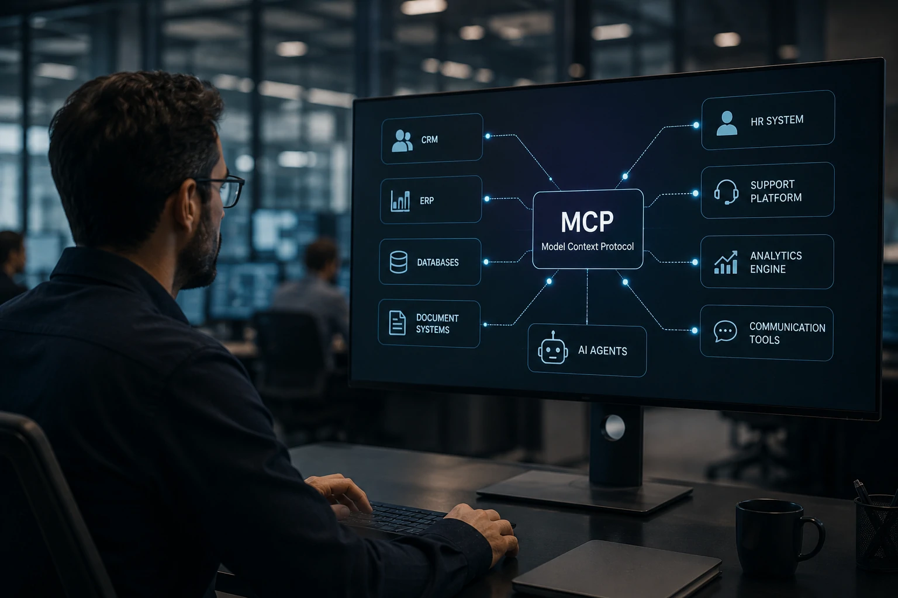

*While the artificial intelligence race is often presented as a race between increasingly powerful models, a less visible transformation is happening behind the scenes. Companies have discovered that the real challenge is not just creating intelligent agents, but connecting them securely to the systems that drive the business.*

*It is in this context that the **Model Context Protocol (MCP)** begins to gain space. The protocol is being viewed by developers, AI platforms and enterprise vendors as a potential standard infrastructure for connecting agents to ERPs, CRMs, databases, SaaS platforms and internal systems.*

## MCP emerges as a response to the main bottleneck of AI agents

The **Model Context Protocol** is a specification created to allow AI models to access external tools in a standardized way.

In practice, it works as an intermediate layer between agents and corporate systems.

Today, many companies need to build specific integrations for each application used by an agent.

This creates high costs, increases operational complexity and makes project scalability difficult.

### Why did the problem become more urgent?

The new generation of agents doesn't just answer questions.

They perform tasks.

An agent can consult a CRM, access an ERP, update a support ticket, generate financial reports and interact with multiple systems simultaneously.

The greater the number of systems involved, the greater the complexity of the integrations.

### Agent growth is accelerating the need for standardization

The market has already begun to realize that large-scale adoption depends less on the quality of the model and more on the integration capacity.

Therefore, the discussion about infrastructure is gaining relevance within the areas of corporate technology.

The movement recalls the evolution of the corporate internet, when APIs became the standard for communication between applications.

## Companies begin to treat context as strategic infrastructure

Context is becoming one of the most important assets in the artificial intelligence economy.

Without access to up-to-date information, even the most advanced models produce limited answers.

The MCP emerged precisely to solve this challenge.

It creates a structured way for agents to find, consult and use corporate information in real time.

### What changes in practice?

Companies no longer depend exclusively on the knowledge embedded in the model.

Agents start to operate using updated corporate data.

This reduces hallucinations, improves accuracy and increases the business value of AI applications.

### The relationship between MCP and Data Products

The advancement of MCP is directly linked to the growth of so-called Data Products.

The more organized and governed corporate data is, the greater the efficiency of agents.

This movement complements trends recently discussed by the market, such as [Corporate Data Products](https://noticiatech.com.br/negocios/ai-data-products-dados-corporativos-produtos-agentes-ia/) and [Data Contracts for AI infrastructure](https://noticiatech.com.br/negocios/data-contracts-infraestrutura-dados-ia-empresas/).

## The software market may enter a new phase of standardization

The potential impact of MCP goes beyond artificial intelligence.

It can directly influence the architecture of enterprise software.

Historically, technological standards create cycles of market expansion.

APIs have driven SaaS.

Containers have accelerated cloud computing.

Now, intelligent agents can drive a new layer of context-based integration.

### Opportunity for software providers

Companies that adapt their platforms to the new ecosystem can gain a competitive advantage.

Agent-ready applications tend to offer faster integration and smoother experiences.

This is true for providers of ERP, CRM, collaboration platforms and specialized systems.

### The birth of the agentic economy

The so-called agentic economy depends on the ability of agents to operate real systems.

Without efficient integration, agents remain limited to superficial tasks.

The MCP appears precisely as an attempt to resolve this structural bottleneck.

## The next artificial intelligence fight could happen in infrastructure

Infrastructure is becoming as important as models.

Companies have realized that having advanced agents is not enough.

It is necessary to guarantee secure, governed and scalable access to corporate knowledge.

For this reason, the debate around protocols, integration and context is advancing rapidly within the industry.

### Why should executives follow this trend?

MCP is still in the early stages of adoption.

Even so, it represents an important change in the way companies think about artificial intelligence architecture.

Organizations that are investing in autonomous agents need to watch how these standards evolve.

### The true value may lie outside the models

In the coming years, competitive advantage may not just come from choosing between **OpenAI**, **Google**, **Anthropic** or other vendors.

The difference may be in the ability to connect these models to the company's internal knowledge.

Just as APIs have become invisible but indispensable to the digital economy, **Model Context Protocol** could follow suit and become the silent infrastructure that will enable AI agents to operate entire businesses.

---