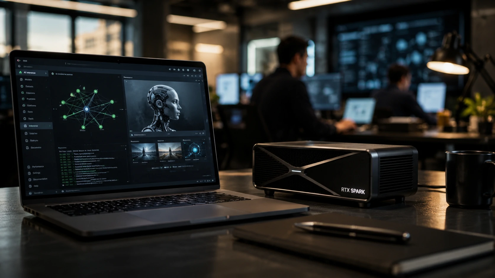

*For years, artificial intelligence has been associated with large data centers, cloud services, and remotely run models. Now, **Nvidia** believes the next industry transformation will happen closer to the user. The company led by **Jensen Huang** has unveiled a new strategy to bring AI agents directly to personal computers, ushering in a race that could redefine the future of enterprise computing.*

## Nvidia wants to transform computers into native platforms for AI agents

**Nvidia**'s strategy is simple to understand: make personal computers capable of running advanced artificial intelligence without continually relying on the cloud.

For years, most AI models have operated in large remote processing infrastructures. This architecture has boosted companies like **OpenAI**, **Google**, **Microsoft** and **Nvidia** itself, but it has also created challenges related to costs, privacy and latency.

Now, the company is betting that a significant part of future workloads will be executed locally.

### What changes with the RTX Spark?

The new **RTX Spark** platform is designed to enable generative models, intelligent assistants and autonomous agents to operate directly on notebooks and desktops.

This means that tasks such as document analysis, content generation, meeting summarization and process automation can happen without all data needing to be sent to external servers.

### Why does this matter for companies?

The move meets a growing demand from the corporate market.

Companies want to use AI at scale, but they also need to maintain control over strategic information, regulatory requirements and data governance policies.

This trend speaks directly to movements already observed in corporate memory and organizational knowledge solutions driven by AI, a topic previously explored by Notícia Tech:

[Corporate memory with AI: why companies are transforming internal knowledge into competitive advantage](https://noticiatech.com.br/negocios/mem%C3%B3ria-corporativa-com-ia-por-que-empresas-est%C3%A3o-transformando-conhecimento-interno-em-vantagem-competitiva/)

## The AI PC market could become the next big technology battle

So-called **AI PCs** represent computers specifically designed to run artificial intelligence applications.

They combine dedicated CPUs, GPUs, and accelerators for local inference.

**Nvidia**'s bet does not happen in isolation.

### Who competes in this market?

The race involves giants such as:

- **Microsoft**
- **Intel**
- **AMD**
- **Qualcomm**
- Manufacturers such as **Dell**, **HP**, **Lenovo** and **ASUS**

All of these companies see a similar opportunity: transforming the computer into a permanent platform for intelligent agents.

### Why have AI PCs gained relevance now?

The evolution of generative models has changed the role of hardware.

While traditional software consumed predictable resources, AI agents require continuous processing, expanded memory and real-time inference capabilities.

The result is a new category of devices developed specifically for this scenario.

## The future of AI agents could be inside the employee's notebook

The vision presented by **Jensen Huang** goes beyond faster computers.

The goal is to transform each device into an environment capable of hosting specialized agents.

These agents will be able to operate continuously, analyzing documents, monitoring projects and automating complex tasks.

### What are AI agents in practice?

Agents are systems capable of executing complete objectives using reasoning, memory and access to tools.

Unlike traditional chatbots, they can make decisions within defined parameters.

This movement is in line with trends already observed in several corporate sectors.

Notícia Tech recently showed how agents are becoming part of modern business infrastructure:

[Claude Code and the rise of AI agents in corporate software development](https://noticiatech.com.br/inteligencia-artificial/claude-code-agentes-ia-desenvolvimento-software-corporativo/)

### How does this affect productivity?

Companies will be able to create specialized agents to:

- financial analysis;
- internal service;
- audit;
- legal support;
- marketing;
- software development.

In practice, each employee will be able to count on a set of digital assistants operating locally on their computer.

## The fight is not just for hardware, but for the infrastructure of the next digital economy

**Nvidia**'s strategy shows that current competition is no longer just about chips.

The real goal is to control the infrastructure that will support the next generation of intelligent applications.

Whoever masters this layer will have influence on productivity, automation and digital transformation.

### Nvidia's role in the new AI infrastructure

The company already leads the GPU market for model training.

Now it seeks to expand this leadership to the local execution layer.

If the strategy works, the company could occupy a similar position to what operating systems had in previous decades.

### What does this mean for the corporate market?

Organizations start to see AI not just as software, but as operational infrastructure.

The trend connects to the growth of business ecosystems based on agents, automation and structured knowledge.

This movement also reinforces themes discussed in:

[AI Knowledge Graphs: why companies are starting to transform internal data into a competitive advantage for AI agents](https://noticiatech.com.br/negocios/ai-knowledge-graphs-por-que-empresas-come%C3%A7am-a-transformar-dados-internos-em-vantagem-competitiva-para-agentes-de-ia/)

The message sent by **Nvidia** to the market is clear: the next phase of artificial intelligence will not just be built in large data centers. It will also take place inside computers used daily by professionals, teams and organizations. If this vision takes hold, AI PCs could become as important to the digital economy as smartphones were to the mobile internet in the last decade.

---