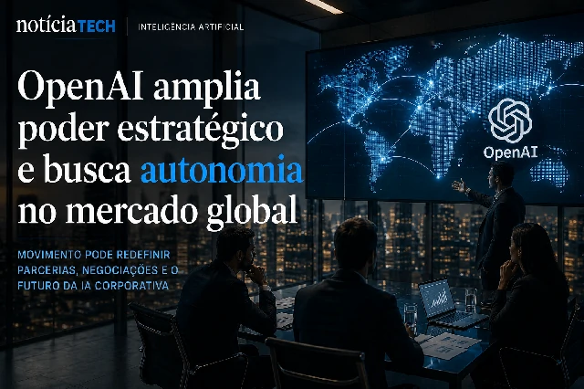

*For years, the partnership between OpenAI and Microsoft was treated as one of the most powerful alliances in the technology industry. Now, the signs of change are beginning to reveal a silent dispute that could redefine the global infrastructure of artificial intelligence, alter the balance between Big Techs and open a new billion-dollar race for control of the next generation of corporate AI.*

## OpenAI begins to move away from dependence on Microsoft

The relationship between **OpenAI** and **Microsoft** remains strategic, but it no longer seems to have the same level of dependence seen in recent years.

According to information released by international vehicles in the technology sector and financial market, OpenAI began a structural renegotiation of the agreement signed with Microsoft, limiting revenue sharing and expanding its freedom to close new infrastructure partnerships with other technology giants.

The move is interpreted by analysts as an important step to reduce the company's operational dependence on the Azure ecosystem.

Until recently, Microsoft was seen as practically OpenAI's main operating base:
- computational infrastructure;
- model training capacity;
- corporate distribution;
- integration with business products.

But the explosive growth of generative AI has transformed infrastructure into strategic power.

Now, OpenAI appears to be pursuing something even more important:
autonomy.

### Infrastructure has become the center of the AI war

In the early years of the generative AI explosion, the market focus was on models.

Today, the center of the dispute has changed.

The real competitive differentiator became:
- massive access to GPUs;
- computational energy;
- data centers;
- global processing capacity;
- corporate distribution.

This explains why giants like:
- Google;
- Amazon;
- Microsoft;
- Goal;
- Oracle;
- Nvidia;

are investing tens of billions of dollars in infrastructure for AI.

OpenAI understands that relying too heavily on a single partner can limit its future expansion.

Therefore, the current move does not seem like a direct break with Microsoft, but rather an attempt to balance power within the global AI chain.

## The corporate market may enter a new phase

The impact of this change goes far beyond the relationship between two companies.

In practice, the market may be entering a new stage in the artificial intelligence race:
the corporate infrastructure war.

Companies that previously competed for users are now competing for:
- computational capacity;
- access to chips;
- corporate contracts;
- distribution of enterprise AI;
- ecosystems of intelligent agents.

This transformation is already starting to affect:
- productivity platforms;
- corporate software;
- automation tools;
- AI-based business solutions.

The scenario also strengthens a trend that the market has been accelerating in recent months:
the creation of “AI-first” companies.

Instead of just integrating AI into existing products, companies are beginning to reorganize entire operations around intelligent models, autonomous agents, and advanced automation.

This movement connects directly with other transformations that have already been happening in the corporate market, as we showed in the article about how AI is changing software development in companies:

[AI accelerates software production and changes the role of programmers in companies](https://noticiatech.com.br/inteligencia-artificial/ia-acelera-produ%C3%A7%C3%A3o-de-software-e-muda-o-papel-dos-programadores-nas-empresas/)

### The dispute now involves control of the digital future

The advancement of generative AI has created a new reality:
Whoever controls infrastructure will have a huge economic advantage in the coming years.

This includes:
- servers;
- chips;
- corporate distribution;
- APIs;
- agent platforms;
- integration with business software.

Behind the technological dispute there is an even bigger issue:
who will control the operational flow of the digital economy.

AI is no longer just a productivity tool.
It begins to become the central operational layer of companies.

## OpenAI tries to increase strategic power in the global market

By seeking greater operational independence, OpenAI also gains freedom to:
- negotiate new contracts;
- expand infrastructure;
- reduce strategic risks;
- accelerate global distribution;
- increase your negotiating power.

This could directly impact the corporate AI market in the coming years.

Client companies are beginning to realize that the sector may not be heading towards an absolute monopoly of a single Big Tech, but rather towards a highly competitive ecosystem involving:
- OpenAI;
- Microsoft;
- Google;
- Amazon;
- Nvidia;
- Goal.

The result could be an even greater acceleration of innovation.

At the same time, the dispute tends to increase:
- investments in data centers;
- energy consumption;
- race for advanced chips;
- consolidation of business platforms.

This scenario is also connected to the advancement of corporate automation and intelligent agents that are beginning to replace traditional processes within companies:

[How companies are using AI to automate processes and reduce costs in 2026](https://noticiatech.com.br/automacao/como-empresas-usam-ia-para-automatizar-processos/)

### The next AI battle will be invisible to the average user

While consumers remain focused on chatbots and apps, the real market competition happens behind the scenes.

The next phase of AI will be defined by:
- infrastructure;
- computational power;
- operational capacity;
- business integration;
- mastery of corporate ecosystems.

And in this scenario, the renegotiation between OpenAI and Microsoft may represent just the first visible sign of a much larger transformation in the global technology market.