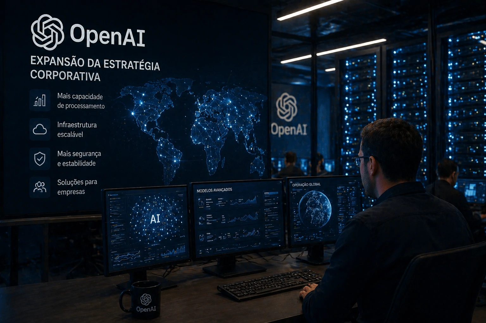
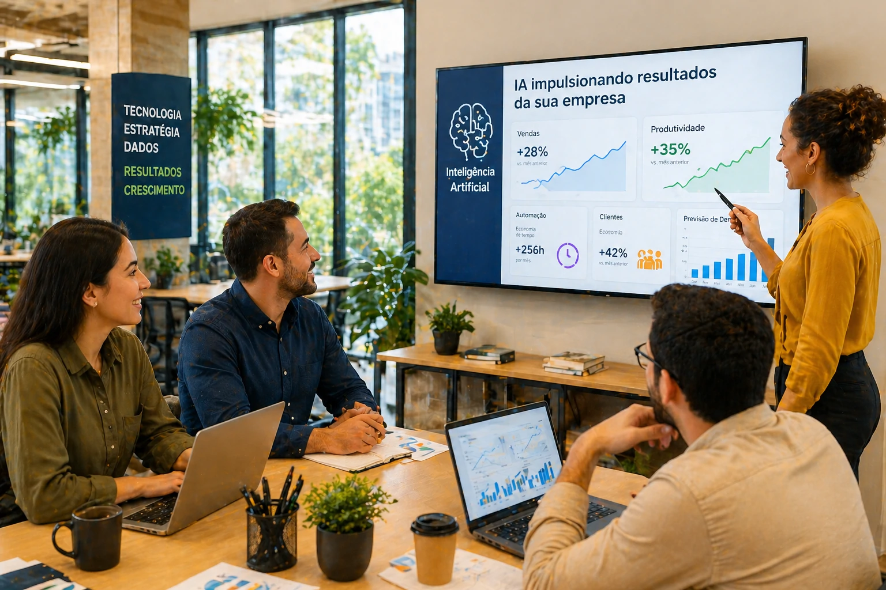

The corporate artificial intelligence market is entering a new phase of strategic dispute.

OpenAI is expanding its business operations and strengthening its infrastructure with support from Amazon, in a move that expands its ability to compete in the corporate market.

The advance shows that the dispute for AI leadership is no longer just focused on technology.

Now the battle is on infrastructure, scalability and enterprise adoption.

For Brazilian companies, this means more options, more competition and more access to corporate AI solutions.

## What has changed in OpenAI's strategy

OpenAI has been expanding its focus on the corporate environment.

The movement includes infrastructure expansion, growth in business solutions and operational strengthening.

This allows:

- greater operating stability  
- more processing capacity  
- expansion of corporate services  
- growth on an enterprise scale

Infrastructure became the centerpiece.

## Why Amazon jumped on this bandwagon

Amazon strengthens this ecosystem through its cloud computing structure.

This support expands OpenAI's ability to serve enterprises at scale.

This directly affects:

### response speed

Faster solutions.

### operational stability

Less risk of failures.

### scalability

Capacity for growth.

### business capacity

More companies using AI simultaneously.

## What does this mean for Brazilian companies

Brazilian companies can benefit from this market movement.

Competition between large players accelerates innovation.

In practice this generates:

- better tools  
- more business integration  
- more competitive costs  
- new corporate solutions

The business environment tends to win.

## The new corporate race for artificial intelligence

The AI market is migrating from an experimental phase to an operational phase.

The dispute now is not about who created the best model.

It's about who delivers the best business solution.

For Brazilian businesses, this represents an opportunity.

Those who start using AI now can gain a competitive advantage before the market fully matures.