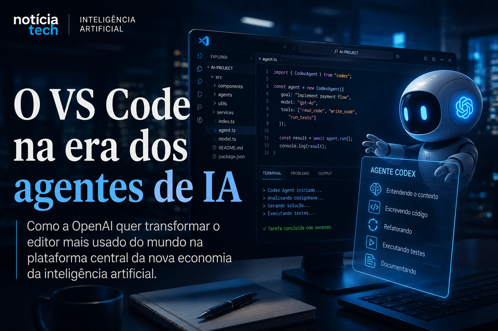

*For decades, operating systems dominated computing by controlling the environment where software ran. Now, artificial intelligence is beginning to shift this center of power to another place: the environment where the software is created. With autonomous agents, AI-assisted programming, and copilots increasingly integrated into the workflow, companies like OpenAI are transforming VS Code into something much more than a code editor.*

## VS Code could become the main operational interface for AI

The artificial intelligence market has entered a new phase. After the race for foundational models, the focus of large companies began to migrate to operational productivity, development automation and accelerated software creation.

In this scenario, Visual Studio Code began to occupy a strategic position.

The Microsoft editor stopped being just a tool for programmers and began to function as an operational platform where intelligent agents perform tasks, analyze code, automate flows and collaborate directly with development teams.

### The advancement of Codex changes the logic of traditional programming

The advancement of OpenAI models within the development ecosystem reinforces a structural change in the software market.

AI-based tools can already:
- interpret documentation;
- suggest architectures;
- identify faults;
- automate refactorings;
- create complete applications from prompts.

In practice, part of the operational development work begins to be transferred to specialized intelligent agents.

This movement expands a trend that had already been appearing on business automation platforms and corporate agents. Notícia Tech itself has already shown how companies are accelerating investments in AI and intelligent agents to automate internal operations:

[Companies double investments in corporate AI and Brazil accelerates adoption of intelligent agents](https://noticiatech.com.br/inteligencia-artificial/empresas-dobram-investimentos-em-ia-corporativa-e-brasil-acelera-ado%C3%A7%C3%A3o-de-agentes-inteligentes/)

Now, the same logic begins to directly affect software engineering.

### The editor stops being a tool and becomes an ecosystem

Historically, operating systems concentrated value because they controlled applications, distribution and user experience.

But AI can change that balance.

VS Code begins to gain importance because it becomes a central point where:
- templates are integrated;
- agents operate;
- automations are executed;
- software is created;
- tests are carried out;
- applications are deployed.

This creates a new operational layer of the digital economy.

Instead of competing only for end users, companies are now competing for the environment where the next generation of software will be produced.

## The new billionaire race for programming agents

The AI race is no longer just focused on chatbots.

The new market focus involves agents capable of carrying out complex tasks autonomously.

In software development, this means AI directly participating in application creation, testing, maintenance and systems integration.

### The market has already entered into a dispute for extreme productivity

Tools like:
- GitHub Copilot;
- Cursor;
- Windsurfing;
- Codex-based agents;
- platforms with integrated AI;

begin to transform the economic logic of development.

The promise of these platforms is to drastically reduce:
- delivery time;
- operational cost;
- dependence on larger teams;
- technical barriers to software creation.

This movement is directly connected to the advancement of AI industrialization that Notícia Tech has recently analyzed:

[2026 became the year of AI industrialization in Brazil](https://noticiatech.com.br/inteligencia-artificial/2026-virou-o-ano-da-industrializa%C3%A7%C3%A3o-da-ia-no-brasil/)

The difference is that now software production itself is at the center of this transformation.

### Smaller startups can gain a competitive advantage

One of the most relevant changes in this new scenario is the reduction in execution costs.

With scheduling agents, small teams can:
- launch products faster;
- validate ideas with less investment;
- automate repetitive tasks;
- operate with leaner structures.

This changes the competitive dynamics of the sector.

Companies that previously needed large technical teams can begin operating with smaller teams supported by AI.

At the same time, developers begin to act less as manual code operators and more as architects of intelligent systems.

### The growth of “vibe coding” accelerates cultural change

In recent months, the concept of “vibe coding” has started to gain traction in the AI ecosystem.

The expression describes a development model where professionals use natural language, context and interaction with intelligent agents to create software much faster.

Instead of writing each line manually, the user now coordinates systems capable of:
- generate complete structures;
- interpret objectives;
- suggest improvements;
- adapt features automatically.

This movement could accelerate a transformation similar to the one that occurred when no-code tools began to gain space.

The difference is that now AI doesn't just eliminate visual complexity. It begins to absorb part of the operational logic of development itself.

## Corporate impact could change the software industry in the coming years

The impact of this transformation goes far beyond programmers.

AI applied to development can change:
- corporate costs;
- speed of innovation;
- product cycles;
- global competitiveness;
- structure of technology companies.

### Software engineering enters the era of intelligent automation

In recent years, business automation has advanced by:
- service;
- marketing;
- sales;
- logistics;
- data analysis.

Now, software engineering itself begins to enter this cycle.

Notícia Tech has previously shown how AI has been redesigning internal processes in companies:

[Why companies are redesigning internal processes with AI instead of just automating tasks](https://noticiatech.com.br/negocios/por-que-empresas-est%C3%A3o-redesenhando-processos-internos-com-ia-e-n%C3%A3o-sobre-automatizando-conscientes/)

With programming agents, this process takes on a new dimension.

Software creation ceases to depend exclusively on manual human execution and begins to incorporate systems capable of producing significant parts of technical work.

### AI’s value center begins to migrate

During the first wave of generative AI, the market focused attention on foundational models.

Now, the value starts to migrate to:
- interfaces;
- ecosystems;
- productivity;
- operational integration;
- platforms capable of centralizing intelligent flows.

This is exactly why VS Code has become so strategic.

Whoever controls the operational environment for software creation will be able to directly influence:
- the development flow;
- the use of models;
- integration standards;
- the behavior of teams;
- the economics of next generation applications.

### The next AI fight could happen within the development environment

The transformation of VS Code into an operational platform for intelligent agents could represent one of the most important changes in the software industry this decade.

The AI ​​race is no longer just about “who has the best model” and starts to involve another much more strategic question:

who will control the environment where the software of the future will be created.

In the coming years, companies that are able to integrate AI directly into the operational development flow will be able to accelerate productivity, reduce costs and gain competitive speed on a scale that few technological revolutions have been able to produce to date.