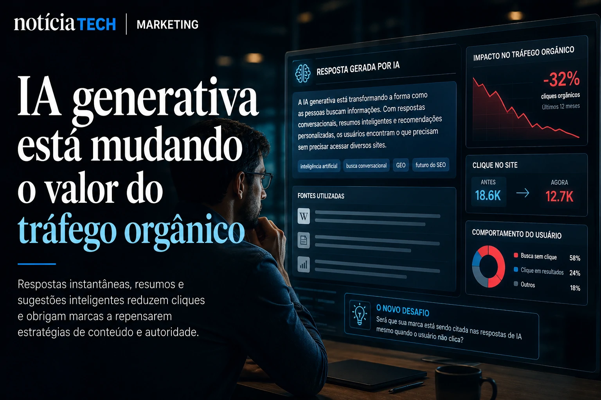

*For years, traditional SEO was treated as the main strategy for capturing organic traffic on the internet. But the rise of **generative AI**, conversational search, short-form video, and closed social platform ecosystems is rapidly altering the dynamics of digital content discovery. Instead of competing solely for the top spot on Google, brands are now trying to appear simultaneously in **ChatGPT** replies, **Google AI Overviews** results, **YouTube** videos, **TikTok** searches, **LinkedIn** feeds, and AI-powered recommendation systems.*

## Search Everywhere Optimization: the new battleground of digital attention

The transformation of digital behavior has created a new concept within the marketing market: **Search Everywhere Optimization**.

In practice, the idea is simple: modern users no longer search only on traditional search engines.

Today, purchasing decisions, brand discovery and information consumption happen in multiple environments simultaneously:

- AI engines;
- social media;
- marketplaces;
- video platforms;
- intelligent assistants;
- digital communities;
- automated recommendation systems.

This means that companies that rely solely on traditional Google traffic begin to face increasing structural risk.

The phenomenon is directly connected to the change already observed in the corporate market around artificial intelligence and new digital navigation models. The advancement of AI browsers shows how the web is migrating to more intelligent conversational interfaces that are less dependent on classic link-based navigation. This movement already appears in recent analyzes by Notícia Tech itself about how **Google**, **OpenAI** and **Perplexity** are accelerating the race for browsers with AI and changing the traditional web economy.

[Google, OpenAI and Perplexity accelerate the race for AI browsers and threaten the traditional web economy](https://noticiatech.com.br/inteligencia-artificial/google-openai-e-perplexity-aceleram-riedade-pelos-navegadores-com-ia-e-amea%C3%A7am-a-economia-tradicional-da-web/)

### The modern user searches in layers

The digital journey is no longer linear.

Before, consumers searched on Google, accessed a few websites and made a decision.

Now the behavior has fragmented:

- the user discovers trends on **TikTok**;
- validates reputation on **Reddit**;
- search for reviews on **YouTube**;
- conversational AI query;
- compares reviews on marketplaces;
- receive automated recommendations;
- make decisions without necessarily visiting a website.

This change completely alters the logic of content marketing.

Content no longer exists just to rank on Google and starts to function as an asset distributed across different algorithmic ecosystems.

## Generative AI is changing the value of organic traffic

With the expansion of automatic response systems, part of traditional organic traffic begins to erode.

AI tools can summarize content directly in the search interface, reducing the need to click.

This creates a new scenario for publishers, blogs and digital companies.

The challenge is no longer just generating visits.

Now, brands need to ensure:

- contextual presence;
- thematic authority;
- semantic recognition;
- structured mentions;
- AI reusable content.

This transformation is accelerating the growth of the so-called **GEO (Generative Engine Optimization)**, a strategy focused on optimizing content for generative engines.

The advance of companies towards more autonomous systems shows how AI is beginning to take on information intermediation functions previously dominated by traditional search engines.

[The era of AI agents has begun: How Microsoft, OpenAI, and Google are turning companies into systems autonomous](https://noticiatech.com.br/inteligencia-artificial/a-era-dos-agentes-de-ia-j%C3%A1-come%C3%A7ou-como-microsoft-openai-e-google-est%C3%A3o-transformando-empresas-em-sistemas-aut%C3%B4nomos/)

### Content is now treated as structured data

More advanced companies have already started to change the way they produce content.

The focus is no longer just keyword density.

The priority now includes:

- semantic context;
- editorial depth;
- brand authority;
- scannable structure;
- informational clarity;
- recognizable entities;
- understandable language for AI.

In practice, this brings content strategies closer to data architecture.

More organized, structured and semantically rich content tends to be more reusable by intelligent systems.

Furthermore, excessively superficial content begins to lose competitiveness in the face of generative platforms capable of quickly synthesizing generic information.

## Brands begin to compete for algorithmic distribution, not just ranking

Another important point of this change is that digital marketing begins to migrate from a ranking logic to an algorithmic distribution logic.

Instead of just thinking about position on Google, companies are now competing for:

- AI recommendation;
- contextual relevance;
- discovery on social platforms;
- automated distribution;
- authority in thematic clusters.

This explains why many companies are increasing investments in:

- multimodal content;
- short videos;
- newsletters;
- content for AI;
- presence in communities;
- personal brand strategies;
- omnichannel distribution.

**LinkedIn**'s own transformation into an AI-driven distribution platform reinforces how dependent enterprise content is becoming on algorithmic recommendation systems.

[LinkedIn stops being a CV network and becomes a B2B distribution platform driven by AI](https://noticiatech.com.br/negocios/linkedin-deixa-de-ser-rede-de-curr%C3%ADculos-e-vira-plataforma-de-distribui%C3%A7%C3%A3o-b2b-impulsionada-por-ia/)

### Direct traffic gains importance again

With the growth of generative interfaces, many companies are beginning to realize a strategic risk:

excessive dependence on external platforms.

Therefore, more mature brands are once again strengthening their own assets:

- newsletters;
- applications;
- closed communities;
- loyalty programs;
- proprietary channels;
- first-party databases.

The objective is to reduce vulnerability in the face of constant changes in algorithms.

At the same time, the perception is growing that strong brands tend to survive better in AI-dominated environments.

This happens because generative systems prioritize signals of authority, reputation and contextual recurrence.

## The future of marketing will be distributed, conversational and AI-driven

The long-term trend points to a much less centralized digital ecosystem.

Traditional search engines will remain relevant, but will no longer function as the only entry point to the internet.

The fight for attention tends to happen simultaneously in:

- conversational interfaces;
- social ecosystems;
- multimodal searches;
- autonomous assistants;
- AI agents;
- personalized algorithmic feeds.

In this scenario, companies that manage to build:

- editorial authority;
- multiplatform distribution;
- semantic presence;
- contextual recognition;
- AI reusable content;
- own digital assets;

will have an important structural advantage in the coming years.

More than optimizing pages for search engines, the new challenge will be to build a digital presence capable of surviving in an environment where algorithms, intelligent agents and generative systems start to decide what deserves attention, discovery and relevance.