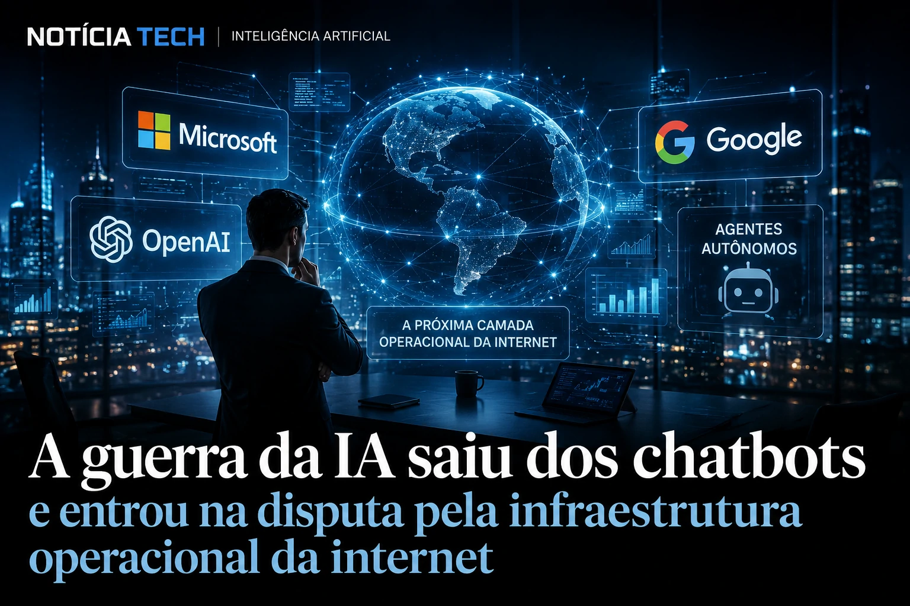

*For the past few years, the artificial intelligence race has seemed to revolve around language models, chatbots, and virtual assistants. But in 2026, the dispute changed level. The real strategic battle now takes place at another layer: who will control the autonomous agents, automated flows and operational infrastructure of the new AI-based internet. Microsoft, Google and OpenAI are accelerating billion-dollar investments to transform artificial intelligence into an invisible layer capable of performing tasks, operating systems and mediating virtually every digital interaction.*

## The AI war is no longer about chatbots

The artificial intelligence market has entered a new strategic phase.

Until recently, the main dispute involved:
- quality of models;
- responsiveness;
- content generation;
- contextual accuracy;
- inference speed.

But the rapid popularization of LLMs began to turn the models into commodities.

Now, the new competitive frontier is in so-called agentic systems.

In practice, companies have realized that the true economic power of AI is not just in answering questions, but in:
- perform tasks;
- operate software;
- access platforms;
- integrate services;
- automate decisions;
- act on behalf of the user.

This change completely alters the logic of the modern internet.

### AI begins to become an invisible operational layer

The current strategy of technology giants points to a scenario where AI stops being just a conversational interface and starts to function as a continuous operational infrastructure.

The goal is not just to talk to the user.

The objective is:
- execute complete flows;
- coordinate multiple systems;
- integrate applications;
- automate processes;
- replace operational steps.

**Microsoft** itself has been accelerating the integration of the **Copilot** ecosystem within the corporate environment, connecting productivity, automation and operational execution on a large scale.

At the same time, **Google** expands the **Gemini** ecosystem to integrate search, productivity, cloud and contextual automation within its global infrastructure.

**OpenAI** is rapidly advancing in the creation of agents capable of interacting with external tools, executing actions and operating digital environments in a persistent manner.

This dispute is already beginning to redesign how the web works.

Instead of users manually navigating through dozens of platforms, intelligent agents can:
- interpret objectives;
- search for information;
- negotiate services;
- fill out forms;
- execute purchases;
- organize tasks;
- operate entire systems.

This movement is directly related to the transformation of digital commerce driven by AI, as we show in [Agentic Commerce: how ChatGPT, Google and Shopify are transforming the internet into an online shopping interface IA](https://noticiatech.com.br/inteligencia-artificial/com%C3%A9rcio-agentic-como-chatgpt-google-e-shopify-est%C3%A3o-transformando-a-internet-em-uma-interface-de-compras-por-ia/).

### The new “operating system” of the internet

For decades:
- browsers dominated the digital experience;
- applications controlled access to services;
- platforms centralized users.

Now, Big Techs are trying to build something much bigger:
an AI-driven operational layer capable of mediating virtually all online activity.

This means AI can become:
- the new main internet interface;
- the new digital commerce intermediary;
- the new corporate productivity center;
- the new web operating engine.

And whoever controls this layer will be able to exert massive influence over:
- consumption;
- advertising;
- productivity;
- data;
- digital behavior;
- economic infrastructure.

## Microsoft, Google and OpenAI accelerate the fight for autonomous ecosystems

The current dispute is not just at the level of AI models.

It happens mainly in the control of ecosystems.

Each technology giant is trying to create its own operational infrastructure based on intelligent agents.

### Microsoft bets on total corporate integration

**Microsoft** is perhaps the most aggressive company today in transforming AI into corporate operational infrastructure.

Its difference is not just in the model.

It's in the integration.

When connecting:
- **Windows**;
- **Azure**;
- **Office**;
- **Teams**;
- **GitHub**;
- **Dynamics**;

the company creates an environment where agents can operate directly within existing corporate flows.

This positions **Copilot** not just as an assistant, but as a distributed enterprise operating system.

The strategy further strengthens the company's presence in the global B2B environment.

This advance is directly connected to the transformation of the professional environment driven by AI, a movement that we have already analyzed in [LinkedIn stops being a resume network and becomes a B2B distribution platform driven by IA](https://noticiatech.com.br/negocios/linkedin-deixa-de-ser-rede-de-curr%C3%ADculos-e-vira-plataforma-de-distribui%C3%A7%C3%A3o-b2b-impulsionada-por-ia/).

### Google tries to preserve its dominance over the internet itself

The **Google** dispute has an even more strategic weight.

For decades, the company controlled the internet's main discovery engine through traditional search.

But the rise of conversational AI threatens precisely this model.

If users stop browsing manually and start delegating tasks to intelligent agents:
- traditional traffic may drop;
- the search model may change;
- digital behavior can be restructured.

Therefore, **Gemini** has become a centerpiece for preserving the company's position in the new AI-driven web ecosystem.

The integration between:
- search;
- Android;
- Workspace;
- cloud;
- YouTube;
- contextual automation;

allows Google to build an extremely powerful operational infrastructure.

### OpenAI wants to become the universal layer of AI

While Microsoft and Google have gigantic ecosystems of their own, **OpenAI** follows another path:
make your agents compatible with the entire internet.

The strategy involves:
- APIs;
- execution of tools;
- persistent memory;
- contextual automation;
- cross-platform integration.

In practice, the company tries to transform its models into a universal layer capable of operating:
- software;
- services;
- platforms;
- marketplaces;
- business systems.

This creates an extremely sensitive dispute:
Whoever dominates the agents will be able to control the operational flow of the digital economy.

## The next internet could work through autonomous agents

Perhaps the most profound consequence of this transformation is the structural change in the online experience itself.

The traditional internet was built for humans to browse manually.

The new AI-driven internet begins to be built for agents to perform actions automatically.

### Digital behavior can change radically

In the traditional model:
- users search;
- click;
- navigate;
- compare;
- fill in data;
- perform tasks manually.

In the agentic model:
- users define objectives;
- agents execute operations;
- systems negotiate services;
- flows happen automatically.

This can completely change:
- digital advertising;
- e-commerce;
- SaaS;
- marketplaces;
- productivity;
- online consumption.

Companies that depend on the traditional traffic model could face one of the biggest transformations in the history of the internet.

### The digital economy begins to enter the agentic era

The rise of autonomous agents also ushers in a new economic dynamic.

Researchers and executives are already beginning to treat this movement as the birth of an “agentic economy”.

In this scenario:
- agents negotiate APIs;
- systems coordinate purchases;
- AI manages business flows;
- platforms automate operational decisions.

This creates new opportunities to:
- productivity;
- automation;
- cost reduction;
- enterprise hyperscale.

But it also raises important debates about:
- concentration of power;
- privacy;
- technological dependence;
- algorithmic governance;
- operational centralization.

### Technology's most important fight may just be beginning

The AI race is no longer just a competition between more intelligent models.

Now, the dispute involves:
- who will control the agents;
- who will dominate the operational flows;
- who will own the infrastructure of the new internet.

And perhaps this is the most important point of this entire transformation:
AI is no longer just changing applications.

It begins to redefine the very operational architecture of the global digital economy.