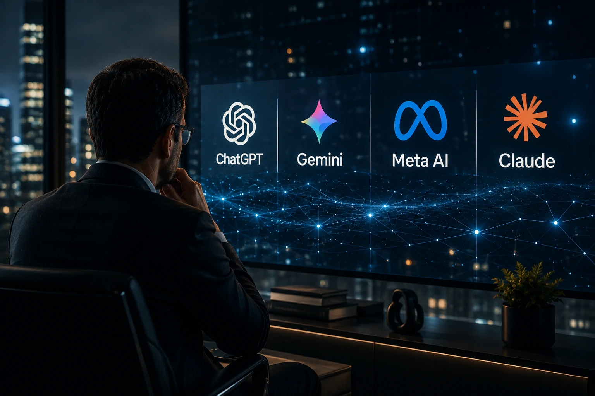

*While most people are following the race between increasingly powerful artificial intelligence models, a silent race is beginning to emerge behind the scenes in the industry. The goal now is not just to answer questions better, but to remember everything that matters to each user. This change could transform the relationship between people, companies and technology in the coming years.*

## The new dispute in AI is for the construction of permanent digital memory

*Technology companies are investing in systems capable of accumulating users' context and history.*

The new frontier of artificial intelligence is moving from just processing capabilities to contextual capabilities.

During the early years of generative AI, platforms like **ChatGPT**, **Gemini**, **Claude**, and **Meta AI** functioned primarily as query tools. Each conversation started practically from scratch.

Now the market is heading in a different direction.

Large companies want to build systems capable of remembering users' preferences, projects, consumption habits, professional goals and even behavior patterns.

In practice, AI stops being just a tool and starts to function as a living digital history.

### Why has memory become so important?

Language models have already reached a high level of technical quality.

The competitive difference begins to migrate to experience.

The more context an AI has about a person, the greater its ability to generate useful responses, relevant recommendations, and personalized automations.

### What changes for the common user?

The experience tends to become more natural.

Instead of repeating information in each conversation, the user starts interacting with a system that already knows their interests, tools used and objectives.

This reduces friction and increases the feeling of continuity.

## ChatGPT, Gemini and Meta AI are building increasingly personal ecosystems

*Personalization has become one of the main competitive weapons of technology giants.*

The current dispute is not just about models.

It happens in ecosystems.

**OpenAI** expands memory resources within **ChatGPT**.

**Google** connects artificial intelligence to products like Gmail, Drive, Docs and Android.

**Meta** uses data from its applications to make experiences more personalized within platforms such as Instagram, Facebook and WhatsApp.

The result is a new competitive dynamic.

Each company tries to build an environment where users find fewer reasons to migrate to competitors.

### The platform effect is getting stronger

Historically, technology companies have grown by creating closed ecosystems.

Artificial intelligence amplifies this phenomenon.

The more memory and context a platform accumulates, the higher the cost of switching to another solution.

### The next exit barrier

In the past, switching platforms meant losing files or contacts.

In the future, it could mean losing years of context accumulated by AI.

This creates a new type of digital loyalty.

## The impact can be even greater within companies

*Organizations are beginning to see contextual memory as a strategic asset for AI agents.*

The most profound transformation can happen in the corporate environment.

Companies are discovering that intelligent agents become much more useful when they can access historical context.

This includes internal processes, policies, documentation, customer and organizational knowledge.

It is precisely this trend that is connected to the growth of topics such as [Corporate memory with AI: why companies are transforming internal knowledge into competitive advantage](https://noticiatech.com.br/negocios/mem%C3%B3ria-corporativa-com-ia-por-que-empresas-est%C3%A3o-transformando-conhecimento-interno-em-vantagem-competitiva/).

The greater the volume of knowledge available, the more efficient corporate agents can become.

### The birth of intelligent organizational memory

Companies accumulate thousands of documents, meetings, reports and processes.

Much of this knowledge remains scattered.

AI can transform this information into a queryable layer of operational intelligence.

### The link with autonomous agents

Evolution also connects to the advancement of intelligent agents.

As shown in [MCP: the infrastructure that connects AI agents to corporate systems](https://noticiatech.com.br/inteligencia-artificial/mcp-infraestrutura-conecta-agentes-ia-sistemas-corporativos/), the agents' next step depends precisely on the ability to access context continuously.

Without memory, autonomy remains limited.

## The most valuable issue may not be technological

The central discussion may not be performance.

It could be confidence.

The more information an AI knows about someone, the more valuable that digital relationship becomes.

At the same time, debates about privacy, governance and data control are increasing.

Companies will need to balance personalization and transparency.

Users will need to decide what information they want to share.

### Who will control digital memory?

The question begins to gain relevance.

If a platform knows professional history, preferences, projects, purchases and browsing habits, it begins to occupy a strategic position within people's digital lives.

### The next chapter of the internet

For decades the internet was built around pages, applications and platforms.

The next phase can be organized around intelligent assistants that deeply understand each user.

In this scenario, the dispute between **OpenAI**, **Google**, **Meta**, **Anthropic** and other competitors is no longer just a war for better models.

It turns into a dispute over the construction of the most valuable asset of the next digital generation: memory.

---