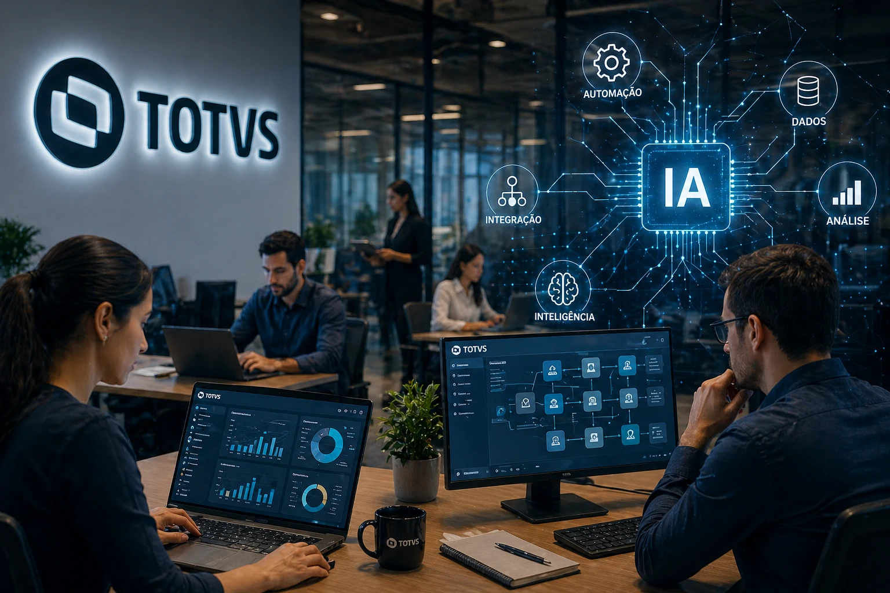
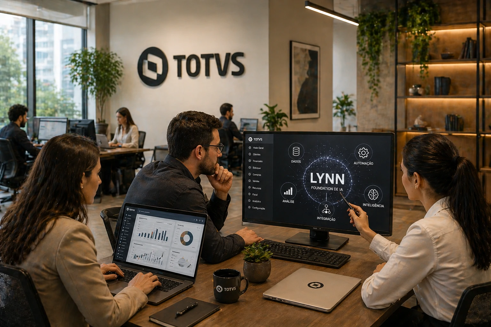

<u>**TOTVS**</u> decided to enter a new phase of business artificial intelligence.

The company launched <u>**LYNN**</u>, its own AI foundation aimed at the B2B market, focusing on a more specialized model integrated with corporate systems.

The movement draws attention because it shows an important change in the sector.

Big software companies no longer just want to integrate third-party AI.

Now they want to build their own infrastructure.

The impact of this could be profound on the Brazilian business software market.

## Why TOTVS decided to build its own AI

The logic is strategic.

When a company controls its own layer of artificial intelligence, it gains:

- more control over costs;
- more predictability;
- more security;
- more customization;
- more integration with own systems.

In the case of <u>**TOTVS**</u>, this is even more important because its ecosystem already operates at the center of critical business processes.

<u>**LYNN**</u> was created precisely to operate in this environment.

The proposal is to develop specialized intelligence, trained to understand business processes in a contextual way.

This changes the logic of adopting AI in the corporate market.

## What changes in corporate software with this movement

Traditional enterprise software has always functioned as a tool.

Now he starts working as an operator.

This means systems can start to:

- perform tasks;
- analyze scenarios;
- recommend actions;
- operate flows;
- correct deviations.

This change transforms the operational logic of companies.

ERP is no longer just a management system.

It becomes an active intelligence environment.

This movement can accelerate the adoption of <u>**intelligent agents**</u> in internal processes.

## The impact on Brazilian companies

For Brazilian companies, this movement can reduce an important barrier.

The distance between advanced technology and practical application.

With AI integrated into management software, companies gain more access to:

- contextual automation;
- faster decisions;
- reduction of repetitive tasks;
- operational improvement.

The difference is in the context.

A specialized AI understands the reality of the business better than generic models.

This could be the turning point of the new generation of enterprise software.

## What does this decision reveal about the market

The launch of <u>**LYNN**</u> shows something important.

The enterprise AI race is changing.

Before, the advantage was in using AI.

Now, the advantage begins to be in controlling the AI ​​itself.

This changes the competition.

Companies that master software + data + their own intelligence will have more strength in the market.

And for Brazil, this movement is relevant because it strengthens a national business-oriented AI ecosystem.

Enterprise software is entering a new phase.

And <u>**TOTVS**</u> wants to be at the center of it.