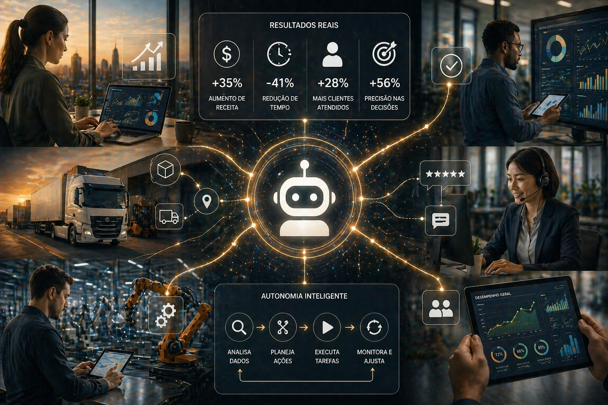

The new phase of <u>**artificial intelligence**</u> begins to leave the experimental field and enter the center of business operations.

After the explosion of generative AI, a new technological layer begins to gain strength: <u>**agentic AI**</u>.

The concept is still new for a large part of the market, but it can represent an important advance in the way companies automate decisions, perform tasks and scale productivity.

Unlike traditional response-based AI, the logic is now autonomy.

## What is agentic AI and why it matters

<u>**Agentic AI**</u> works based on goals.

Instead of just responding to commands, these systems can:

- interpret context;
- plan steps;
- perform actions;
- evaluate results;
- correct routes.

In practice, this turns AI into an operational agent.

It is an important leap compared to the first generation of automation.

If before AI needed constant command, now it begins to act more independently.

This model is already beginning to influence areas such as <u>**business automation**</u>, service, marketing and operations.

## What changes compared to traditional automation

In traditional automation, everything depends on fixed rules.

If a condition happens, an action is performed.

In agentic AI, the logic changes.

The system can evaluate multiple scenarios and decide which path to follow.

### In sales

Instead of simply firing off automated emails, an agent can:

- analyze lead profile;
- understand behavior;
- adapt approach;
- choose ideal moment.

### In service

Instead of following closed scripts, intelligent agents can adapt conversations according to the context.

This increases efficiency and personalization.

For companies that already work with <u>**process automation**</u>, this could be the next evolutionary step.

## Where agentic AI can make real impact

The impact tends to be greater in areas with a high volume of decisions.

### Marketing

Campaigns can be automatically adjusted according to results.

### Sales

Leads can be qualified with less human intervention.

### Service

Faster, personalized and contextual responses.

### Operations

Internal processes can gain operational autonomy.

The central logic is clear:

less manual execution.

More operational intelligence.

Companies that already invest in <u>**operational efficiency**</u> can accelerate gains with this model.

## The challenge that comes along with this new phase

Despite the potential, there is a critical point.

Agentic AI depends on good processes.

Without structure, organized data and clear rules, autonomy can generate noise instead of efficiency.

The main challenges are:

- systems integration;
- data governance;
- operational security;
- quality of information.

The competitive advantage will not just be in using AI.

But use it better.

And that starts now.

Companies that understand this movement early can gain an advantage before the entire market makes the same transition.