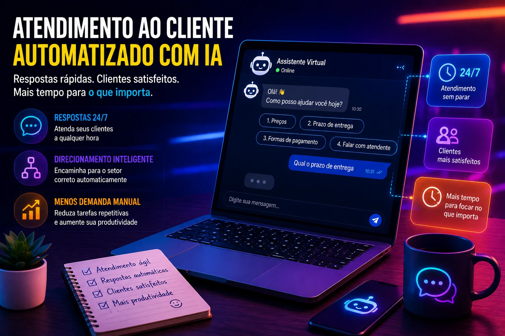
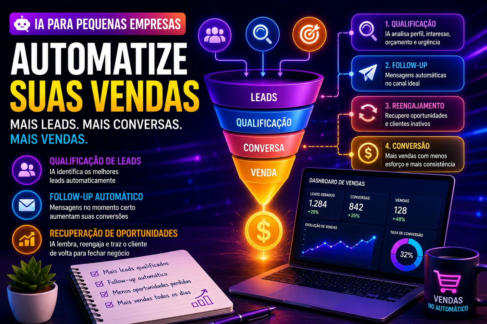

Small businesses have always had a structural challenge: doing more with less.

Less team.

Less time.

Less margin for error.

In 2026, artificial intelligence began to change this logic.

Today, processes that previously took hours can be automated in minutes.

And this is no longer the privilege of large companies.

Technology became accessible.

And the advantage now is in the speed of implementation.

## Customer service

Customer service is one of the easiest processes to automate.

And one of the most time consuming.

Today, AI can:

### Answer repetitive questions

Examples:

- prices  
- delivery time  
- availability  
- payment methods

### Target customers correctly

Separating:

- support  
- sales  
- financial

This reduces operating noise.

## Commercial process and sales

Selling requires repetition.

But repetition consumes energy.

AI can automate:

### Lead qualification

Filtering:

- interest  
- budget  
- urgency

### Automatic follow-up

Many sales die due to lack of follow-up.

This is a classic problem.

### Recovery of opportunities

Customers forget.

The AI ​​remembers.

## Marketing and content production

Marketing has also become a strong field for automation.

Today it is possible to automate:

### Copy production

Ads.

Emails.

Offers.

### Campaign planning

Organization.

Calendar.

Segmentation.

### Performance analysis

Understand what works.

And cut waste.

## Financial and billing

Many small businesses still operate finance manually.

This generates:

- delay  
- error  
- rework

AI can help with:

### Automatic billing

Reminders.

Confirmations.

Recovery.

### Financial organization

Cash flow.

Forecast.

Alerts.

## HR and recruitment

Even small companies hire.

And hiring poorly is expensive.

AI can automate:

### CV screening

Filtering profiles.

### Scheduling interviews

No endless exchange of messages.

### Internal communication

Onboarding.

Information.

Documents.

## Technical support

Whoever sells services needs to sustain service.

AI helps with:

### Smart knowledge base

Quick responses.

### Organization of tickets

Automatic prioritization.

### Initial resolution

Reduction of human burden.

## Data and decision making

Many companies have data.

Few use it.

That's the problem.

AI can:

### Read patterns

Sale.

Behavior.

Operation.

### Generate insights

Where to cut.

Where to invest.

Where to improve.

## The mistake is not not using AI

The mistake is thinking that AI replaces management.

It does not replace.

She speeds up.

Automating a bad process only accelerates the problem.

Therefore:

first organize.

Then automate.

## Whoever automates first grows first

Small businesses don't need to compete on size.

They need to compete on efficiency.

And efficiency today involves automation.

Artificial intelligence is no longer a laboratory technology.

It became an operation tool.

Those who implement early will build an advantage before the market matures.