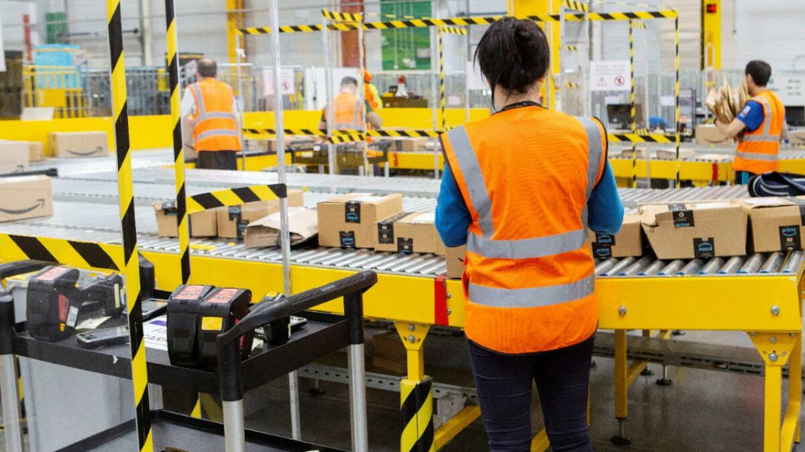
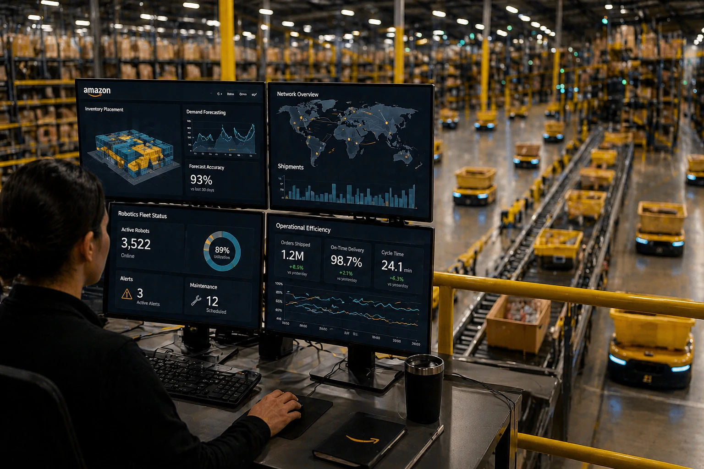
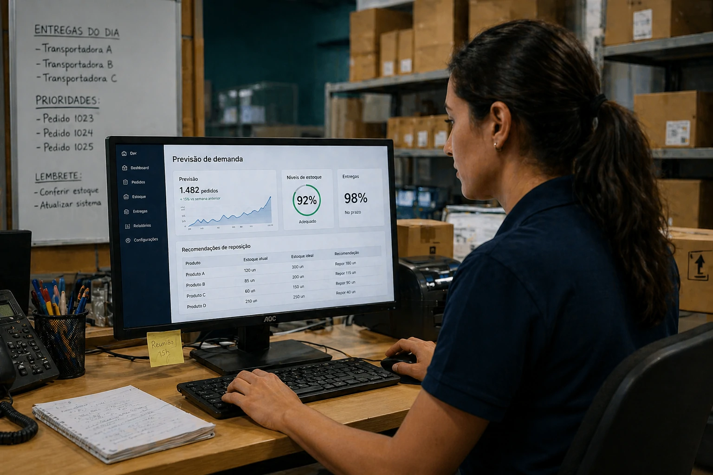
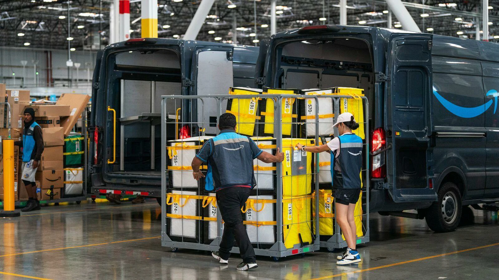

Logistics automation is entering a new phase.

Amazon is expanding the use of artificial intelligence in its logistics operations to predict demand, organize inventories and speed up deliveries.

The movement reinforces an important trend in the market: logistics is no longer just transportation and has become operational intelligence.

For Brazilian companies, the message is clear.

Anyone who uses data and automation to improve operations can gain efficiency and reduce costs.

## What Amazon is doing in practice

Amazon is using artificial intelligence to predict which products will be most in demand in specific regions.

With this, the company positions stocks closer to customers.

The impact is direct:

- less delivery time  
- less operating cost  
- less logistical waste  
- better stock organization

The logic is simple.

The more predictable the demand, the more efficient the operation.

## How AI improves logistics

Artificial intelligence enters critical points in the operation.

### Demand forecast

The system identifies purchasing patterns and anticipates needs.

### Inventory management

Products are distributed more accurately.

### Route optimization

Deliveries are faster and cheaper.

### Operational automation

Fewer manual processes and fewer errors.

This model reduces operational friction.

## What Brazilian companies can learn from this

Amazon's reality is different from most Brazilian companies.

But the principle is the same.

Businesses in Brazil can apply AI in:

- stock control  
- sales forecast  
- internal logistics  
- distribution  
- e-commerce

This is especially important for retail and digital operations.

Smaller companies can also use affordable tools for this.

## The impact of logistics automation on the market

Amazon's advancement shows that smart logistics is becoming a competitive advantage.

Companies that can predict demand and automate operations operate better.

This means:

### Less cost

Less waste and more efficiency.

### More speed

Faster operation.

### Better customer experience

More predictable deliveries.

### More scale

Ability to grow without increasing costs in the same proportion.

Amazon's move reinforces an important reality.

Artificial intelligence isn't just changing marketing or service.

It is transforming business operations from within.

And Brazilian companies that understand this first can gain a competitive advantage.

---