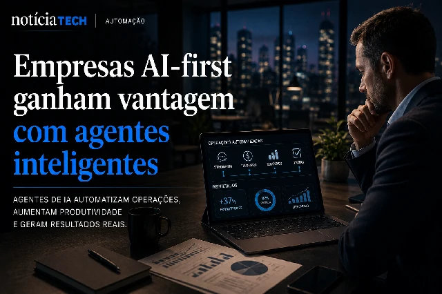

*For years, companies have built entire operations around traditional enterprise software. Now, a new transformation is beginning to gain momentum within the global market: artificial intelligence agents capable of executing tasks, making operational decisions and automating complete flows are beginning to replace the traditional logic of business applications.*

## Companies begin to exchange software for intelligent agents

The advancement of generative artificial intelligence is creating a structural change within the corporate market.

Instead of relying exclusively on traditional software, companies are starting to use intelligent agents capable of:
- perform tasks;
- interpret context;
- automate operations;
- access multiple systems;
- respond to operational decisions in real time.

In practice, the market is beginning to move away from the era of static software and into the era of intelligent operating systems.

This means that, in many cases, professionals will no longer need to manually navigate between:
- CRMs;
- service platforms;
- financial systems;
- productivity tools;
- internal software.

The agents themselves will be able to perform part of these operations automatically.

### AI stops just responding and starts acting

In the early years of generative AI, the focus was on chatbots and text assistants.

Now, the market is moving into a new phase:
AI with operational capabilities.

This includes agents capable of:
- access tools;
- navigate systems;
- execute commands;
- integrate platforms;
- automate complete processes.

Large technology companies are already accelerating investments in this model:
- OpenAI;
- Microsoft;
- Google;
- Anthropic;
- Salesforce;
- Notion.

The goal is to transform AI into a permanent operational layer within companies.

This transformation also connects to the advancement of enterprise AI and business automation that has already been changing software development in recent months:

[AI accelerates software production and changes the role of programmers in companies](https://noticiatech.com.br/inteligencia-artificial/ia-acelera-produ%C3%A7%C3%A3o-de-software-e-muda-o-papel-dos-programadores-nas-empresas/)

## The SaaS market could undergo profound transformation

For more than a decade, the SaaS market dominated the corporate environment.

Companies started to operate through dozens of platforms:
- CRM;
- ERP;
- service;
- marketing;
- analytics;
- automation;
- collaboration.

Now, intelligent agents are beginning to create new operational logic:
fewer interfaces and more automatic execution.

Instead of opening several different apps, users will be able to simply request objectives:
- generate report;
- organize meetings;
- respond to customers;
- update contracts;
- create campaigns;
- consolidate data.

The agent starts to operate behind the scenes.

This reduces operational friction and profoundly changes the traditional corporate experience.

### Traditional software may lose protagonism

Industry experts are already beginning to discuss a possible repositioning of the SaaS market.

Software may not disappear completely, but it may no longer be the center of the operational experience.

AI tends to become the main interface.

In this scenario:
- applications become invisible infrastructure;
- agents become main layer;
- automation replaces manual navigation;
- companies operate by objectives and no longer by isolated tools.

This change may affect:
- subscription models;
- user retention;
- corporate productivity;
- operational teams;
- enterprise software development.

The movement also connects to the growing global dispute over AI infrastructure and control of corporate ecosystems:

[OpenAI begins to reduce dependence on Microsoft and the AI market enters a new billion-dollar war](https://noticiatech.com.br/inteligencia-artificial/openai-come%C3%A7a-a-redutor-depend%C3%AAncia-da-microsoft-e-mercado-de-ia-entra-em-nova-guerra-bilion%C3%A1ria/)

## AI-first companies begin to gain competitive advantage

The advancement of intelligent agents also accelerates the emergence of so-called “AI-first” companies.

In this model, artificial intelligence stops being just a complementary tool and starts to occupy a central position in corporate operations.

This includes:
- service automation;
- operational coordination;
- data analysis;
- task management;
- productivity;
- internal support;
- content generation;
- execution of business flows.

Companies that can onboard agents quickly tend to gain:
- operating speed;
- cost reduction;
- greater scalability;
- increased productivity;
- competitive advantage.

At the same time, pressure is growing on companies that still operate with traditional, highly manual structures.

### The next phase of AI will be operational

Artificial intelligence is no longer just a support tool.

It begins to transform into a permanent operational layer within companies.

While the market is still debating chatbots and content generation, the next dispute is already taking place at another level:
who will be able to build entire operations coordinated by intelligent agents.

This movement can redefine:
- corporate productivity;
- business software;
- working models;
- operational structure of companies;
- global digital economy.

And everything indicates that this transformation is just beginning.