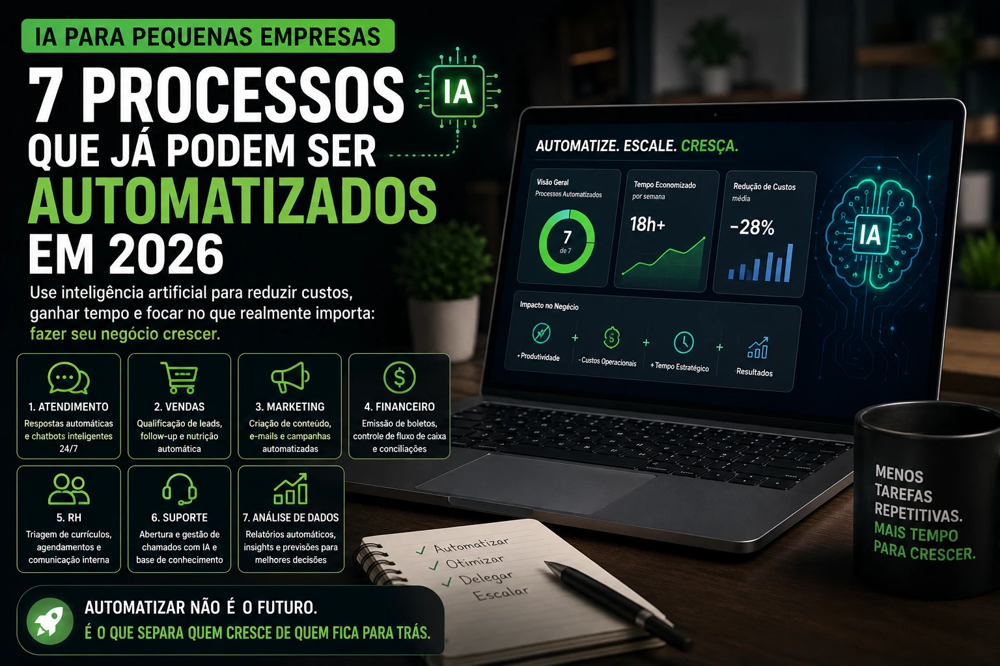

WhatsApp is no longer just a service channel. In 2026, it established itself as one of the main sales environments for Brazilian companies.

The problem is that a lot of operation still works in manual mode.

Message by message.

Customer by customer.

No scale.

That's where artificial intelligence comes in.

With AI integrated into WhatsApp, companies can respond faster, qualify leads better and automate commercial processes without losing personalization.

## WhatsApp has become a central sales channel

In Brazil, WhatsApp became commercial infrastructure.

Many companies use the app as their main point of contact to:

- first service  
- budget  
- closing  
- support  
- after-sales

But there is a bottleneck.

Volume.

When demand grows, service slows down.

And a waiting customer is a cooling customer.

### Speed became a conversion factor

Whoever responds first has an advantage.

Just like that.

AI reduces this time to seconds.

## Where AI comes into business operation

Artificial intelligence does not replace commercials.

It organizes the flow.

And speed up.

In practice:

### Automatic lead qualification

Before arriving at the seller, the system may ask:

- which product do you want  
- budget range  
- urgency  
- city  
- company profile

When the salesperson enters, he enters at the right time.

### Recovery of lost opportunities

Customers disappear.

This is normal.

But AI can reactivate:

- abandoned carts  
- forgotten budgets  
- cold contacts

All automatically.

### Smart follow-up

The biggest business mistake is forgetting to follow up.

AI doesn't forget.

## The direct impact on revenue

Companies that automate WhatsApp win on three fronts:

### More speed

Immediate response.

No queue.

No waiting.

### More efficiency

Team focuses on complex sales.

Not in repetitive tasks.

### More conversion

Less lead loss.

More opportunity seized.

This gain is operational and financial.

## The mistake that many companies still make

Automating does not mean robotizing.

That's the error.

Cold and mechanical messages drive away customers.

Ideally, use AI to:

- speed up  
- organize  
- prioritize  
- customize

The experience needs to remain human.

## The new Brazilian commercial is on WhatsApp

Customer behavior has changed.

And the commercial process too.

Companies that still operate manually are losing competitive speed.

WhatsApp is already a sales channel.

AI is transforming this channel into a conversion machine.

Whoever implements it first, learns first.

And sell first.